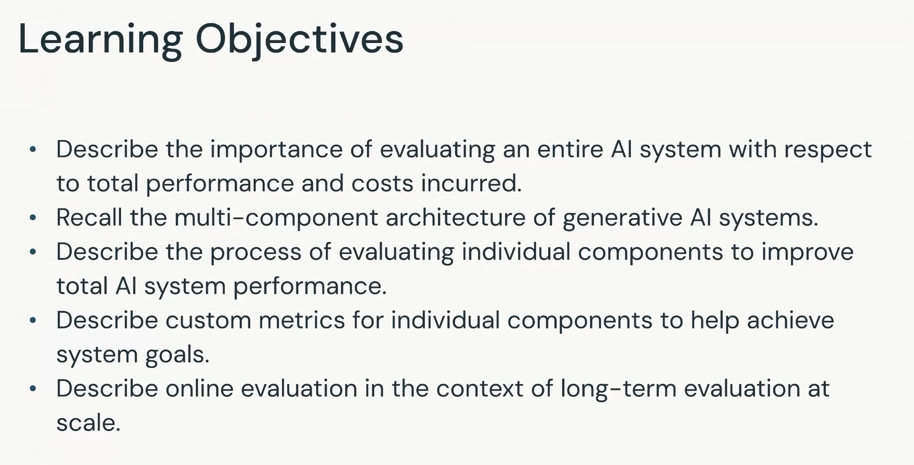

# Introduction to End-to-end Application Evaluation

## Module context

This is the final module of the evaluation and governance course. It expands evaluation from an individual model or metric to the complete AI application, its components, business value, operating cost, and long-term production behavior.

## Learning objectives

The module aims to:

1. Explain why the entire AI system must be evaluated with respect to total performance and incurred cost.
2. Recall the multi-component architecture of generative AI systems.
3. Describe how evaluating individual components can improve total system performance.
4. Describe custom metrics for individual components that support system goals.
5. Describe online evaluation as part of long-term evaluation at scale.

## Performance, value, and cost

End-to-end evaluation must balance three related concerns:

- **Prediction or task performance:** how well the system completes its intended work.
- **Customer value:** whether that performance produces a useful outcome for the user or business.
- **Infrastructure cost:** whether the compute and operational spending are justified by the delivered value.

A technically strong system may still be unsuitable if its cost exceeds the value it creates. Conversely, a lower-cost system may be unacceptable if it fails the task or produces a poor customer experience.

## Multi-component systems

Generative AI applications contain multiple components rather than one isolated model. The module will revisit this architecture and examine how each component contributes to total system quality, latency, reliability, and cost.

## Component-level improvement

The planned process evaluates individual components, identifies bottlenecks or failures, and improves them in support of end-to-end goals. This avoids assuming that every system problem originates in the LLM.

## Custom metrics

Different components may require different metrics. The module will explain how custom measurements can connect component behavior with the goals of the complete application.

## Online evaluation

Offline tests before deployment provide only a snapshot. Online evaluation monitors the application over time and at production scale, allowing teams to identify changes in behavior, performance, cost, or user outcomes.

## Scope note

This introductory lesson defines the module's goals. It does not yet specify the component metrics, production architecture, monitoring implementation, or optimization procedure.

## Key takeaways

- End-to-end quality combines performance, task value, and cost.
- GenAI applications must be evaluated as multi-component systems.
- Component metrics should contribute to system-level goals.
- The LLM is only one possible source of a system problem.
- Online evaluation supports long-term assessment at production scale.
