# End-to-end App. Evaluation

## Evaluation scope

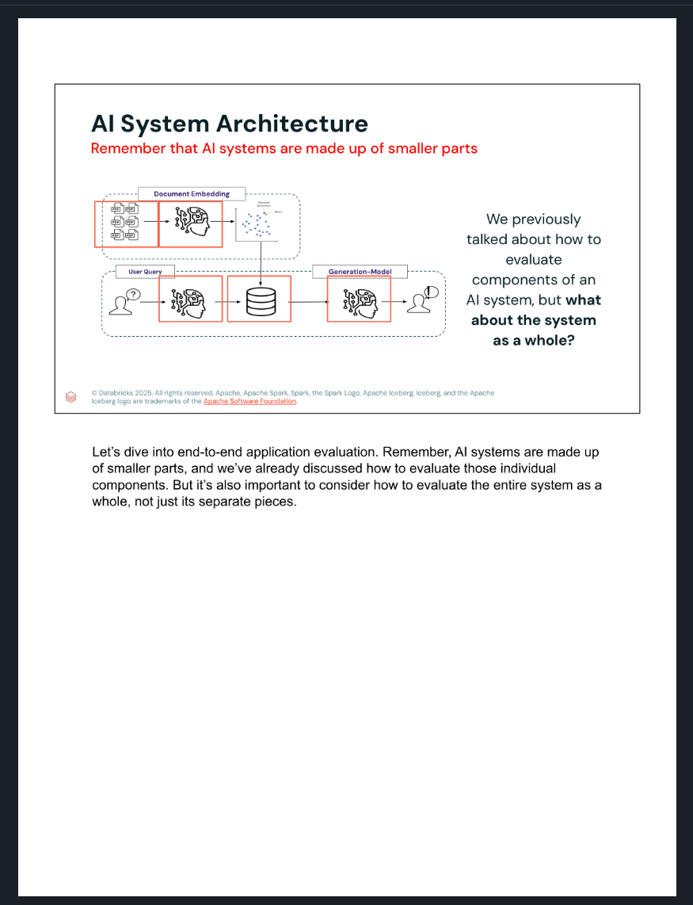

A generative AI application is a system of interacting components. For a RAG application, these may include chunking, embeddings, retrieval, reranking, generation, and the user-facing flow. A sound evaluation strategy therefore works at two levels:

1. Evaluate each component to locate weaknesses.
2. Evaluate the complete system to determine whether it delivers value at an acceptable cost.

## Whole-system measures

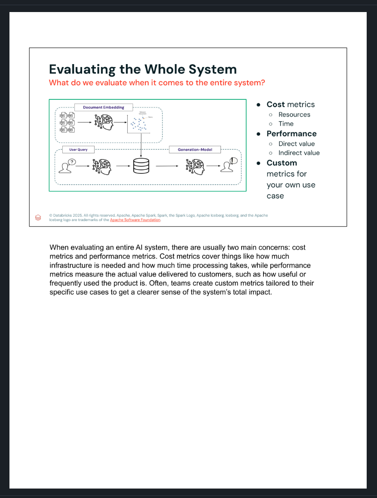

| Dimension | Typical measures | Question answered |
|---|---|---|
| Cost | Compute resources, infrastructure consumption, processing time | Is the solution economically and operationally sustainable? |
| Performance and value | Usefulness, task success, direct and indirect value | Does the application solve the intended problem? |
| Custom business outcomes | Latency, total cost, product demand, customer satisfaction | Does the system meet the organization's own goals and constraints? |

Optimizing a single technical metric is not enough. The best system is the one that balances quality, value, latency, risk, and cost for the actual use case.

## Evaluating a RAG pipeline

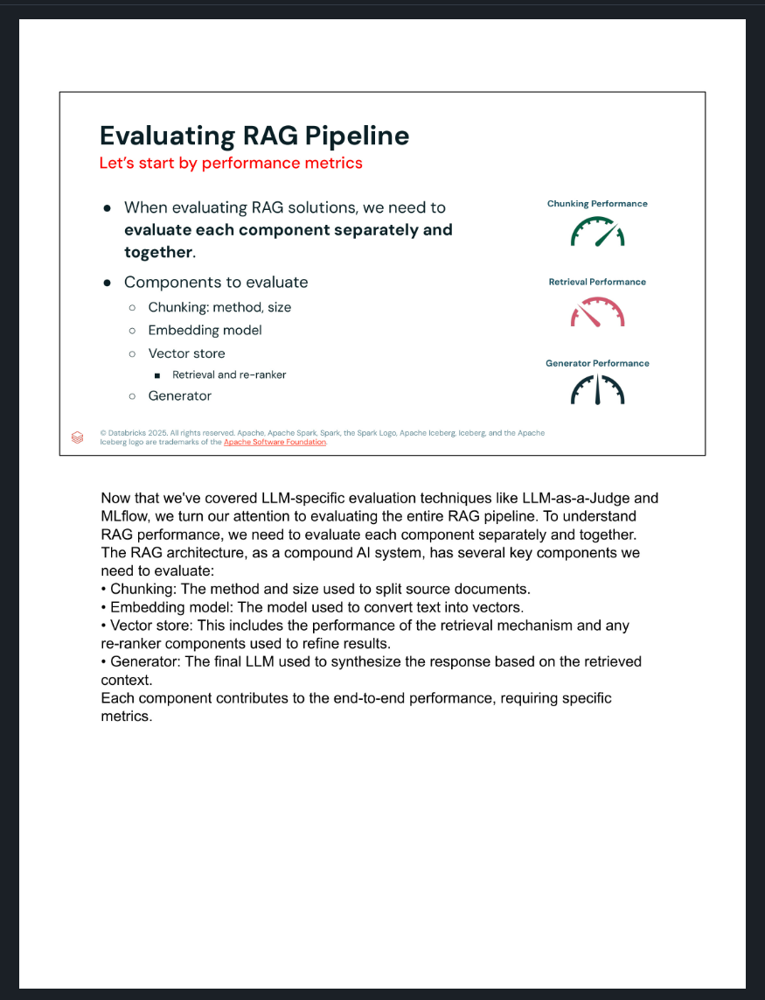

| Component | Evaluation focus |
|---|---|
| Chunking | Method, chunk size, preservation of useful context |
| Embedding model | Semantic representation and retrieval suitability |
| Vector store | Retrieval quality and reranker behavior |
| Generator | Quality of the final response grounded in retrieved context |
| Complete pipeline | End-to-end quality, latency, cost, and user value |

## RAG evaluation model

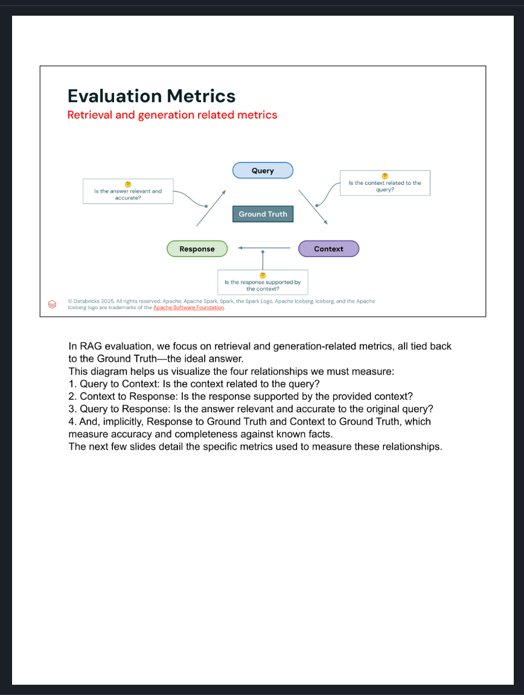

RAG evaluation connects four objects:

- **Query:** the user's request.
- **Context:** the information retrieved for the request.
- **Response:** the generated answer.
- **Ground Truth:** the expected or validated answer.

### Retrieval metrics

| Metric | Inputs compared | What it asks |
|---|---|---|
| Context Precision | Query + retrieved contexts | Are relevant chunks ranked above irrelevant noise? |
| Context Relevancy | Query + retrieved contexts | Does the retrieved material address the query? |
| Context Recall | Ground truth + retrieved contexts | Was all necessary information retrieved? |

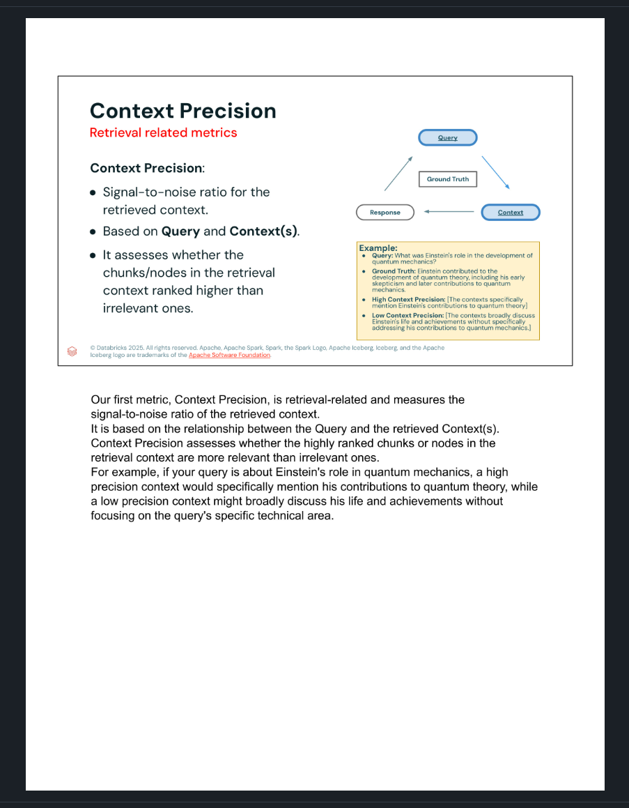

**Context Precision** emphasizes ranking quality and the signal-to-noise ratio. A retrieval can contain the correct information but still have low precision if it is buried beneath irrelevant chunks.

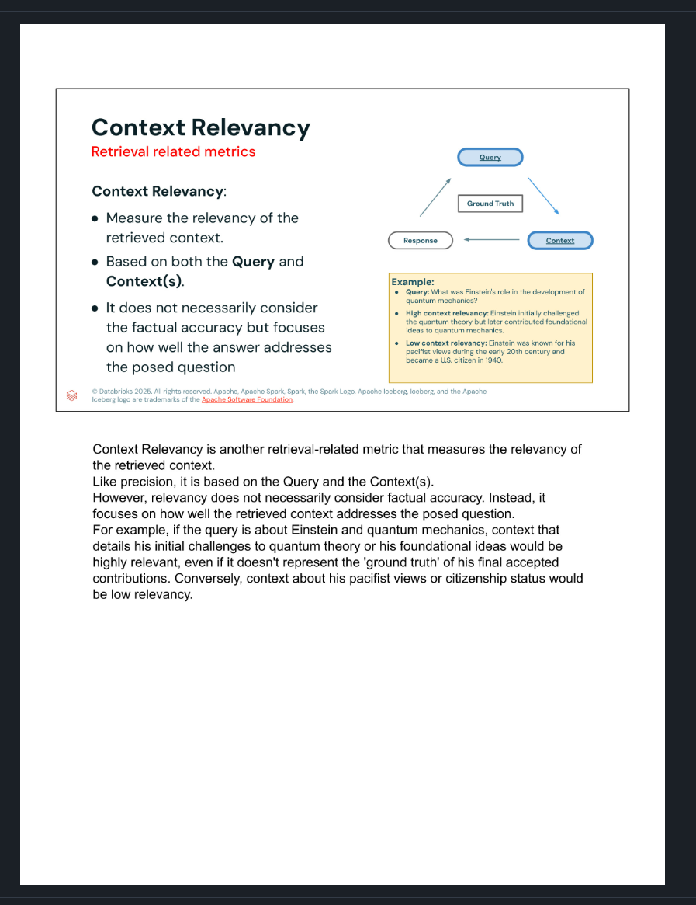

**Context Relevancy** emphasizes topical alignment. Relevant text can still be factually wrong, so this metric should not be confused with correctness.

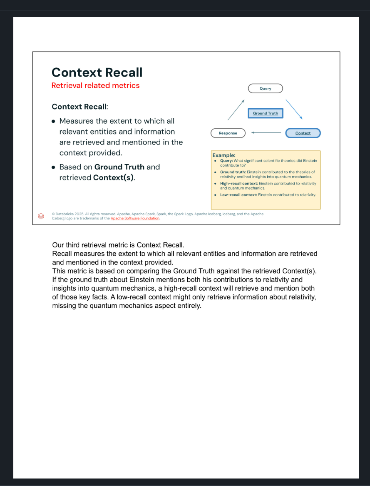

**Context Recall** emphasizes coverage. High recall means that the retrieved context contains all the information required by the ground truth.

### Generation metrics

| Metric | Inputs compared | What it asks |
|---|---|---|
| Faithfulness | Response + retrieved contexts | Is every claim in the answer supported by the supplied context? |
| Answer Relevancy | Query + response | Does the answer address the user's actual intent? |
| Answer Correctness | Ground truth + response | Is the answer semantically and factually correct? |

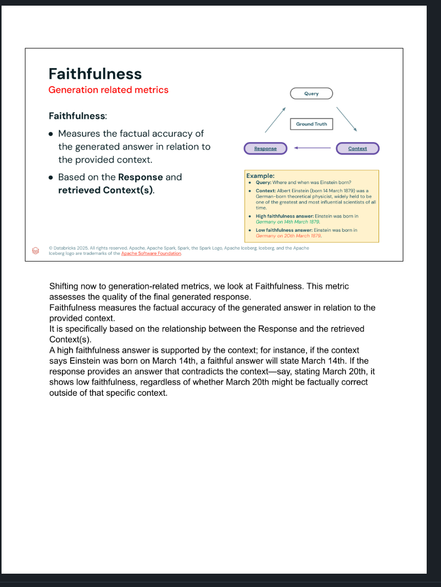

**Faithfulness** is about grounding, not external truth. A response is unfaithful when it contradicts the supplied context, even if it happens to match information found elsewhere.

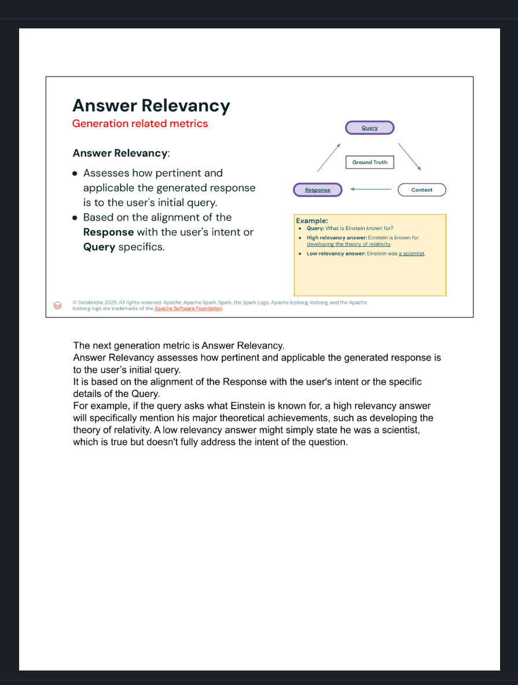

**Answer Relevancy** distinguishes a useful, specific answer from a vague statement that is merely related to the topic.

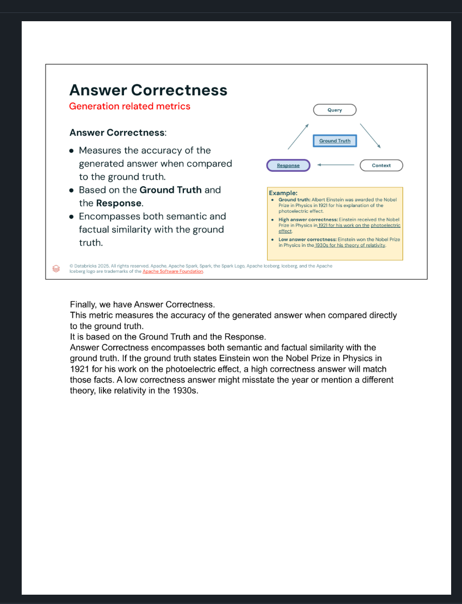

**Answer Correctness** compares the response with validated ground truth and includes both factual and semantic agreement.

## Metric distinctions that matter

| Pair | Difference |
|---|---|
| Precision vs. recall | Precision reduces irrelevant retrieved content; recall prevents missing relevant content. |
| Relevancy vs. correctness | Relevancy measures whether content addresses the question; correctness measures whether it is true against ground truth. |
| Faithfulness vs. correctness | Faithfulness checks support from retrieved context; correctness checks agreement with validated facts. |
| Component quality vs. system quality | Strong individual components do not automatically guarantee acceptable end-to-end value, latency, or cost. |

## Custom metrics

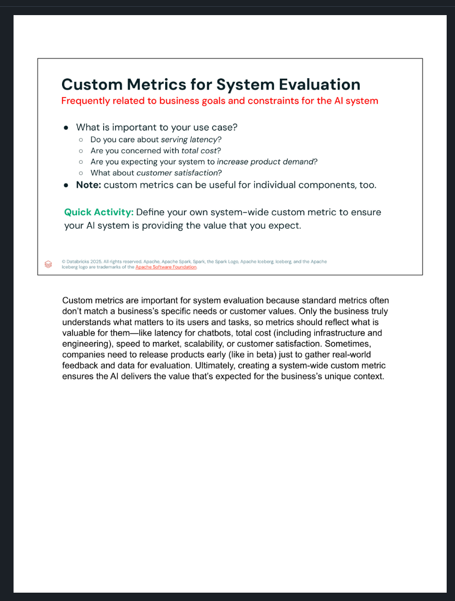

Business-specific metrics are necessary when standard scores do not capture the intended outcome. Examples include:

- Serving latency.
- Total operational cost.
- Customer satisfaction.
- Conversion or product demand.
- Compliance with a required tone or level of professionalism.

Custom metrics may describe the whole system or a single component.

### MLflow custom evaluation

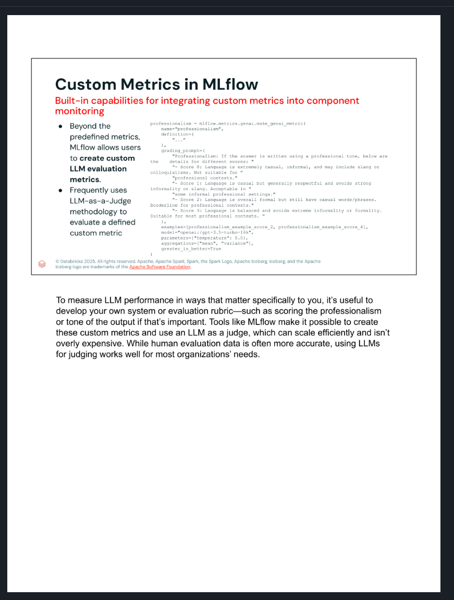

MLflow can operationalize a custom LLM metric by defining its name, rubric, examples, judge model, inference parameters, aggregation, and score direction. LLM-as-a-judge makes this scalable, while human review remains important for ambiguous or high-impact cases.

## Offline and online evaluation

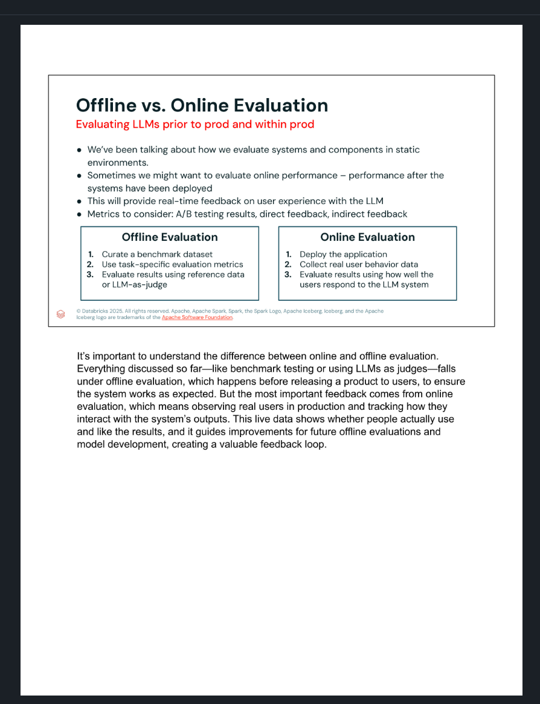

| Offline evaluation | Online evaluation |
|---|---|
| Conducted before release or in a static test environment. | Conducted after deployment with production interactions. |
| Uses curated benchmarks, task metrics, ground truth, or LLM judges. | Uses real behavior, A/B tests, direct feedback, and indirect signals. |
| Helps determine whether a candidate system is ready. | Reveals whether users actually receive value and exposes drift. |

The two modes form a feedback loop: production evidence improves future offline datasets, rubrics, and experiments.

## Human feedback and ongoing monitoring

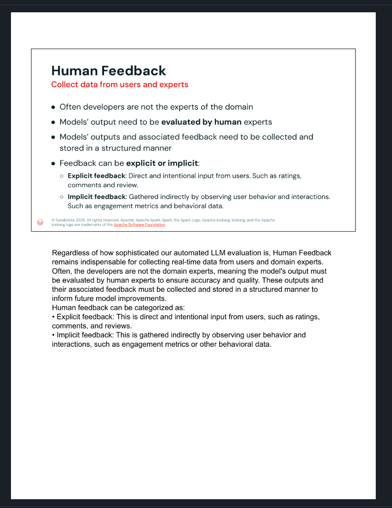

Human feedback is either:

- **Explicit:** ratings, comments, reviews, and expert judgments.
- **Implicit:** engagement, abandonment, repeated queries, clicks, and other observed behavior.

Feedback should be stored together with the evaluated outputs in a structured way. Domain experts are especially important when developers cannot judge subject-matter correctness.

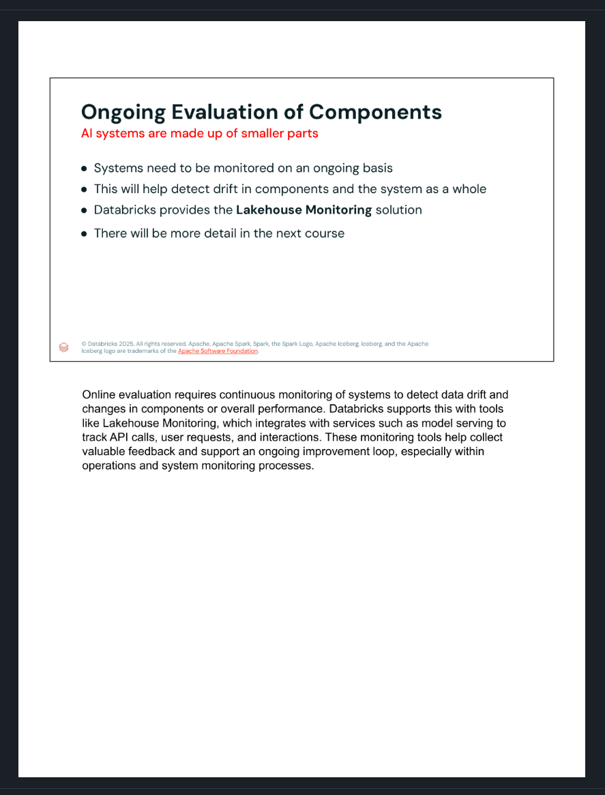

Continuous monitoring detects data drift, component drift, and degradation in complete-system performance. The lesson points to Lakehouse Monitoring and its integration with serving and operational telemetry.

## Mosaic AI Agent Framework

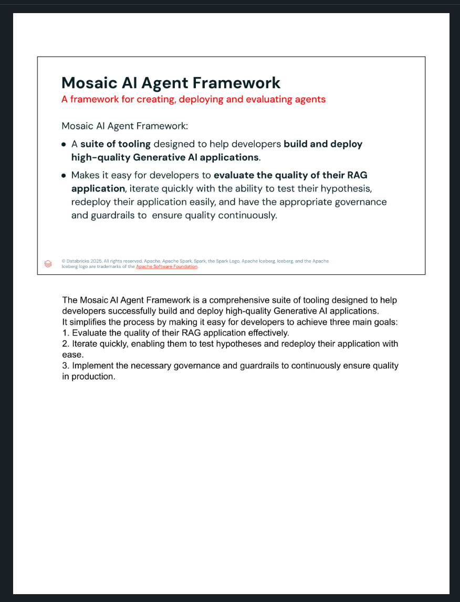

Mosaic AI Agent Framework supports building, deploying, evaluating, governing, and continuously improving compound AI applications.

Agent Evaluation adds:

- Step-level traces of agent behavior.
- RAG-specific metrics for offline and online evaluation.
- A Review App for collecting human feedback.
- Databricks LLM Judges for quality assessment and root-cause analysis.

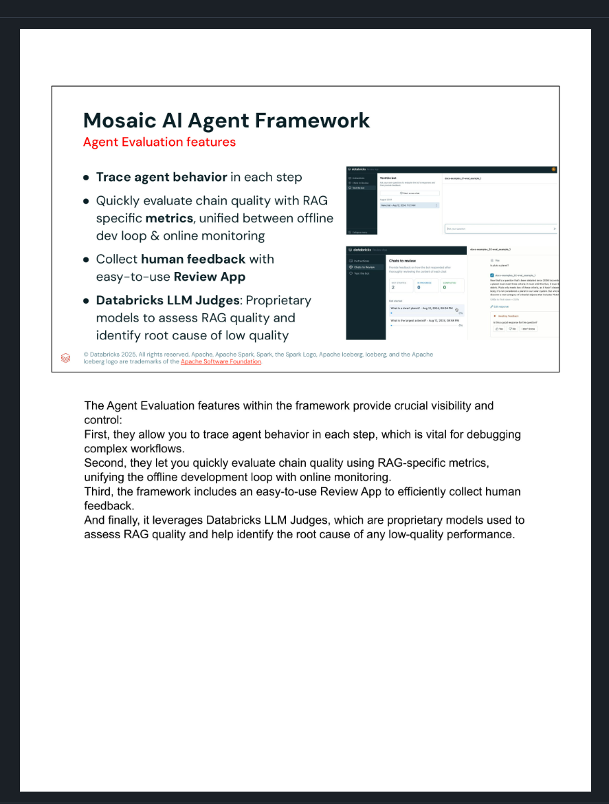

## Practical evaluation sequence

1. Define user and business goals, constraints, and acceptable costs.
2. Build a representative offline evaluation dataset.
3. Measure retrieval and generation components independently.
4. Evaluate the complete pipeline with end-to-end and custom metrics.
5. Review important cases with domain experts.
6. Deploy cautiously and collect explicit and implicit feedback.
7. Monitor drift, latency, cost, safety, and quality continuously.
8. Feed production findings back into offline tests and development.

## Key takeaways

- End-to-end evaluation combines component metrics with system cost and business value.
- RAG retrieval quality requires precision, relevancy, and recall.
- Generation quality requires faithfulness, answer relevancy, and correctness.
- These metrics are related but not interchangeable.
- Custom metrics connect technical evaluation to real business objectives.
- Offline testing must be complemented by online evaluation, human feedback, and ongoing monitoring.
- Mosaic AI Agent Framework provides tracing, RAG evaluation, human review, and LLM judges for compound AI systems.
