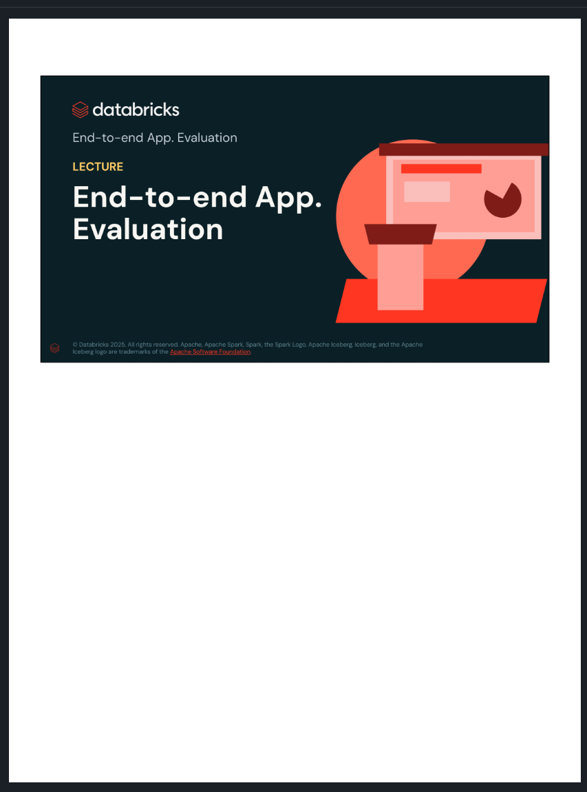
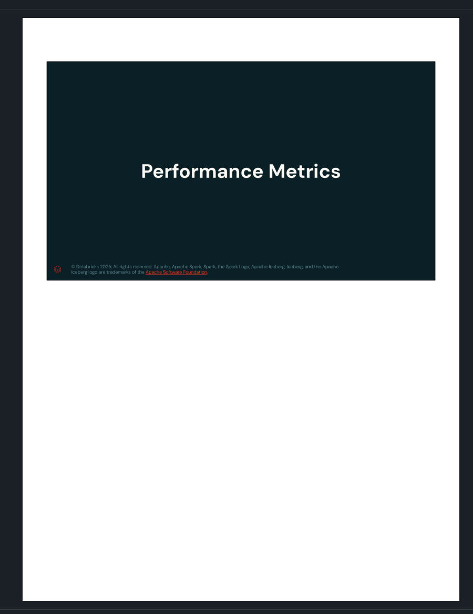
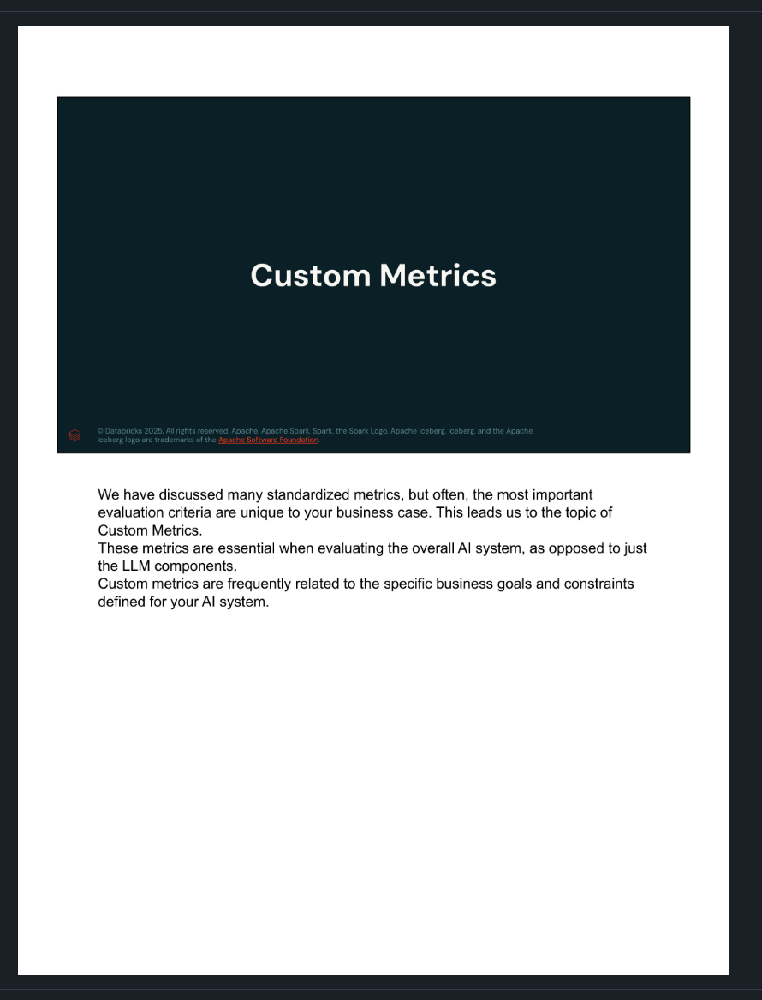
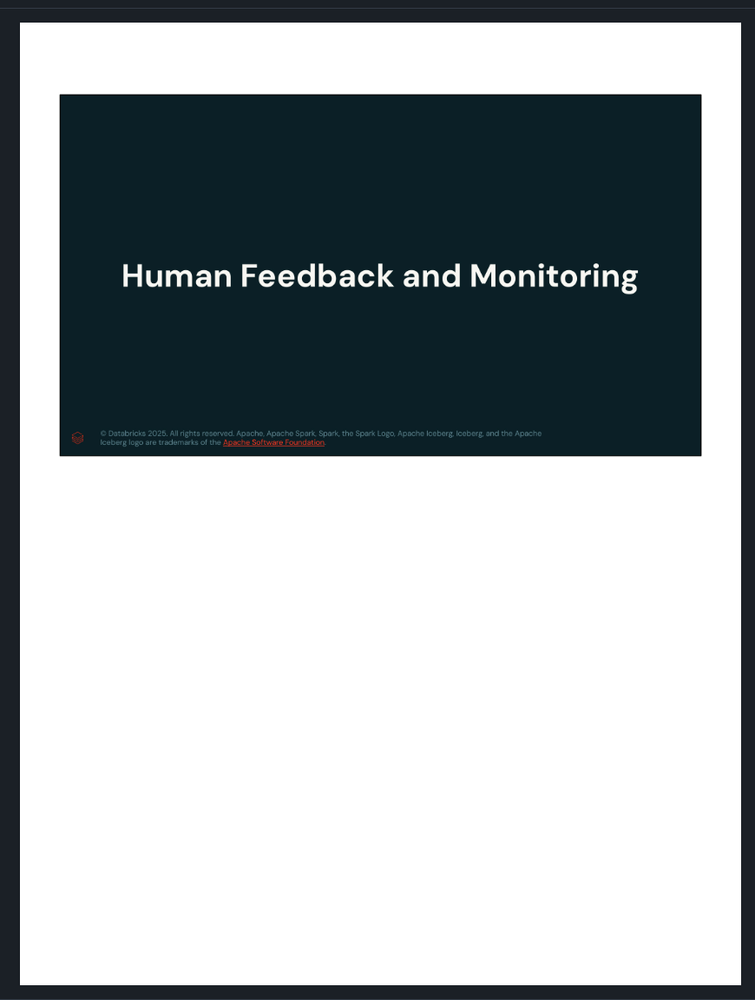
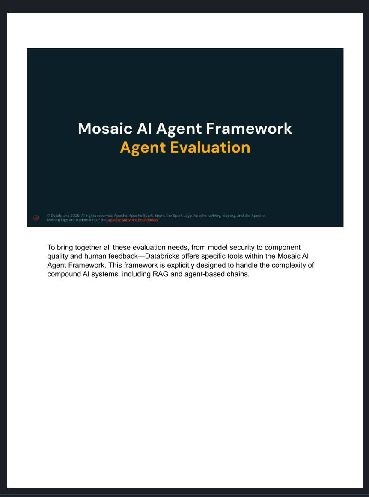
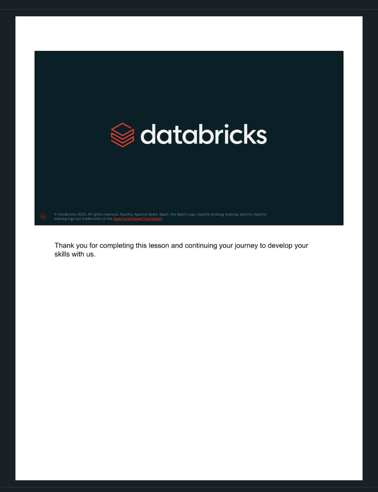

# End-to-end App. Evaluation

## Source reconstruction

This English source was reconstructed from the twenty-three screenshots supplied by the user. The slide text and accompanying explanations have been combined into one continuous thematic document rather than separated page by page. Repeated copyright footers have been omitted.

## AI system architecture

AI systems are made up of smaller parts. A RAG application can include source documents, document chunking, an embedding model, a vector store, a retrieval or reranking mechanism, a generation model, user queries, and generated responses. Evaluating the components individually is necessary, but it is not sufficient: the application must also be evaluated as a complete system.

## Evaluating the whole system

End-to-end evaluation usually considers three groups of measures:

- **Cost metrics:** infrastructure resources and processing time.
- **Performance metrics:** direct and indirect value delivered to users or customers.
- **Custom metrics:** measurements designed for the application's own use case.

Cost and performance must be considered together. A technically strong system may still be unsuitable if its latency or infrastructure cost is too high, while a low-cost system may fail if it does not provide useful business value.

## Evaluating a RAG pipeline

When evaluating a RAG solution, every component should be evaluated separately and the pipeline should be evaluated as a whole. Important components include:

- **Chunking:** the method and size used to divide source documents.
- **Embedding model:** the model that converts text into vectors.
- **Vector store:** the retrieval mechanism and any reranker used to refine results.
- **Generator:** the final language model that synthesizes a response from the retrieved context.

Each component contributes to the end-to-end result and therefore requires suitable metrics.

## Relationships used in RAG evaluation

RAG evaluation examines the relationships among four elements: **Query**, **Context**, **Response**, and **Ground Truth**.

1. **Query to Context:** Is the retrieved context related to the query?
2. **Context to Response:** Is the response supported by the retrieved context?
3. **Query to Response:** Is the answer relevant and applicable to the original query?
4. **Response or Context to Ground Truth:** Are the retrieved facts and generated answer accurate and complete when compared with the expected answer?

The following retrieval and generation metrics make these relationships measurable.

## Retrieval-related metrics

### Context Precision

**Context Precision** measures the signal-to-noise ratio of the retrieved context. It is based on the relationship between the query and the retrieved contexts. It checks whether relevant chunks or nodes are ranked higher than irrelevant ones.

For a query about Einstein's role in the development of quantum mechanics, a high-precision context specifically discusses his contributions to quantum theory. A low-precision context may broadly describe his life and achievements without addressing quantum mechanics.

### Context Relevancy

**Context Relevancy** measures how well the retrieved context addresses the posed query. It is also based on the query and the retrieved contexts. It does not necessarily evaluate factual accuracy; its focus is topical alignment.

For a question about Einstein and quantum mechanics, context describing his initial challenges to quantum theory or his foundational ideas is highly relevant. Context about his pacifist views or United States citizenship has low relevancy for that question.

### Context Recall

**Context Recall** measures the extent to which all relevant entities and information from the ground truth are retrieved and mentioned in the provided context. It compares the ground truth with the retrieved contexts.

If the ground truth says that Einstein contributed both to relativity and to quantum mechanics, a high-recall context retrieves both facts. A low-recall context might retrieve only relativity and omit the quantum-mechanics contribution.

## Generation-related metrics

### Faithfulness

**Faithfulness** measures whether the generated answer is factually supported by the provided context. It is based on the relationship between the response and the retrieved contexts.

If the context says that Albert Einstein was born in Germany on 14 March 1879, a faithful answer repeats the supported date and place. An answer that says 20 March 1879 has low faithfulness because it contradicts the supplied context, regardless of information available outside that context.

### Answer Relevancy

**Answer Relevancy** assesses how pertinent and applicable the generated response is to the user's original query. It measures the alignment between the response and the user's intent or the specific details of the query.

For the question "What is Einstein known for?", an answer that identifies the theory of relativity is highly relevant. The generic statement "Einstein was a scientist" is true but has low relevancy because it does not adequately address the user's intent.

### Answer Correctness

**Answer Correctness** measures the accuracy of the generated answer when compared directly with the ground truth. It is based on the ground truth and the response and can include both semantic and factual similarity.

If the ground truth states that Einstein received the Nobel Prize in Physics in 1921 for his explanation of the photoelectric effect, a highly correct answer includes those facts. An answer that says he won in the 1930s for relativity has low correctness.

## Custom metrics

Standardized metrics are useful, but the most important criteria are often unique to the business. Custom metrics are particularly important when evaluating the complete AI system rather than only its LLM components.

Useful custom metrics can answer questions such as:

- Does serving latency satisfy the application's requirements?
- Is the total cost acceptable?
- Does the system increase product demand?
- Are customers satisfied?

Custom metrics can also be applied to individual components. The goal is to define system-wide measurements that verify whether the AI application provides the value expected for its specific context.

### Custom metrics in MLflow

MLflow allows teams to create custom LLM evaluation metrics beyond predefined metrics. These metrics frequently use an LLM-as-a-judge methodology. A custom metric definition can include:

- A name and a human-readable definition.
- A grading prompt or rubric.
- Scored examples that demonstrate the expected judgments.
- A judge model and inference parameters.
- Aggregations such as mean and variance.
- A declaration of whether a larger score is better.

The slide illustrates a professionalism metric created with `mlflow.metrics.genai.make_genai_metric`. Human evaluation can be more accurate for some cases, but LLM-based judging often provides useful scale and cost efficiency.

## Human feedback and monitoring

### Offline versus online evaluation

**Offline evaluation** occurs before deployment or in a static development environment:

1. Curate a benchmark dataset.
2. Use task-specific evaluation metrics.
3. Evaluate results with reference data or an LLM-as-a-judge.

**Online evaluation** occurs after the application has been deployed:

1. Deploy the application.
2. Collect real user behavior data.
3. Evaluate results according to how users respond to the LLM system.

Online signals provide real-time evidence about user experience. Useful measures include A/B testing results, direct feedback, and indirect behavioral feedback. Production findings should feed future offline evaluations and model-development cycles.

### Human feedback

Developers are often not experts in the application's domain, so outputs may need to be evaluated by human experts. Model outputs and their associated feedback should be collected and stored in a structured form.

Human feedback can be:

- **Explicit:** direct and intentional input, such as ratings, comments, and reviews.
- **Implicit:** information inferred from observed user behavior and interactions, such as engagement and other behavioral data.

Human feedback remains essential even when automated LLM evaluation is sophisticated.

### Ongoing evaluation of components

AI systems and their components must be monitored continuously. Ongoing monitoring helps detect data drift, component drift, and changes in end-to-end performance. The lesson identifies **Lakehouse Monitoring** as the Databricks solution for this purpose. It can integrate with model serving and track API calls, user requests, interactions, and other operational signals.

## Mosaic AI Agent Framework and Agent Evaluation

Databricks brings system security, component quality, human feedback, and ongoing monitoring together through tools in the Mosaic AI Agent Framework. The framework is designed for compound AI systems, including RAG applications and agent-based chains.

Mosaic AI Agent Framework is a suite of tooling designed to help developers build and deploy high-quality generative AI applications. It supports three central goals:

1. Evaluate the quality of a RAG application.
2. Iterate quickly by testing hypotheses and redeploying the application.
3. Apply governance and guardrails to maintain quality in production.

### Agent Evaluation features

The lesson highlights the following Agent Evaluation capabilities:

- Trace agent behavior at every step for debugging complex workflows.
- Evaluate chain quality quickly with RAG-specific metrics shared across the offline development loop and online monitoring.
- Collect human feedback with an easy-to-use Review App.
- Use Databricks LLM Judges, proprietary models that assess RAG quality and help identify the root cause of low-quality results.

## Lesson completion

Thank you for completing this lesson and continuing your journey to develop your skills with us.
