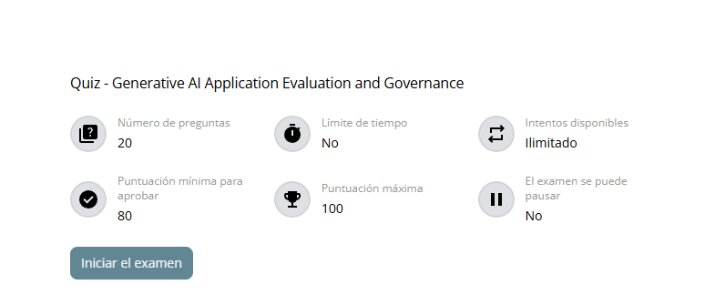

# Respuestas del cuestionario

## Datos del examen

- **Examen:** Quiz - Generative AI Application Evaluation and Governance
- **Número de preguntas:** 20
- **Límite de tiempo:** No
- **Intentos disponibles:** Ilimitados
- **Puntuación mínima para aprobar:** 80
- **Puntuación máxima:** 100
- **Se puede pausar:** No
- **Estado en la plataforma:** En curso; pendiente de envio y calificacion
- **Preguntas documentadas:** 20 de 20
- **Respuestas registradas:** 20 de 20
- **Puntuación obtenida:** Pendiente
- **Resultado oficial:** Pendiente

## Convención de respuesta

Cada pregunta se registrará con la siguiente estructura bilingüe:

1. Pregunta y opciones originales en inglés.
2. Opción correcta marcada con `[x]`.
3. Sección **Answer (EN)** con la respuesta y una justificación clara en inglés.
4. Traducción completa de la pregunta y las opciones al español.
5. Sección **Respuesta (ES)** con la respuesta y una justificación clara en español.
6. Resultado oficial o corrección de Databricks Academy, cuando se proporcione.

Las respuestas se fundamentarán primero en el material local del curso. Cuando sea necesario distinguir terminología muy similar, se explicará expresamente la diferencia.

## Registro de preguntas

## Question 1 of 20 / Pregunta 1 de 20

### English

**Question:** What does the "Answer Relevancy" metric specifically assess in a RAG pipeline?

**Options:**

- [ ] The semantic similarity between the generated response and the ground truth.
- [x] The alignment of the generated response with the user's initial query intent.
- [ ] Whether the retrieved documents contain the correct answer.
- [ ] The percentage of n-grams in the response that appear in the context.

### Answer (EN)

**Correct answer:** The alignment of the generated response with the user's initial query intent.

**Justification:** Answer Relevancy assesses how pertinent and applicable the generated response is to the user's original query. It compares the response with the query intent, not with the ground truth, retrieved documents, or n-gram overlap.

### Español

**Pregunta:** ¿Qué evalúa específicamente la métrica «Answer Relevancy» en un pipeline RAG?

**Opciones:**

- [ ] La similitud semántica entre la respuesta generada y el ground truth.
- [x] La alineación de la respuesta generada con la intención de la consulta inicial del usuario.
- [ ] Si los documentos recuperados contienen la respuesta correcta.
- [ ] El porcentaje de n-gramas de la respuesta que aparecen en el contexto.

### Respuesta (ES)

**Respuesta correcta:** La alineación de la respuesta generada con la intención de la consulta inicial del usuario.

**Justificación:** Answer Relevancy mide qué tan pertinente y aplicable es la respuesta para la consulta original. Compara la respuesta con la intención del usuario; no la compara con el ground truth, los documentos recuperados ni la coincidencia de n-gramas.

---

## Question 2 of 20 / Pregunta 2 de 20

### English

**Question:** When comparing LLM evaluation to classical ML evaluation, which distinct resource requirement is a primary challenge for LLMs?

**Options:**

- [ ] LLMs rely solely on CPU compute, making them cheaper to evaluate than classical regression models.
- [ ] LLMs require significantly less storage because they do not use feature stores.
- [x] LLMs require massive amounts of data and substantial computational resources (GPUs/TPUs) compared to the less expensive hardware of classical ML.
- [ ] Classical ML requires human judges for every prediction, whereas LLMs never require human feedback.

### Answer (EN)

**Correct answer:** LLMs require massive amounts of data and substantial computational resources (GPUs/TPUs) compared to the less expensive hardware of classical ML.

**Justification:** LLMs operate on much larger datasets and require accelerators such as GPUs or TPUs. Their evaluation therefore consumes substantially more resources than classical ML evaluation.

### Español

**Pregunta:** Al comparar la evaluación de LLM con la evaluación de machine learning clásico, ¿qué requisito de recursos constituye un desafío principal y distintivo para los LLM?

**Opciones:**

- [ ] Los LLM dependen exclusivamente de CPU, por lo que son más baratos de evaluar que los modelos clásicos de regresión.
- [ ] Los LLM requieren mucho menos almacenamiento porque no utilizan feature stores.
- [x] Los LLM necesitan cantidades masivas de datos y recursos computacionales sustanciales (GPU o TPU) en comparación con el hardware menos costoso del machine learning clásico.
- [ ] El machine learning clásico necesita jueces humanos para cada predicción, mientras que los LLM nunca requieren feedback humano.

### Respuesta (ES)

**Respuesta correcta:** Los LLM necesitan cantidades masivas de datos y recursos computacionales sustanciales (GPU o TPU) en comparación con el hardware menos costoso del machine learning clásico.

**Justificación:** Los LLM trabajan con volúmenes de datos mucho mayores y requieren aceleradores como GPU o TPU. Esto hace que su evaluación necesite más recursos que la evaluación de modelos clásicos de machine learning.

---

## Question 3 of 20 / Pregunta 3 de 20

### English

**Question:** If a base foundation model exhibits a sharp peak in its probability distribution for the next token prediction, how is this reflected in the Perplexity metric and the model's confidence?

**Options:**

- [ ] Low Perplexity, indicating low confidence and low accuracy.
- [x] Low Perplexity, indicating high confidence and accuracy.
- [ ] High Perplexity, indicating high confidence and high accuracy.
- [ ] High Perplexity, indicating low confidence and accuracy.

### Answer (EN)

**Correct answer:** Low Perplexity, indicating high confidence and accuracy.

**Justification:** A sharp probability peak means the model assigns a high probability to one next-token prediction. The model is therefore less surprised by the correct token, producing low Perplexity and indicating high confidence and predictive accuracy.

### Español

**Pregunta:** Si un foundation model base presenta un pico pronunciado en su distribución de probabilidad para predecir el siguiente token, ¿cómo se refleja esto en la métrica Perplexity y en la confianza del modelo?

**Opciones:**

- [ ] Perplexity baja, lo que indica confianza y exactitud bajas.
- [x] Perplexity baja, lo que indica confianza y exactitud altas.
- [ ] Perplexity alta, lo que indica confianza y exactitud altas.
- [ ] Perplexity alta, lo que indica confianza y exactitud bajas.

### Respuesta (ES)

**Respuesta correcta:** Perplexity baja, lo que indica confianza y exactitud altas.

**Justificación:** Un pico pronunciado significa que el modelo asigna una probabilidad alta a un token específico. Por ello, el token correcto le produce poca sorpresa: la Perplexity es baja y la confianza predictiva es alta.

---

## Question 4 of 20 / Pregunta 4 de 20

### English

**Question:** What is a shared limitation of both BLEU and ROUGE metrics when evaluating Generative AI outputs?

**Options:**

- [ ] They rely on "LLM-as-a-Judge" to generate a score, making them non-deterministic.
- [ ] They are only applicable to image generation tasks, not text.
- [ ] They can only be calculated using the Mosaic AI Agent Framework.
- [x] They both require a reference dataset and rely on n-gram matching rather than semantic understanding.

### Answer (EN)

**Correct answer:** They both require a reference dataset and rely on n-gram matching rather than semantic understanding.

**Justification:** BLEU and ROUGE compare generated text with reference text through word or n-gram overlap. They may miss valid answers that express the same meaning with different wording.

### Español

**Pregunta:** ¿Cuál es una limitación compartida por las métricas BLEU y ROUGE al evaluar salidas de IA generativa?

**Opciones:**

- [ ] Dependen de LLM-as-a-Judge para generar una puntuación, por lo que no son deterministas.
- [ ] Solo se aplican a tareas de generación de imágenes, no a texto.
- [ ] Solo pueden calcularse mediante Mosaic AI Agent Framework.
- [x] Ambas necesitan un dataset de referencia y dependen de coincidencias de n-gramas en lugar de comprensión semántica.

### Respuesta (ES)

**Respuesta correcta:** Ambas necesitan un dataset de referencia y dependen de coincidencias de n-gramas en lugar de comprensión semántica.

**Justificación:** BLEU y ROUGE comparan el texto generado con referencias mediante coincidencias de palabras o n-gramas. Por ello, pueden penalizar respuestas válidas que expresan el mismo significado con palabras diferentes.

---

## Question 5 of 20 / Pregunta 5 de 20

### English

**Question:** In an MLflow evaluation workflow for a custom "Professionalism" metric, what are the three essential steps required to perform the evaluation?

**Options:**

- [ ] 1) Train a new model, 2) Deploy to production, 3) Check latency.
- [ ] 1) Ingest data into Delta Lake, 2) Run a SQL query, 3) Visualize in a dashboard.
- [ ] 1) Define a BLEU score, 2) Define a ROUGE score, 3) Average them together.
- [x] 1) Create evaluation records, 2) Create a metric object (including definition, grading prompt, and scoring criteria), 3) Evaluate the model against a dataset using the metric.

### Answer (EN)

**Correct answer:** 1) Create evaluation records, 2) Create a metric object, 3) Evaluate the model against a dataset using the metric.

**Justification:** The records provide examples, the metric object defines the professionalism rubric and judge configuration, and the evaluation applies that metric to the model's outputs over a dataset.

### Español

**Pregunta:** En un flujo de evaluación de MLflow para una métrica personalizada de «Professionalism», ¿cuáles son los tres pasos esenciales para realizar la evaluación?

**Opciones:**

- [ ] 1) Entrenar un modelo nuevo, 2) desplegarlo en producción, 3) comprobar la latencia.
- [ ] 1) Ingerir datos en Delta Lake, 2) ejecutar una consulta SQL, 3) visualizarlos en un dashboard.
- [ ] 1) Definir BLEU, 2) definir ROUGE, 3) calcular el promedio de ambos.
- [x] 1) Crear registros de evaluación, 2) crear un objeto de métrica con definición, grading prompt y criterios de puntuación, 3) evaluar el modelo contra un dataset mediante esa métrica.

### Respuesta (ES)

**Respuesta correcta:** 1) Crear registros de evaluación, 2) crear el objeto de métrica, 3) evaluar el modelo contra un dataset mediante la métrica.

**Justificación:** Los registros aportan ejemplos; el objeto de métrica define la rúbrica de profesionalismo y la configuración del juez; finalmente, la evaluación aplica esa métrica a las salidas del modelo sobre un dataset.

---

## Question 6 of 20 / Pregunta 6 de 20

### English

**Question:** In a RAG (Retrieval Augmented Generation) architecture, why is it critical to evaluate the "Context Precision" metric?

**Options:**

- [x] To determine the signal-to-noise ratio of the retrieved context, ensuring relevant chunks are ranked higher than irrelevant ones.
- [ ] To calculate the cost of the embedding model in dollars per token.
- [ ] To ensure the user's query does not contain PII (Personally Identifiable Information).
- [ ] To measure the grammatical correctness of the final answer generated by the LLM.

### Answer (EN)

**Correct answer:** To determine the signal-to-noise ratio of the retrieved context, ensuring relevant chunks are ranked higher than irrelevant ones.

**Justification:** Context Precision evaluates retrieval quality. A high score means relevant chunks appear above irrelevant material, giving the generator cleaner and more useful context.

### Español

**Pregunta:** En una arquitectura RAG, ¿por qué es fundamental evaluar la métrica «Context Precision»?

**Opciones:**

- [x] Para determinar la relación señal-ruido del contexto recuperado y asegurar que los fragmentos relevantes se clasifiquen por encima de los irrelevantes.
- [ ] Para calcular el costo del modelo de embeddings en dólares por token.
- [ ] Para asegurar que la consulta del usuario no contenga información personal identificable (PII).
- [ ] Para medir la corrección gramatical de la respuesta final generada por el LLM.

### Respuesta (ES)

**Respuesta correcta:** Determinar la relación señal-ruido del contexto recuperado y asegurar que los fragmentos relevantes aparezcan antes que los irrelevantes.

**Justificación:** Context Precision evalúa la calidad del retrieval. Una puntuación alta indica que el sistema prioriza información relevante y proporciona al generador un contexto más limpio y útil.

---

## Question 7 of 20 / Pregunta 7 de 20

### English

**Question:** Which RAG evaluation metric measures the factual accuracy of the generated answer specifically in relation to the provided context, without necessarily checking against a ground truth?

**Options:**

- [ ] Answer Correctness
- [x] Faithfulness
- [ ] Toxicity
- [ ] Context Recall

### Answer (EN)

**Correct answer:** Faithfulness

**Justification:** Faithfulness checks whether the claims in the generated answer are supported by the retrieved context. Answer Correctness instead compares the response with a ground truth.

### Español

**Pregunta:** ¿Qué métrica de evaluación RAG mide la exactitud factual de la respuesta generada específicamente respecto del contexto proporcionado, sin compararla necesariamente con un ground truth?

**Opciones:**

- [ ] Answer Correctness
- [x] Faithfulness
- [ ] Toxicity
- [ ] Context Recall

### Respuesta (ES)

**Respuesta correcta:** Faithfulness

**Justificación:** Faithfulness comprueba si las afirmaciones de la respuesta están respaldadas por el contexto recuperado. Answer Correctness, en cambio, compara la respuesta con un ground truth.

---

## Question 8 of 20 / Pregunta 8 de 20

### English

**Question:** Within the Data and AI Security Framework (DASF), which component focuses on the governance of data assets through centralized access control, lineage, and auditing to ensure data quality and reliability?

**Options:**

- [x] Catalog
- [ ] Algorithm
- [ ] Model Management
- [ ] Evaluation

### Answer (EN)

**Correct answer:** Catalog

**Justification:** The Catalog component governs data assets throughout their lifecycle through centralized permissions, lineage, auditing, and discovery. These controls support data quality and reliability.

### Español

**Pregunta:** Dentro del Data and AI Security Framework (DASF), ¿qué componente se concentra en gobernar los activos de datos mediante control de acceso centralizado, lineage y auditoría para garantizar calidad y confiabilidad?

**Opciones:**

- [x] Catalog
- [ ] Algorithm
- [ ] Model Management
- [ ] Evaluation

### Respuesta (ES)

**Respuesta correcta:** Catalog

**Justificación:** Catalog gobierna los activos de datos durante todo su ciclo de vida mediante permisos centralizados, lineage, auditoría y discovery. Estos controles favorecen la calidad y confiabilidad de los datos.

---

## Question 9 of 20 / Pregunta 9 de 20

### English

**Question:** An attacker inputs a query designed to override a GenAI system's instructions to extract private information or generate harmful responses. Which term best describes this security risk, and what is the primary mitigation strategy discussed?

**Options:**

- [ ] Data Drift; mitigated by retraining the model on fresh data using Lakehouse Monitoring.
- [x] Prompt Injection; mitigated by implementing guardrails to filter inputs and outputs.
- [ ] Hallucination; mitigated by lowering the temperature parameter of the model.
- [ ] Model Poisoning; mitigated by increasing the size of the validation dataset.

### Answer (EN)

**Correct answer:** Prompt Injection; mitigated by implementing guardrails to filter inputs and outputs.

**Justification:** Prompt Injection attempts to override the system's intended instructions. Input and output guardrails detect or block unsafe prompts and harmful model responses.

### Español

**Pregunta:** Un atacante introduce una consulta diseñada para anular las instrucciones de un sistema GenAI, extraer información privada o generar respuestas perjudiciales. ¿Qué término describe mejor este riesgo y cuál es la estrategia principal de mitigación?

**Opciones:**

- [ ] Data Drift; mitigado reentrenando el modelo con datos recientes mediante Lakehouse Monitoring.
- [x] Prompt Injection; mitigado implementando guardrails que filtren entradas y salidas.
- [ ] Hallucination; mitigada reduciendo el parámetro temperature del modelo.
- [ ] Model Poisoning; mitigado aumentando el tamaño del dataset de validación.

### Respuesta (ES)

**Respuesta correcta:** Prompt Injection; mitigado implementando guardrails que filtren entradas y salidas.

**Justificación:** Prompt Injection intenta sobrescribir las instrucciones previstas del sistema. Los guardrails de entrada y salida permiten detectar o bloquear prompts inseguros y respuestas perjudiciales del modelo.

---

## Question 10 of 20 / Pregunta 10 de 20

### English

**Question:** Which distinction best describes the difference between Offline and Online Evaluation of LLMs?

**Options:**

- [x] Offline evaluation uses benchmark datasets and reference data (or LLM-as-a-Judge) prior to production; Online evaluation uses real user behavior and feedback within production.
- [ ] Offline evaluation measures latency; Online evaluation measures accuracy.
- [ ] Offline evaluation is manual; Online evaluation is fully automated by MLflow.
- [ ] Offline evaluation occurs in the cloud; Online evaluation occurs on-device.

### Answer (EN)

**Correct answer:** Offline evaluation uses benchmark datasets and reference data (or LLM-as-a-Judge) prior to production; Online evaluation uses real user behavior and feedback within production.

**Justification:** Offline evaluation validates a system in a controlled environment before release. Online evaluation observes deployed-system performance through real interactions, direct feedback, and behavioral signals.

### Español

**Pregunta:** ¿Qué distinción describe mejor la diferencia entre la evaluación offline y online de LLM?

**Opciones:**

- [x] La evaluación offline utiliza benchmarks y datos de referencia (o LLM-as-a-Judge) antes de producción; la evaluación online utiliza conducta y feedback de usuarios reales en producción.
- [ ] La evaluación offline mide latencia; la evaluación online mide exactitud.
- [ ] La evaluación offline es manual; la evaluación online está completamente automatizada por MLflow.
- [ ] La evaluación offline ocurre en la nube; la evaluación online ocurre en el dispositivo.

### Respuesta (ES)

**Respuesta correcta:** La evaluación offline utiliza benchmarks y referencias antes de producción; la evaluación online utiliza conducta y feedback reales dentro de producción.

**Justificación:** Offline valida el sistema en un entorno controlado antes de publicarlo. Online observa su desempeño ya desplegado mediante interacciones reales, feedback directo y señales de comportamiento.

---

## Question 11 of 20 / Pregunta 11 de 20

### English

**Question:** According to the Data and AI Security Framework (DASF), identifying security risks is complex because few practitioners have a complete picture of the system. Which stakeholder gap is explicitly identified as a challenge in AI security?

**Options:**

- [ ] Cloud providers do not offer encryption for vector databases.
- [ ] Legal teams often refuse to review the code of generative models.
- [x] Data scientists typically have not performed security tasks, and security teams are often new to AI architectures.
- [ ] Executive leadership prioritizes speed over compliance in 90% of organizations.

### Answer (EN)

**Correct answer:** Data scientists typically have not performed security tasks, and security teams are often new to AI architectures.

**Justification:** AI security spans several disciplines. Data scientists may lack security experience, while security teams may not yet understand probabilistic AI behavior and complex model architectures.

### Español

**Pregunta:** Según DASF, identificar riesgos es complejo porque pocos profesionales poseen una visión completa del sistema. ¿Qué brecha entre los participantes se identifica explícitamente como un desafío de seguridad de IA?

**Opciones:**

- [ ] Los proveedores cloud no ofrecen cifrado para bases de datos vectoriales.
- [ ] Los equipos legales suelen negarse a revisar el código de modelos generativos.
- [x] Los científicos de datos normalmente no han realizado tareas de seguridad y los equipos de seguridad suelen ser nuevos en arquitecturas de IA.
- [ ] La dirección ejecutiva prioriza la velocidad sobre el cumplimiento en el 90 % de las organizaciones.

### Respuesta (ES)

**Respuesta correcta:** Los científicos de datos suelen carecer de experiencia en seguridad y los equipos de seguridad todavía están aprendiendo las arquitecturas de IA.

**Justificación:** La seguridad de IA abarca varias disciplinas. Un equipo conoce los modelos, mientras el otro domina la seguridad; ninguno posee necesariamente la visión completa del sistema.

---

## Question 12 of 20 / Pregunta 12 de 20

### English

**Question:** How does Unity Catalog support the governance of GenAI applications specifically regarding vector search and retrieval?

**Options:**

- [ ] It automatically rewrites user prompts to remove toxic language before they reach the model.
- [x] It governs vector indexes in Vector Search, manages GenAI models, and tracks end-to-end lineage of application data.
- [ ] It provides a proprietary "LLM-as-a-Judge" model to score the accuracy of vector embeddings.
- [ ] It encrypts the GPU memory used during the inference process of the foundation model.

### Answer (EN)

**Correct answer:** It governs vector indexes in Vector Search, manages GenAI models, and tracks end-to-end lineage of application data.

**Justification:** Unity Catalog centralizes governance for data and AI assets. It controls access to models and vector indexes and records lineage across the application's data flow.

### Español

**Pregunta:** ¿Cómo apoya Unity Catalog el gobierno de aplicaciones GenAI específicamente respecto de vector search y retrieval?

**Opciones:**

- [ ] Reescribe automáticamente los prompts para eliminar lenguaje tóxico antes de que lleguen al modelo.
- [x] Gobierna los índices vectoriales de Vector Search, administra modelos GenAI y registra el lineage end-to-end de los datos de la aplicación.
- [ ] Proporciona un modelo propietario LLM-as-a-Judge para puntuar la exactitud de los embeddings.
- [ ] Cifra la memoria GPU utilizada durante la inferencia del foundation model.

### Respuesta (ES)

**Respuesta correcta:** Gobierna los índices de Vector Search, administra los modelos GenAI y registra el lineage end-to-end de los datos.

**Justificación:** Unity Catalog centraliza el gobierno de los activos de datos e IA. Controla el acceso a modelos e índices vectoriales y conserva la trazabilidad del flujo de datos de la aplicación.

---

## Question 13 of 20 / Pregunta 13 de 20

### English

**Question:** In the context of Generative AI evaluation, how does the concept of "Truth" differ from classical Machine Learning (ML) evaluation, presenting a specific challenge for governance?

**Options:**

- [ ] Classical ML produces probabilistic outputs that are impossible to audit, whereas GenAI outputs are deterministic.
- [x] In GenAI, there is often no single true or correct answer for a given input, unlike classical ML which typically compares predictions to specific target label data.
- [ ] GenAI models are incapable of processing labeled data, whereas classical ML relies exclusively on unsupervised learning.
- [ ] GenAI models automatically filter "Truth" based on training data toxicity scores, whereas classical ML requires manual intervention.

### Answer (EN)

**Correct answer:** In GenAI, there is often no single true or correct answer for a given input, unlike classical ML which typically compares predictions to specific target label data.

**Justification:** Classical ML often has a defined target label. Generative tasks can have several different but valid responses, making ground truth and governance criteria harder to define.

### Español

**Pregunta:** En la evaluación de IA generativa, ¿cómo difiere el concepto de «verdad» respecto de la evaluación clásica de machine learning, creando un desafío particular para el gobierno?

**Opciones:**

- [ ] El ML clásico produce salidas probabilísticas imposibles de auditar, mientras que las salidas GenAI son deterministas.
- [x] En GenAI frecuentemente no existe una única respuesta verdadera o correcta, mientras que el ML clásico suele comparar predicciones con etiquetas objetivo específicas.
- [ ] Los modelos GenAI no pueden procesar datos etiquetados, mientras que el ML clásico utiliza exclusivamente aprendizaje no supervisado.
- [ ] Los modelos GenAI filtran automáticamente la verdad mediante puntuaciones de toxicidad, mientras que el ML clásico requiere intervención manual.

### Respuesta (ES)

**Respuesta correcta:** En GenAI puede no existir una única respuesta correcta, a diferencia del ML clásico, que normalmente dispone de una etiqueta objetivo específica.

**Justificación:** Una tarea clásica suele tener un target definido. Una tarea generativa puede admitir varias respuestas diferentes y válidas, por lo que resulta más difícil establecer un único ground truth y criterios de gobierno.

---

## Question 14 of 20 / Pregunta 14 de 20

### English

**Question:** How does "Answer Correctness" differ from "Faithfulness" in RAG evaluation?

**Options:**

- [ ] There is no difference; they are synonymous terms in the Mosaic AI framework.
- [ ] Answer Correctness is an offline metric; Faithfulness is only available in online evaluation.
- [ ] Faithfulness compares the response to the ground truth; Answer Correctness compares the response to the context.
- [x] Answer Correctness requires a Ground Truth to measure accuracy; Faithfulness checks if the answer is derived purely from the retrieved context.

### Answer (EN)

**Correct answer:** Answer Correctness requires a Ground Truth to measure accuracy; Faithfulness checks if the answer is derived purely from the retrieved context.

**Justification:** Answer Correctness compares the response with a validated answer. Faithfulness instead checks whether the response's claims are supported by the retrieved context.

### Español

**Pregunta:** ¿En qué se diferencia «Answer Correctness» de «Faithfulness» en la evaluación RAG?

**Opciones:**

- [ ] No existe diferencia; son términos sinónimos en Mosaic AI Framework.
- [ ] Answer Correctness es una métrica offline; Faithfulness solo está disponible online.
- [ ] Faithfulness compara la respuesta con el ground truth; Answer Correctness la compara con el contexto.
- [x] Answer Correctness necesita un ground truth para medir exactitud; Faithfulness comprueba si la respuesta se deriva del contexto recuperado.

### Respuesta (ES)

**Respuesta correcta:** Answer Correctness compara con el ground truth; Faithfulness comprueba el respaldo de la respuesta en el contexto recuperado.

**Justificación:** Correctness determina si la respuesta coincide con una respuesta validada. Faithfulness determina si sus afirmaciones están sustentadas por el contexto utilizado para generarla.

---

## Question 15 of 20 / Pregunta 15 de 20

### English

**Question:** When evaluating data legality for a GenAI application intended for commercial profit, which of the following scenarios presents a violation based on the course's discussion of data licensing?

**Options:**

- [x] Using a dataset licensed for "personal and research purposes" to train a model that powers a paid subscription service.
- [ ] Using a pre-trained model that includes a "Safety Filter" to block toxic outputs.
- [ ] Using a dataset with an open-source license that permits modification and redistribution for any purpose.
- [ ] Training a model on internal company data that has been fully anonymized and approved by the legal team.

### Answer (EN)

**Correct answer:** Using a dataset licensed for "personal and research purposes" to train a model that powers a paid subscription service.

**Justification:** A paid service is a commercial use. A license limited to personal and research purposes does not grant the required commercial rights.

### Español

**Pregunta:** Al evaluar la legalidad de los datos para una aplicación GenAI con fines comerciales, ¿qué escenario representa una infracción según la explicación del curso sobre licencias?

**Opciones:**

- [x] Usar un dataset autorizado para «fines personales y de investigación» para entrenar un modelo que impulsa un servicio de suscripción pagado.
- [ ] Usar un modelo preentrenado con un Safety Filter para bloquear salidas tóxicas.
- [ ] Usar un dataset con licencia open source que permite modificación y redistribución para cualquier propósito.
- [ ] Entrenar un modelo con datos internos totalmente anonimizados y aprobados por el equipo legal.

### Respuesta (ES)

**Respuesta correcta:** Usar un dataset limitado a fines personales y de investigación en un servicio de suscripción pagado.

**Justificación:** Un servicio pagado constituye uso comercial. Una licencia restringida a fines personales y de investigación no concede los derechos comerciales necesarios.

---

## Question 16 of 20 / Pregunta 16 de 20

### English

**Question:** When using "LLM-as-a-Judge" to evaluate complex cases where reference data is unavailable, what is a recommended best practice to improve the reliability of the metrics?

**Options:**

- [ ] Avoid providing a rubric or specific instructions to prevent biasing the judge model.
- [x] Implement a "Human-in-the-loop" process to review metrics generated by the LLM and handle ambiguities.
- [ ] Use the smallest possible model (e.g., 7B parameters) to ensure faster processing speeds.
- [ ] Rely exclusively on the "toxicity" metric as it is the only stable metric for LLMs.

### Answer (EN)

**Correct answer:** Implement a "Human-in-the-loop" process to review metrics generated by the LLM and handle ambiguities.

**Justification:** A judge LLM can misunderstand context, hallucinate judgments, or reproduce bias. Human review validates its metrics and resolves ambiguous or high-impact cases.

### Español

**Pregunta:** Al utilizar LLM-as-a-Judge para evaluar casos complejos sin datos de referencia, ¿qué práctica se recomienda para mejorar la confiabilidad de las métricas?

**Opciones:**

- [ ] Evitar una rúbrica o instrucciones específicas para no sesgar al modelo juez.
- [x] Implementar un proceso Human-in-the-loop que revise las métricas generadas por el LLM y resuelva ambigüedades.
- [ ] Utilizar el modelo más pequeño posible para garantizar mayor velocidad.
- [ ] Depender exclusivamente de toxicity porque es la única métrica estable para LLM.

### Respuesta (ES)

**Respuesta correcta:** Implementar Human-in-the-loop para revisar las métricas generadas por el LLM y resolver ambigüedades.

**Justificación:** Un juez LLM puede interpretar mal el contexto, alucinar evaluaciones o reproducir sesgos. La revisión humana valida sus métricas y resuelve casos ambiguos o de alto impacto.

---

## Question 17 of 20 / Pregunta 17 de 20

### English

**Question:** Which description best characterizes the architecture and function of Llama Guard as a safeguard model?

**Options:**

- [ ] It is a vector database tool that removes high-perplexity tokens from the context window.
- [x] It is an LLM-based classifier that uses a taxonomy of risks and guidelines to classify and mitigate safety risks in both user prompts and model responses.
- [ ] It is a post-processing script that only evaluates the final output of the model for grammatical correctness.
- [ ] It is a keyword-matching filter that blocks any prompt containing words from a static "banned list."

### Answer (EN)

**Correct answer:** It is an LLM-based classifier that uses a taxonomy of risks and guidelines to classify and mitigate safety risks in both user prompts and model responses.

**Justification:** Llama Guard classifies content against defined risk categories and follows guidelines that specify the required action. It can protect both the input before the LLM and the output before delivery.

### Español

**Pregunta:** ¿Qué descripción caracteriza mejor la arquitectura y función de Llama Guard como modelo de protección?

**Opciones:**

- [ ] Es una herramienta de base de datos vectorial que elimina tokens con perplexity alta.
- [x] Es un clasificador basado en LLM que utiliza una taxonomía de riesgos y directrices para clasificar y mitigar riesgos en prompts y respuestas.
- [ ] Es un script de posprocesamiento que solo evalúa la corrección gramatical de la salida final.
- [ ] Es un filtro de palabras clave que bloquea cualquier prompt con términos de una lista estática.

### Respuesta (ES)

**Respuesta correcta:** Es un clasificador basado en LLM que utiliza una taxonomía de riesgos y directrices para proteger prompts y respuestas.

**Justificación:** Llama Guard clasifica el contenido según categorías de riesgo y aplica directrices que determinan la acción correspondiente. Puede proteger tanto la entrada antes del LLM como la salida antes de entregarla.

---

## Question 18 of 20 / Pregunta 18 de 20

### English

**Question:** To calculate "Context Recall," which two specific data elements are required?

**Options:**

- [ ] The User Query and the Generated Response.
- [x] The Ground Truth and the Retrieved Context(s).
- [ ] The Generated Response and the Retrieved Context.
- [ ] The User Query and the Latency logs.

### Answer (EN)

**Correct answer:** The Ground Truth and the Retrieved Context(s).

**Justification:** Context Recall measures whether the retrieved context contains all information required by the ground truth. It therefore compares the expected facts with the retrieved contexts.

### Español

**Pregunta:** Para calcular «Context Recall», ¿qué dos elementos de datos específicos se necesitan?

**Opciones:**

- [ ] La consulta del usuario y la respuesta generada.
- [x] El ground truth y los contextos recuperados.
- [ ] La respuesta generada y el contexto recuperado.
- [ ] La consulta del usuario y los registros de latencia.

### Respuesta (ES)

**Respuesta correcta:** El ground truth y los contextos recuperados.

**Justificación:** Context Recall mide si el contexto recuperado contiene toda la información exigida por el ground truth. Por ello, compara los hechos esperados con los contextos obtenidos.

---

## Question 19 of 20 / Pregunta 19 de 20

### English

**Question:** Which statement accurately contrasts the BLEU and ROUGE evaluation metrics?

**Options:**

- [ ] Both metrics are semantic evaluators that use embeddings to determine the emotional tone of the text.
- [x] BLEU compares n-gram similarities for translation (precision-oriented); ROUGE calculates n-gram recall, making it suitable for summarization gisting.
- [ ] BLEU is a recall-oriented metric used primarily for summarization; ROUGE is a precision-oriented metric used for translation.
- [ ] BLEU measures the toxicity of the output, while ROUGE measures the latency of the request.

### Answer (EN)

**Correct answer:** BLEU compares n-gram similarities for translation (precision-oriented); ROUGE calculates n-gram recall, making it suitable for summarization gisting.

**Justification:** BLEU is commonly used to evaluate translations through n-gram overlap with references. ROUGE emphasizes recall of reference content and is commonly used for summarization.

### Español

**Pregunta:** ¿Qué afirmación contrasta correctamente las métricas BLEU y ROUGE?

**Opciones:**

- [ ] Ambas son evaluadores semánticos que utilizan embeddings para determinar el tono emocional.
- [x] BLEU compara similitudes de n-gramas para traducción y se orienta a precision; ROUGE calcula recall de n-gramas y resulta apropiada para evaluar resúmenes.
- [ ] BLEU se orienta a recall y se utiliza para resumen; ROUGE se orienta a precision y se utiliza para traducción.
- [ ] BLEU mide toxicidad y ROUGE mide latencia.

### Respuesta (ES)

**Respuesta correcta:** BLEU evalúa traducción mediante coincidencias de n-gramas; ROUGE mide el recall de n-gramas y se utiliza para resumen.

**Justificación:** BLEU suele evaluar traducciones comparándolas con referencias. ROUGE enfatiza cuánto contenido de la referencia aparece en la salida, por lo que es habitual en tareas de resumen.

---

## Question 20 of 20 / Pregunta 20 de 20

### English

**Question:** The Mosaic AI Agent Framework facilitates "Agent Evaluation" by providing which specific set of capabilities?

**Options:**

- [ ] A tool that automatically rewrites the underlying Python code of the agent to improve performance.
- [x] A suite of tools to trace agent behavior, evaluate quality with RAG-specific metrics, and collect human feedback via a Review App.
- [ ] A dashboard that only displays the cost of API calls and no quality metrics.
- [ ] A strictly manual spreadsheet for logging errors found by QA testers.

### Answer (EN)

**Correct answer:** A suite of tools to trace agent behavior, evaluate quality with RAG-specific metrics, and collect human feedback via a Review App.

**Justification:** Agent Evaluation combines step-level tracing, RAG quality metrics, LLM judges, and the Review App. These capabilities support debugging, automated evaluation, root-cause analysis, and human feedback.

### Español

**Pregunta:** ¿Qué conjunto específico de capacidades proporciona Mosaic AI Agent Framework para facilitar Agent Evaluation?

**Opciones:**

- [ ] Una herramienta que reescribe automáticamente el código Python del agente para mejorar el rendimiento.
- [x] Una suite para trazar el comportamiento del agente, evaluar calidad con métricas RAG y recopilar feedback humano mediante una Review App.
- [ ] Un dashboard que muestra únicamente el costo de llamadas API y ninguna métrica de calidad.
- [ ] Una hoja de cálculo estrictamente manual para registrar errores encontrados por QA.

### Respuesta (ES)

**Respuesta correcta:** Una suite para tracing del agente, evaluación mediante métricas RAG y recopilación de feedback humano con Review App.

**Justificación:** Agent Evaluation combina tracing de cada paso, métricas de calidad RAG, jueces LLM y Review App. Esto facilita debugging, evaluación automatizada, análisis de causa raíz y revisión humana.
