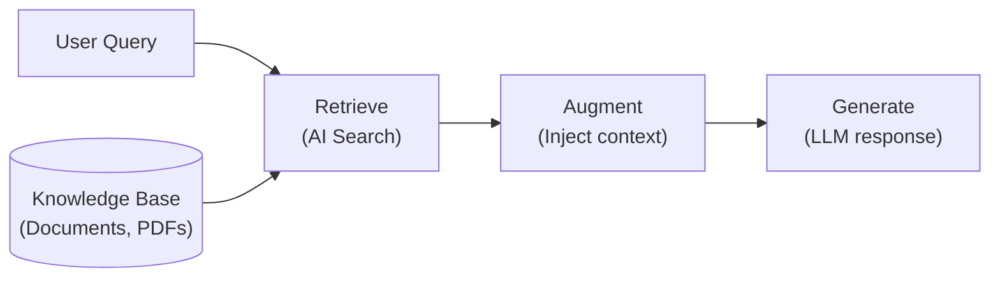

# Módulo 1: Agent Bricks for Retrieval and Context Engineering
## Curso 3: Building RAG Agents with Agent Bricks (Databricks Academy)

> **Tipo de contenido:** Transcripción literal y completa de la lección oficial de Databricks Academy  
> **ID del objeto de aprendizaje:** `64405:3570`  
> **Estado:** Oficial Databricks Academy

---

## 1. Overview y Objetivos de Aprendizaje

### Overview
This lecture introduces the core ideas behind retrieval agents and context engineering on Databricks. We'll cover why prompting alone isn't enough, how Retrieval Augmented Generation (RAG) fills the gap, what context engineering means for agent systems, and how Databricks Knowledge Assistants offer a managed path to production-grade RAG.

### Learning Objectives
By the end of this lecture, you will be able to:
1. Explain what retrieval agents are and why they are needed.
2. Define context engineering and distinguish it from prompt engineering.
3. Describe Databricks Knowledge Assistants as a managed retrieval agent solution.
4. Identify the key components of a Knowledge Assistant.

---

## 2. A. Introduction to Retrieval Agents

### A1. Why Retrieval Agents?
Large Language Models (LLMs) are powerful, but they have hard limits. No amount of prompt refinement can overcome:
- **Knowledge cutoffs:** The model doesn't know about events after its training date.
- **Hallucination:** The model fabricates plausible-sounding facts when it lacks real data.
- **Missing private context:** The model has no access to your organization's proprietary documents.

**Retrieval Augmented Generation (RAG)** addresses these limits by injecting relevant external data into the model's context at query time. Instead of relying on frozen training data, a RAG system:
1. **Retrieves** relevant documents.
2. **Augments** the prompt with them.
3. Lets the model **generate** a grounded response.

A **retrieval agent** is a concrete implementation of this pattern that handles query routing, retrieval orchestration, and context assembly within a real system.

### RAG Pipeline Flowchart



#### Recursos de profundización
Documentación oficial de Databricks sobre Retrieval Augmented Generation:
- [Databricks RAG en AWS](https://docs.databricks.com/aws/en/generative-ai/retrieval-augmented-generation#what-is-retrieval-augmented-generation)
- [Databricks RAG en Azure](https://learn.microsoft.com/en-us/azure/databricks/generative-ai/retrieval-augmented-generation#what-is-retrieval-augmented-generation)
- [Databricks RAG en GCP](https://docs.databricks.com/gcp/en/generative-ai/retrieval-augmented-generation#what-is-retrieval-augmented-generation)

---

## 3. B. Introduction to Context Engineering

### B1. From Prompt Engineering to Context Engineering
- **Prompt engineering:** Focuses on crafting the instruction text sent to a model. It involves choosing the right words, formatting, and examples. It is tactical and operates at the level of a single query.
- **Context engineering:** A broader discipline. It is the art and science of designing the **entire information environment** that a model receives: not just the question, but all the supporting data, instructions, history, and constraints that shape the model's decision at inference time.

> **Analogía pedagógica:**  
> Prompt engineering es redactar una buena pregunta en un examen.  
> Context engineering es diseñar el aula entera del examen: los materiales de referencia sobre el pupitre, las instrucciones en la pizarra y las reglas de qué recursos están permitidos.

### Comparativa: Prompt Engineering vs. Context Engineering

| Característica | Prompt Engineering | Context Engineering |
| :--- | :--- | :--- |
| **Alcance** | Texto de instrucción de la consulta | Todo el entorno de entrada del modelo |
| **Componentes típicos** | - Instrucciones del sistema<br>- Ejemplos few-shot<br>- Prompt del usuario | - Instrucciones del sistema persistentes<br>- Documentos recuperados + metadatos<br>- Historial de conversación + restricciones de usuario (Lakebase)<br>- Uso de herramientas (MCP + Genie)<br>- Prompt del usuario |
| **Gestión** | Táctica, a nivel de prompt individual | Estratégica, administra todo el estado del contexto a lo largo de turnos |

### B2. Why Context Engineering Matters for Agents
When building AI agents (systems that reason, plan, and take actions), context engineering becomes essential. An agent doesn't just answer one question; it makes a **sequence** of decisions, each of which depends on having the right information available.

Effective context engineering for agents involves:
1. **Providing the right information at the right time:** Supplying relevant retrieved data, tool outputs, and prior decisions without overwhelming the model with noise.
2. **Writing clear instructions that persist:** System prompts that define behavior, constraints, and output format across multiple turns.
3. **Managing state across turns:** Summarizing conversation history, pruning irrelevant context, and keeping token budgets under control.
4. **Keeping the context trustworthy:** Grounding the model strictly in retrieved facts and preventing hallucination through explicit instructions.

> **Resumen clave:**  
> La calidad de la respuesta de un agente está acotada por la calidad de su contexto. Ningún modelo puede razonar bien sobre entradas deficientes. Context engineering es la práctica de asegurar que cada token dentro de la ventana de entrada se gane su lugar.

---

## 4. C. Overview of Agent Bricks Knowledge Assistant

### Arquitectura de 4 Etapas de un Knowledge Assistant

```
[ Etapa 1: Indexing (Offline) ]
┌─────────────────────────────┐         ┌──────────────────────────────┐
│       Ingest & Parse        │ ──────> │        Embed & Index         │
│ UC volumes/tables → chunks  │         │ databricks-gte-large-en →    │
│ + metadata                  │         │ AI Search index              │
└─────────────────────────────┘         └──────────────────────────────┘
                                                       │
                                                       ▼
[ Etapa 2: Retrieval (Online) ]
┌─────────────────────────────┐         ┌──────────────────────────────┐         ┌──────────────────────────────┐
│        Receive Query        │ ──────> │    Plan Retrieval (IR)       │ ──────> │        Search & Rank         │
│ User question hits endpoint │         │ Pick sources → tailored      │         │ AI Search → rerank →         │
│                             │         │ sub-queries                  │         │ evidence set                 │
└─────────────────────────────┘         └──────────────────────────────┘         └──────────────────────────────┘
                                                                                               │
                                                                                               ▼
[ Etapa 3: Generation (Online) ]
                                                                                 ┌──────────────────────────────┐
                                                                                 │       Generate Answer        │
                                                                                 │ LLM grounds on chunks →      │
                                                                                 │ cited answer (doc & page)    │
                                                                                 └──────────────────────────────┘
                                                                                               │
                                                                                               ▼
[ Etapa 4: Feedback Loop (Continuous Tuning) ]
                                                                                 ┌──────────────────────────────┐
                                                                                 │   Log & Learn (ALHF)         │
                                                                                 │ Trace + SME feedback →       │
                                                                                 │ refines retrieval & gen      │
                                                                                 └──────────────────────────────┘
```

### Detalle de las Cuatro Fases:
1. **Pipelines / Transformations (Offline):** Ingesta volúmenes o tablas de Unity Catalog (o índices preexistentes de Vector Search), y ejecuta **parse, chunk, embed e index** de los documentos, normalizando metadatos.
2. **Retrieval (Online):** Recibe la consulta del usuario, ejecuta **Plan Retrieval** con el *Instructed Retriever* seleccionando las fuentes y generando subconsultas personalizadas, y luego ejecuta **Search and Rank** para obtener el conjunto de evidencia ordenado.
3. **Generation (Online):** El LLM genera una **respuesta fundamentada (grounded answer)** a partir del contexto recuperado, agregando **citas a nivel de documento y página** (útiles tanto para el usuario final como para los evaluadores).
4. **Feedback Loop (Optimización Continua):** Utiliza la evaluación de MLflow (trazas, jueces LLM, datasets de evaluación específicos por tarea) y **Agent Learning from Human Feedback (ALHF)** para refinar tanto el comportamiento de recuperación como la generación de respuestas.

---

## 5. C1. Knowledge Source Types

Un Knowledge Assistant puede consultar múltiples fuentes de conocimiento simultáneamente (hasta **10 fuentes por agente**):

| Source Type | Descripción | Casos de Uso Ideales |
| :--- | :--- | :--- |
| **Files in UC Volume** | Apunta a un volumen de Unity Catalog con archivos `.txt`, `.pdf`, `.md`, `.ppt/.pptx` o `.doc/.docx`. Knowledge Assistant los parsea, divide en fragmentos, genera embeddings e indexa automáticamente. Archivos **> 50 MB son omitidos automáticamente**. | Colecciones de documentos que cambian con el tiempo (políticas, manuales, especificaciones). |
| **AI Search Index** | Conecta un índice preconstruido de Databricks AI Search (debe utilizar obligatoriamente **`databricks-gte-large-en`** como modelo de embedding). El usuario gestiona el pipeline de parseo, chunking e indexación. | Pipelines de RAG personalizados donde ya se administra el esquema y el ciclo de vida del índice. |
| **Files in UC Table / File Table** | Utiliza una tabla de Unity Catalog (debe ser una **streaming table** o tener **Change Data Feed habilitado**) con una columna `content` (BINARY o STRING) que almacena el archivo y una estructura `_metadata` o `metadata` con ruta, nombre, tamaño y fecha de modificación. KA ingiere y crea su propio índice. | Documentos ingeridos mediante conectores corporativos (SharePoint, Google Drive, Jira, Confluence) que aterrizan como file tables en Lakehouse. |

---

## 6. C2. Declarative vs. Code-First Approaches

Databricks ofrece dos enfoques complementarios para construir agentes de recuperación:

| Dimensión | Enfoque Declarativo (Knowledge Assistant) | Enfoque Code-First (Custom Agents / Supervisor) |
| :--- | :--- | :--- |
| **Enfoque** | Declara *qué* quieres; el sistema aprende y optimiza el *cómo*. | Escribe la lógica de recuperación, prompts, herramientas y orquestación manualmente. |
| **Tiempo de configuración** | Minutos | Horas o días |
| **Personalización** | Guiada por configuración y retroalimentación | Prácticamente ilimitada |
| **Optimización** | Automática mediante bucle ALHF y mejoras del motor | Ajuste manual y experimentación de código |
| **Mejor para** | Preguntas y respuestas de alta calidad sobre documentos, prototipado rápido y producción estándar. | Arquitecturas novedosas, flujos multi-paso complejos y uso intensivo de herramientas externas. |

---

## 7. Integración con Genie Code

Para explorar cómo Agent Bricks se integra con otras capacidades de la plataforma (como Databricks Apps), la lección sugiere interactuar directamente con Genie Code:
- Consulta sugerida: `How can Agent Bricks be used with Databricks Apps?`

---

## 8. D. Conclusiones Principales

1. **Retrieval Agents:** Superan las limitaciones fundamentales de los LLMs (cortes de conocimiento, alucinaciones y falta de datos privados) inyectando datos externos relevantes en tiempo de consulta mediante RAG.
2. **Context Engineering:** Es la disciplina global de diseñar todo el entorno de información del modelo, trascendiendo el prompt para gestionar datos recuperados, directrices persistentes y estados conversacionales.
3. **Knowledge Assistants:** Representan la solución administrada y declarativa de Databricks para desplegar agentes de recuperación de nivel productivo con parseo automático, citas verificables e indexación optimizada.
