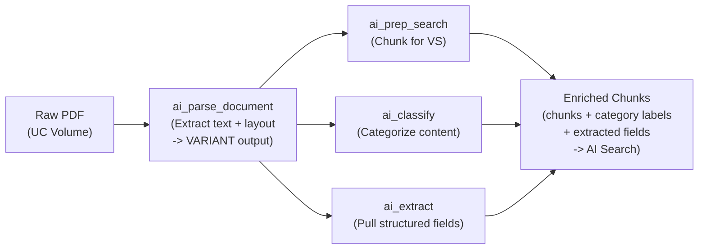

# Módulo 2: Document Parsing and Chunking Strategies for AI Search
## Curso 3: Building RAG Agents with Agent Bricks (Databricks Academy)

> **Tipo de contenido:** Transcripción literal y completa de la lección oficial de Databricks Academy  
> **ID del objeto de aprendizaje:** `64401:3571`  
> **Estado:** Oficial Databricks Academy

---

## 1. Overview y Objetivos de Aprendizaje

### Overview
Before a retrieval agent can answer questions about your documents, those documents must be transformed from raw files into searchable, structured data. This lecture covers the key Databricks AI Functions that power this pipeline:
- `ai_parse_document` for extracting text from PDFs.
- `ai_classify` and `ai_extract` for structuring content.
- `ai_prep_search` for chunking text for AI Search.

We'll also cover how chunks flow into an AI Search index: what happens when you create one, how it stays in sync, and why the text you embed differs from the text you retrieve.

### Learning Objectives
By the end of this lecture, you will be able to:
1. Describe how `ai_parse_document` extracts structured content from PDFs.
2. Explain the role of `ai_classify` and `ai_extract` in document processing.
3. Use `ai_prep_search` to chunk text for AI Search.
4. Compare different chunking strategies and their trade-offs.
5. Explain what happens when an AI Search index is created and how it stays in sync.
6. Distinguish between `chunk_to_embed` and `chunk_to_retrieve` and why they differ.

---

## 2. A. The Document Processing Pipeline

### A1. From Raw Files to Searchable Data



### Funcionamiento del Pipeline:
Los sistemas RAG son tan buenos como los datos que recuperan. Antes de que los documentos puedan alimentar a un agente RAG, deben procesarse a través de un pipeline que extrae, clasifica y fragmenta el contenido.
- Databricks Knowledge Assistant puede ingerir volúmenes y tablas de Unity Catalog directamente, ejecutando su propio pipeline de parseo y chunking bajo el capó sin necesidad de conectar manualmente estas funciones.
- Para arquitecturas personalizadas (Code-First), Databricks provee un conjunto de **AI Functions** (invocables directamente desde SQL y potenciadas por Foundation Models):
  1. `ai_parse_document` produce una salida de tipo `VARIANT`.
  2. `ai_prep_search`, `ai_classify` y `ai_extract` se ejecutan **en paralelo** a partir del documento parseado.
  3. Se combinan las clasificaciones y campos extraídos sobre la tabla de fragmentos (chunks) como columnas de metadatos adicionales para filtrado o ranking en AI Search.

---

## 3. B. Parsing Documents with `ai_parse_document`

### B1. Cómo Funciona
`ai_parse_document` invoca modelos de IA generativa de última generación para extraer contenido estructurado a partir de PDFs e imágenes. Retorna un objeto JSON estructurado de tipo `VARIANT` con extracción de texto sensible al diseño (layout-aware).

```
[ Input: Raw PDF ]
  ┌─────────────────────────────────────────────────────────┐
  │ Raw PDF (texto, tablas estructuradas, imágenes, etc.)   │
  └─────────────────────────────────────────────────────────┘
                              │
                              ▼
  ┌─────────────────────────────────────────────────────────┐
  │                 ai_parse_document                       │
  │ OCR + layout analysis, figure descriptions,             │
  │ bounding boxes                                          │
  └─────────────────────────────────────────────────────────┘
                              │
                              ▼
  ┌─────────────────────────────────────────────────────────┐
  │               Structured JSON (VARIANT)                 │
  │ document:                                               │
  │   elements: [...]                                       │
  │   pages: [...]                                          │
  │   error_status: [...]                                   │
  │ metadata: {...}                                         │
  └─────────────────────────────────────────────────────────┘
```

### Versión recomendada y Sintaxis SQL:
- `version`: Parámetro que especifica el esquema de salida.
- **`'2.0'` (v2):** Es la versión recomendada oficialmente. Proporciona el formato de salida más moderno (tablas HTML, preservación de layout mejorada) y es el formato óptimo para las funciones `ai_extract` y `ai_classify`.

```sql
SELECT
  path,
  ai_parse_document(content, MAP('version', '2.0')) AS parsed_content
FROM READ_FILES('/Volumes/...', format => 'binaryFile')
```

La salida contiene:
- `document:elements`: Bloques individuales de contenido (párrafos, encabezados, tablas).
- `document:pages`: Desglose estructurado a nivel de página.

---

## 4. C. Classifying and Extracting with AI Functions

Para desanidar los elementos del documento parseado en filas consultables se utiliza la función con valores de tabla `variant_explode`.

### Funcionamiento de `variant_explode`:
Convierte un arreglo u objeto `VARIANT` en un conjunto de filas con tres columnas:
- `pos INT`: Posición del elemento dentro del arreglo u objeto.
- `key STRING`: Nombre del campo (en objetos; `NULL` para arreglos).
- `value VARIANT`: Valor del campo o elemento del arreglo.

> **Nota:** Si la entrada es `NULL` o no es un array/objeto, no produce filas. Para preservar filas con nulos, se utiliza `variant_explode_outer`.

```sql
SELECT pos, key, value
FROM variant_explode(parse_json('{"name": "Ada", "age": 36}'));

-- pos | key  | value
-- ----+------+--------
--  0  | name | "Ada"
--  1  | age  | 36
```

---

### C1. Categorize Content: `ai_classify`
Asigna una etiqueta al texto a partir de un conjunto de categorías definidas por el usuario. Permite enrutar documentos hacia diferentes rutas de procesamiento:

```sql
WITH elements AS (
  SELECT path, element.value:content::string AS content
  FROM (
    SELECT path, ai_parse_document(content, MAP('version', '2.0')) AS parsed
    FROM READ_FILES('/Volumes/my_catalog/my_schema/my_volume', format => 'binaryFile')
  ) t,
  LATERAL variant_explode(parsed:document:elements) AS element
  WHERE element.value:type::string = 'paragraph'
),
classified AS (
  SELECT
    content,
    ai_classify(
      content,
      '["property_description","pricing_information","location_details","amenities","host_information","other"]'
    ) AS cls
  FROM elements
)
SELECT
  content,
  cls:response[0] AS category -- Parse del resultado devuelto por ai_classify()
FROM classified;
```

---

### C2. Pull Structured Fields: `ai_extract`
Extrae campos específicos de texto no estructurado según una lista de claves solicitadas:

```sql
WITH elements AS (
  SELECT path, element.value:content::string AS content
  FROM (
    SELECT path, ai_parse_document(content, MAP('version', '2.0')) AS parsed
    FROM READ_FILES('/Volumes/invoices_volume', format => 'binaryFile')
  ) t,
  LATERAL variant_explode(parsed:document:elements) AS element
),
extracted AS (
  SELECT
    content,
    ai_extract(
      content,
      '["invoice_id", "date", "total"]'
    ) AS ext
  FROM elements
)
SELECT
  content,
  ext:response.invoice_id AS invoice_id,
  ext:response.date       AS date,
  ext:response.total      AS total
FROM extracted
LIMIT 15;
```

---

## 5. D. Chunking with `ai_prep_search`

### D1. ¿Qué es `ai_prep_search`?
Es una función de IA de Databricks que **divide el texto en fragmentos (chunks) optimizados para AI Search**. En lugar de dividir manualmente por recuento fijo de caracteres o palabras, `ai_prep_search` utiliza modelos de IA para detectar límites semánticos naturales (párrafos, secciones lógicas, tablas).

```sql
SELECT ai_prep_search(parsed_text) AS chunks
FROM parsed_documents;
```

### D2. Consideraciones de Estrategia de Chunking
1. **Chunk size vs. Límites del modelo de embedding:** Los fragmentos deben caber dentro de la ventana de contexto del modelo de embedding (p. ej., 512 tokens para muchos modelos estándar). El texto que sobrepasa el límite es truncado silenciosamente.
2. **Overlap (Superposición):** Incluir una pequeña superposición entre fragmentos consecutivos (p. ej., 10% - 20%) evita que se pierda información contextual en los cortes de frontera.
3. **Compromiso de granularidad:** Chunks más pequeños son más precisos para recuperación vectorial pero pueden carecer de contexto circundante. Chunks más grandes capturan más contexto pero pueden diluir la señal de similitud semántica.

> **Fenómeno "Lost in the Middle":**  
> Los LLMs tienden a pasar por alto información enterrada profundamente en contextos extensos. Generar chunks pequeños y enfocados garantiza que los detalles críticos no se omitan durante la generación.

---

### D3. Embed vs. Retrieve: ¿Por qué son columnas diferentes?

`ai_prep_search` produce dos columnas de texto diferenciadas para cada fragmento:

```
                      ai_prep_search
                            │
            ┌───────────────┴───────────────┐
            ▼                               ▼
    [ chunk_to_embed ]             [ chunk_to_retrieve ]
   (Texto enriquecido con          (Texto crudo original)
    títulos y contexto)                     │
            │                               │
            ▼                               ▼
    [ Embedding Model ]               [ LLM Context ]
 (Genera vector semántico)     (Genera respuesta limpia sin ruido)
```

| Columna | Propósito | Ejemplo de Contenido | Objetivo de Calidad |
| :--- | :--- | :--- | :--- |
| **`chunk_to_embed`** | Para el modelo de embedding (`databricks-gte-large-en`). Responde: *"¿De qué trata este fragmento?"* | `"Title: House Rules > Section: Pets > The fee is $50 per pet per night."` | **Optimizar para localizabilidad (findability):** El embedding model sitúa el vector en la región correcta del espacio vectorial. |
| **`chunk_to_retrieve`** | Para el contexto del LLM generador. Responde: *"¿Qué debe leer el LLM?"* | `"The fee is $50 per pet per night. Max 2 pets."` | **Optimizar para legibilidad (readability):** Ahorra tokens en la ventana de contexto y evita confundir al LLM con metadatos repetitivos. |

---

## 6. E. From Chunks to AI Search Index

### E1. Ciclo de Vida de Creación del Índice

```
[ Step 1: Read Source Table ]
Delta Table (chunks, metadatos, primary_key)
             │
             ▼
[ Step 2: Compute Embeddings ]
Model Serving Endpoint ejecuta inferencia vectorizando chunk_to_embed
             │
             ▼
[ Step 3: AI Search (ANN) Index ]
Estructura de Approximate Nearest Neighbor para búsqueda rápida en ms
             │
             ▼
[ Step 4: Store Synced Columns ]
Almacena columnas de consulta (chunk_id, chunk_to_retrieve, source_path)
```

### Parámetros Clave al Crear un Índice Vector Search:

| Parámetro | Función |
| :--- | :--- |
| `endpoint_name` | Endpoint de Vector Search que sirve el índice (compute compartido). |
| `source_table_name` | Tabla Delta origen que contiene los chunks. |
| `index_name` | Nombre de 3 niveles en Unity Catalog (`catalog.schema.index`). |
| `pipeline_type` | `TRIGGERED` (sincronización bajo demanda) o `CONTINUOUS` (sincronización automática continua). |
| `primary_key` | Identificador único de fila requerido para rastrear cambios incrementales. |
| `embedding_source_column` | Columna de texto a vectorizar (`chunk_to_embed`). |
| `embedding_model_endpoint_name` | Endpoint del modelo de embeddings (p. ej., `databricks-gte-large-en`). |
| `columns_to_sync` | Columnas adicionales que se devuelven en los resultados de búsqueda (`chunk_to_retrieve`, metadatos de filtrado). |

---

### E2. Sincronización Incremental con Change Data Feed (CDF)

Para que el índice Delta Sync procese únicamente los cambios sin recomputar toda la tabla:
```sql
ALTER TABLE chunks_table SET TBLPROPERTIES (delta.enableChangeDataFeed = true);
```

- **Requisito mandatorio:** CDF es obligatorio en endpoints estándar para habilitar sincronización incremental.
- **Rastreo de cambios:** Registra `_change_type` (`insert`, `update_postimage`, `delete`), `_commit_version` y `_commit_timestamp`.
- **Modos de Sincronización:**
  - **`TRIGGERED`:** Se sincroniza solo cuando se ejecuta explícitamente `index.sync()` o desde la UI. Ideal para procesamiento por lotes (batch ETL).
  - **`CONTINUOUS`:** Se sincroniza automáticamente en tiempo casi real a medida que la tabla de origen se modifica (consume más cómputo continuo).

---

## 7. F. Conclusiones Principales

1. **`ai_parse_document`:** Extrae texto estructurado de PDFs complejos preservando tablas y diseño visual en formato `VARIANT` v2.
2. **`ai_classify` y `ai_extract`:** Categorizan y extraen metadatos estructurados para habilitar filtrado híbrido de alta precisión.
3. **`ai_prep_search`:** Implementa límites semánticos inteligentes y desacopla `chunk_to_embed` (localizabilidad) de `chunk_to_retrieve` (legibilidad).
4. **AI Search Index:** Lee la tabla Delta, genera vectores con modelos administrados y soporta sincronización incremental vía Change Data Feed en modos `TRIGGERED` o `CONTINUOUS`.
