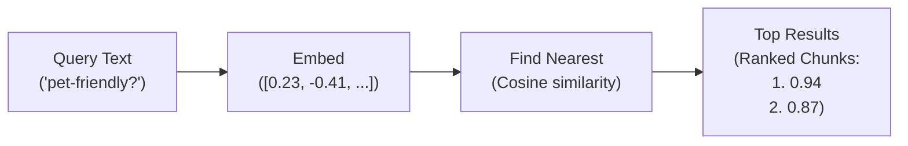
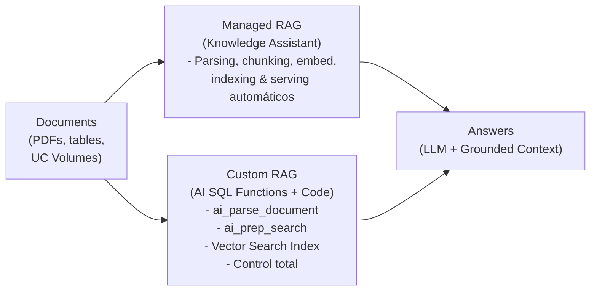

# Módulo 3: AI Search on Databricks
## Curso 3: Building RAG Agents with Agent Bricks (Databricks Academy)

> **Tipo de contenido:** Transcripción literal y completa de la lección oficial de Databricks Academy  
> **ID del objeto de aprendizaje:** `64397:3572`  
> **Estado:** Oficial Databricks Academy

---

## 1. Overview y Objetivos de Aprendizaje

### Overview
This lecture covers the theory behind AI Search before you build one in the next demo. We'll explore how embeddings and similarity search power retrieval, how Knowledge Assistants use AI Search under the hood, and when to choose managed RAG vs. building your own. We'll also cover how Unity Catalog governs the entire pipeline.

### Learning Objectives
By the end of this lecture, you will be able to:
1. Explain how embeddings transform text into searchable vectors.
2. Describe how cosine similarity drives retrieval ranking.
3. Compare managed RAG (Knowledge Assistants) and custom RAG approaches.
4. Explain how Unity Catalog governs AI Search indexes.

---

## 2. A. Embeddings and Similarity

### A1. ¿Qué son los Embeddings?
Un **embedding** es una lista ordenada de números (un vector) que captura el significado semántico de un fragmento de texto. Los textos con significados similares producen vectores que se ubican cerca entre sí en el espacio matemático multidimensional.

> **Ejemplo:**  
> Frases como *"cozy apartment near the park"* y *"comfortable flat close to green space"* tendrán embeddings muy cercanos, a pesar de usar palabras completamente distintas.

Al crear un índice de AI Search con `embedding_model_endpoint_name="databricks-gte-large-en"`, Databricks invoca automáticamente este modelo sobre cada fila de la columna de texto (`chunk_to_embed`) para generar estos vectores.

#### Consideraciones clave al trabajar con embeddings:
1. **Usar el mismo modelo:** Se debe utilizar estrictamente el mismo modelo tanto para vectorizar los documentos indexados como para vectorizar las consultas en tiempo de inferencia, garantizando que coexistan en el mismo espacio vectorial.
2. **Respetar la ventana de contexto:** Los modelos de embedding tienen límites de tokens (p. ej., 512 tokens). El texto que excede este límite se trunca silenciosamente sin advertencia.
3. **Compromiso de dimensiones:** Dimensiones más altas (p. ej., 1024 frente a 384) capturan mayor sutileza semántica pero incrementan el costo de almacenamiento y la latencia de búsqueda.

---

### A2. Cómo Funciona la Búsqueda por Similitud



Flujo paso a paso al consultar un índice vectorial:
1. Convierte el texto de la consulta en un vector de embedding mediante el endpoint del modelo.
2. Encuentra los vectores más cercanos en el índice (usando similitud coseno u otra métrica de distancia).
3. Retorna los fragmentos de texto correspondientes ordenados por relevancia (score).

Databricks implementa algoritmos de **Approximate Nearest Neighbors (ANN)** para permitir búsquedas vectoriales a escala masiva en milisegundos, sacrificando una fracción imperceptible de precisión a cambio de una velocidad dramática.

---

### A3. Cómo Funciona la Similitud Coseno (Cosine Similarity)

La similitud coseno mide el ángulo $\theta$ entre dos vectores multidimensionales:
$$\text{Cosine Similarity} = \cos(\theta) = \frac{\mathbf{A} \cdot \mathbf{B}}{\|\mathbf{A}\| \|\mathbf{B}\|}$$

- **Ángulo pequeño ($\theta \to 0^\circ$):** Los vectores apuntan en direcciones casi idénticas. El score de similitud es alto (cercano a 1.0, p. ej. 0.95).
- **Ángulo grande ($\theta \to 90^\circ$ o superior):** Los vectores apuntan en direcciones divergentes. El score de similitud desciende hacia 0 (p. ej. 0.25).

---

## 3. B. Managed vs. Custom RAG

### B1. Dos Caminos hacia RAG en Databricks



| Criterio | Managed RAG (Knowledge Assistant) | Custom RAG (Agent Framework + AI Search) |
| :--- | :--- | :--- |
| **Implementación** | Se proporcionan los documentos en un volumen UC o índice AI Search. El sistema gestiona todo el ciclo de vida. | El desarrollador construye y conecta cada etapa del pipeline con código manual o SQL. |
| **Control** | Declarativo; guiado por configuración y retroalimentación (ALHF). | Control total sobre la estrategia de parseo, algoritmo de chunking, modelo de embedding y lógica de recuperación. |
| **Optimización** | Se optimiza continuamente de forma automática con aprendizaje a partir de retroalimentación humana (ALHF). | Requiere experimentación, ajuste manual de hiperparámetros y benchmarking continuo. |
| **Casos de uso ideales** | Casos de uso empresariales estándar de Q&A sobre documentación corporativa donde la velocidad a producción es prioritaria. | Requerimientos únicos, flujos multi-paso complejos con herramientas externas y arquitecturas de agentes novedosas. |

---

## 4. B2. Gobernanza Integral con Unity Catalog

Los índices de AI Search y los endpoints están gobernados de forma unificada bajo **Unity Catalog**:

```
┌────────────────────────────────────────────────────────────────────────────────────────┐
│                        Governance across the retrieval pipeline                        │
│                                                                                        │
│   [ UC Volume ] ───> [ Delta Table ] ───> [ VS Index ] ───> [ VS Endpoint ] ───> [Agent]│
│   Source PDFs       Chunks + meta        Vectors + cols    Query interface       RAG   │
│   (UC Privileges)   (UC Privileges)     (UC Privileges)     (Endpoint ACLs)    (Query) │
└────────────────────────────────────────────────────────────────────────────────────────┘
```

1. **Privilegios de Unity Catalog:** Controlan el acceso a volúmenes, tablas de origen Delta y objetos de índice vectorial mediante permisos estándar de UC (`SELECT`, `READ VOLUME`, `MODIFY`).
2. **Endpoint ACLs:** Regulan quién puede consultar (`CAN QUERY`) o administrar (`CAN MANAGE`) el endpoint de Vector Search que sirve las consultas.
3. **Auditoría e Inferencia:** Toda la actividad queda registrada en las **System Tables** de Databricks para auditoría de seguridad y cumplimiento normativo.
4. **Linaje Unificado (Lineage):** Unity Catalog rastrea automáticamente el linaje de datos de extremo a extremo desde el archivo PDF original en el volumen hasta la tabla Delta, el índice vectorial y la respuesta servida por el agente.

---

## 5. Integración con Genie Code

Para profundizar en cómo Databricks AI Search combina búsqueda semántica con búsqueda tradicional de palabras clave:
- Consulta sugerida: `How does Databricks AI Search handle hybrid keyword and semantic search?`

---

## 6. C. Conclusiones Principales

1. **Embeddings:** Transforman texto no estructurado en vectores que capturan el significado semántico para emparejar consultas con fragmentos relevantes.
2. **Cosine Similarity:** Ordena y prioriza los resultados según la proximidad angular de los vectores respecto al vector de consulta.
3. **Knowledge Assistants:** Constituyen el camino RAG administrado que ejecuta el pipeline completo de parseo, chunking, embedding e indexación de forma desatendida.
4. **Custom RAG:** Ofrece flexibilidad y control total sobre cada componente cuando la ruta declarativa no se ajusta a los requisitos.
5. **Unity Catalog:** Proporciona un gobierno de datos de extremo a extremo con control de acceso por privilegios y ACLs, linaje transparente y auditoría continua.
