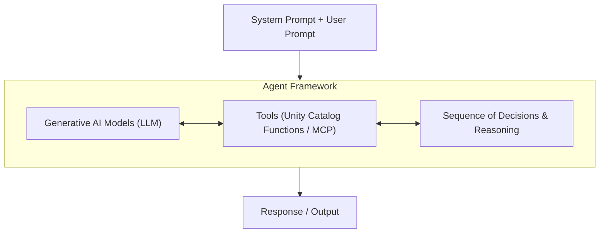
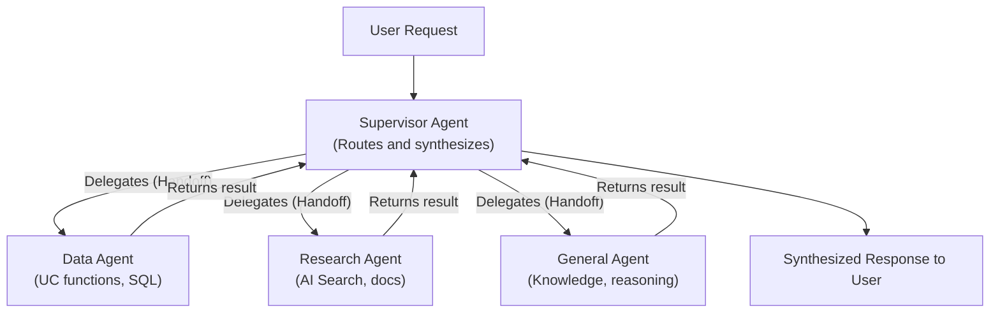

# Módulo 1: Agents, MCP, and AI Governance on Databricks
## Curso 4: Building Agentic Applications on Databricks (Databricks Academy)

> **Tipo de contenido:** Transcripción literal y completa de la lección oficial de Databricks Academy  
> **ID del objeto de aprendizaje:** `64272:3565`  
> **Estado:** Oficial Databricks Academy

---

## 1. Overview y Objetivos de Aprendizaje

### Overview
This lecture establishes the foundations for building AI agents on Databricks. We cover what agents are, how they use tools registered in Unity Catalog, how the Model Context Protocol (MCP) enables tool discovery and execution, and how AI Gateway provides governance across the stack.

### Learning Objectives
By the end of this lecture, you will be able to:
1. Define what AI agents are and identify their core components.
2. Explain how Unity Catalog functions serve as governed agent tools.
3. Describe how MCP enables agents to discover and call tools at runtime.
4. Identify common tool patterns: structured retrieval, unstructured retrieval, code interpreter, and external connections.
5. Understand the role of AI Gateway for governance and access control.

---

## 2. A. What are AI Agents?

### A1. Single Agents
An **AI agent** is an intelligent software system that can perceive its environment, make decisions, and take actions to achieve specific goals. Unlike traditional AI systems that require continuous inputs from users, AI agents are autonomous systems that can:
- **Reason** about complex problems and situations.
- **Plan** sequences of actions to achieve objectives.
- **Adapt** their behavior based on new information.
- **Interact** with external systems and data sources.
- **Learn** from experience to improve future performance.



---

### A2. Multi-Agent Supervisors

Una arquitectura multi-agente común es el patrón **supervisor-worker** (también denominado router-delegate):



#### Flujo Operativo:
1. El **supervisor** recibe la solicitud del usuario y analiza la intención.
2. **Delega** en el agente especialista adecuado (o resuelve solicitudes simples directamente).
3. El agente especialista ejecuta con sus herramientas especializadas y devuelve el resultado.
4. El supervisor **sintetiza** la respuesta consolidada y la entrega al usuario.

#### Implementación con OpenAI Agents SDK (Handoffs):
```python
from agents import Agent

supervisor = Agent(
    name="Supervisor",
    instructions="Route requests to the appropriate specialist.",
    handoffs=[data_agent, business_agent],
)
```

---

### A3. Single-Agent vs. Multi-Agent

| Factor | Single Agent | Multi-Agent |
| :--- | :--- | :--- |
| **Número de herramientas** | Funciona mejor cuando el total de herramientas es modesto (**hasta 8–10**); más allá de eso, la selección de herramientas y la gestión del prompt se degradan (heurística práctica). | Recomendado cuando se tienen muchas herramientas (**a menudo > 10**) que abarcan capacidades distintas y requieren separación limpia. |
| **Complejidad del dominio** | Un dominio enfocado o estrechamente relacionado. | Múltiples dominios o verticales de negocio independientes. |
| **Longitud de instrucciones** | System prompt más corto y coherente que un solo agente puede seguir con fiabilidad. | Evita prompts excesivamente largos, fragmentados o con directrices contradictorias. |
| **Aislamiento de fallos** | El fallo se asume como una unidad; más fácil de razonar globalmente. | Permite aislar, depurar y reemplazar capacidades individuales sin modificar todo el sistema. |
| **Propiedad del equipo** | Un único equipo es dueño de la mayoría o de todas las conductas. | Diferentes equipos son dueños de distintos dominios/herramientas y evolucionan de forma autónoma. |
| **Latencia** | Mínima sobrecarga; menos llamadas al modelo y orquestación directa. | Las llamadas adicionales de enrutamiento y orquestación añaden latencia y costo en tokens. |
| **Escalabilidad y paralelismo**| Escala bien con dominios acotados; paralelismo limitado dentro de la ventana de contexto. | Facilita la paralelización del trabajo entre dominios y distribuye el contexto, con mayor complejidad de coordinación. |

> **Regla de oro Databricks:**  
> Comienza siempre con un **agente único (single agent)**. Descompón en múltiples agentes únicamente cuando observes fallos en la selección de herramientas, instrucciones conflictivas o cuando diferentes equipos necesiten administrar capacidades de forma independiente.

---

## 3. B. Tools and Common Patterns

### B1. Model Context Protocol (MCP) en Databricks
El **Model Context Protocol (MCP)** es un estándar abierto para conectar agentes de IA con herramientas y contexto (datos, funciones y servicios externos).

**Managed MCP Servers en Databricks:**  
Son endpoints administrados y alojados directamente por Databricks, listos para usar con:
- **Genie Spaces:** Recuperación sobre datos estructurados (SQL conversacional).
- **AI Search (Vector Search):** Recuperación sobre datos no estructurados (documentos, políticas).
- **Unity Catalog Functions:** Lógica personalizada, APIs y cálculo.
- **Databricks SQL:** Consultas directas sobre el Lakehouse.

```
                  ┌────────────────────────────────────────────────────────┐
                  │                      Databricks                        │
                  │                                                        │
                  │  ┌──────────────┐             ┌─────────────────────┐  │
                  │  │    Agent     │   (MCP)     │     MCP Servers     │  │
User Query ──────>│  │ (MCP Client) │ ──────────> │ ┌─────────────────┐ │  │ ──────> Response
                  │  │              │ <────────── │ │ Genie (Struct)  │ │  │
                  │  └──────────────┘             │ ├─────────────────┤ │  │
                  │                               │ │ AI Search (Docs)│ │  │
                  │                               │ ├─────────────────┤ │  │
                  │                               │ │ UC Functions    │ │  │
                  │                               │ └─────────────────┘ │  │
                  │                               └─────────────────────┘  │
                  │        Governed by Unity Catalog + AI Gateway          │
                  └────────────────────────────────────────────────────────┘
```

**Ventaja clave de MCP:**  
Estandarización absoluta. Construyes una herramienta una sola vez y cualquier agente o cliente compatible con MCP puede descubrirla y ejecutarla sin código propietario de conexión.

---

### B2. Patrones Comunes de Herramientas (Common Tool Patterns)

| Patrón de Herramienta | Descripción en Databricks |
| :--- | :--- |
| **Structured data retrieval tools** | Consultan tablas Delta, bases de datos relacionales y almacenes estructurados mediante SQL gobernado por UC. |
| **Unstructured data retrieval tools** | Buscan colecciones de documentos vectorizados mediante índices de AI Search (RAG). |
| **Code interpreter tools** | Permiten al agente generar y ejecutar código Python en entornos aislados para cálculos matemáticos, análisis de datos dinámico y generación de gráficos. |
| **External connection tools** | Conectan con servicios externos, APIs y plataformas de comunicación empresarial (p. ej. Slack, Jira, ServiceNow). |
| **AI Playground prototyping** | Permite vincular herramientas de Unity Catalog directamente en la interfaz gráfica para prototipar y validar el comportamiento del agente sin escribir código de despliegue. |

---

## 4. C. Governance and AI Management with Unity AI Gateway

**Unity AI Gateway** es la capa centralizada de gobernanza para endpoints de LLMs, servidores MCP y agentes de código en Databricks.

```
                   [ Client (User / Application) ]
                                 │
                                 ▼
┌─────────────────────────────────────────────────────────────────────────┐
│                           Unity AI Gateway                              │
│  ┌───────────────────────────┐  ┌─────────────────────────────────────┐ │
│  │ Permission & Rate Limiting│  │           Payload Logging           │ │
│  │ (QPM / TPM por identidad) │  │  (Inference Tables en Delta UC)     │ │
│  └───────────────────────────┘  └─────────────────────────────────────┘ │
│  ┌───────────────────────────┐  ┌─────────────────────────────────────┐ │
│  │       AI Guardrails       │  │        Fallbacks & Splitting        │ │
│  │ (Filtros de seguridad I/O)│  │ (Rutas alternativas automáticas)    │ │
│  └───────────────────────────┘  └─────────────────────────────────────┘ │
└─────────────────────────────────────────────────────────────────────────┘
        │                             │                            │
        ▼                             ▼                            ▼
 [ External Models ]        [ Databricks Hosted ]           [ Managed MCP ]
 (OpenAI, Anthropic)       - Pay-per-token                 (Genie, AI Search,
                           - Provisioned throughput         UC Functions)
```

### Capacidades Principales:
1. **Governance & MCP Governance:** Rastrea qué usuarios, agentes y aplicaciones invocan LLMs y MCPs. Implementa **On-behalf-of execution**: los agentes actúan con los permisos exactos del usuario autenticado en lugar de una cuenta de servicio compartida con sobreprivilegios.
2. **Rate Limiting:** Protege los endpoints contra sobrecargas mediante límites de consultas por minuto (QPM) y tokens por minuto (TPM) configurables por endpoint e identidad (usuario o grupo).
3. **AI Guardrails:** Aplica filtros de seguridad de entrada y salida para detectar y bloquear inyecciones de prompts, lenguaje dañino o enmascarar información personal confidencial (PII).
4. **Usage Tracking:** Monitoriza el consumo de tokens y costos agregados mediante las System Tables de Unity Catalog.
5. **Payload Logging:** Registra las solicitudes y respuestas completas en **Inference Tables** de Delta Lake para auditoría forense, monitoreo de deriva y reentrenamiento.

---

### C1. Ejemplo de Fallback Routing en AI Gateway

Cuando un endpoint primario devuelve errores de capacidad (código `429 Too Many Requests`) o indisponibilidad (`5xx Server Error`), AI Gateway redirige automáticamente la petición a modelos de reserva definidos:

```
[ Client Request ] ───> [ Unity AI Gateway Endpoint ]
                               │
       ┌───────────────────────┴───────────────────────┐
       ▼                                               ▼
[ Model 1 (Primary) ] ──(429/5xx)──> [ Model 2 (Fallback 1) ] ──(429/5xx)──> [ Model 3 (Last) ]
       │                                       │                                     │
    200 OK                                  200 OK                                200 OK
       │                                       │                                     │
       └───────────────────────┬───────────────────────┘
                               ▼
                   [ Inference Tables (Log) ]
```

---

## 5. D. Conclusiones Principales

1. **AI Agents:** Son sistemas autónomos que combinan el razonamiento de un LLM con la ejecución de herramientas gobernadas.
2. **Unity Catalog Functions:** Actúan como las herramientas canónicas del agente en Databricks, aportando control de acceso, linaje y auditoría.
3. **MCP (Model Context Protocol):** Proporciona el protocolo estándar de la industria para que los agentes descubran y ejecuten herramientas dinámicamente en tiempo de ejecución.
4. **Unity AI Gateway:** Proporciona la capa unificada de control empresarial (autenticación delegada on-behalf-of, rate limiting, guardrails, fallbacks y tablas de inferencia).
