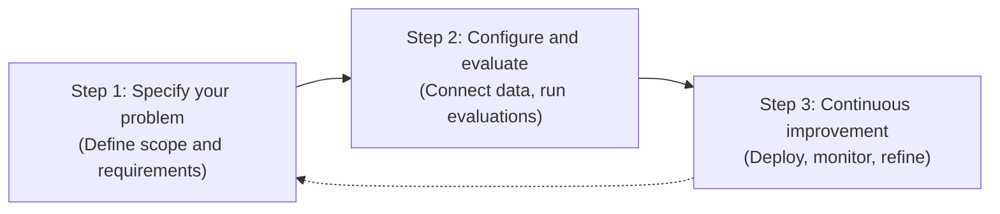
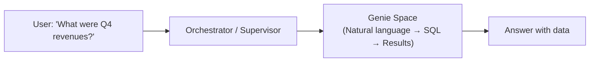

# Módulo 3: Agent Bricks and Genie
## Curso 4: Building Agentic Applications on Databricks (Databricks Academy)

> **Tipo de contenido:** Transcripción literal y completa de la lección oficial de Databricks Academy  
> **ID del objeto de aprendizaje:** `64264:3564`  
> **Estado:** Oficial Databricks Academy — 100% Verbatim

---

## 1. Overview y Objetivos de Aprendizaje

### Overview
In the previous notebooks you built agents with code using the OpenAI Agents SDK. Databricks also provides **Agent Bricks**, which is a no-code platform for building, optimizing, and governing production agents, and **Genie** for natural language access to structured data. This lecture covers both and discusses how a **Genie Agent** can be integrated with **Agent Bricks**.

### Learning Objectives
By the end of this lecture, you will be able to:
1. Describe what Agent Bricks is and identify its supported agent types (Knowledge Assistant, Supervisor Agent, Document Intelligence, Custom Agents).
2. Explain how Agent Bricks differs from the code-first Agent Framework approach.
3. Understand the Agent Bricks development lifecycle: specify, optimize, improve.
4. Describe how Genie enables natural language querying of structured data.
5. Identify when to use a Knowledge Assistant vs a Supervisor Agent vs Genie.

---

## 2. A. Databricks Agent Bricks

[Databricks Agent Bricks](https://www.databricks.com/product/artificial-intelligence/agent-bricks) is a unified platform and control plane for building, optimizing, and governing production AI agents over your enterprise data, shifting the focus from low-level implementation details to the actual business task, data, and quality metrics.

### Pilares Fundamentales de Agent Bricks

| Pilar | Descripción Oficial |
|---|---|
| **Agents that know your data** | Agent Bricks uses your enterprise context — schemas, business definitions and custom semantics — to make smarter decisions about which tools and tables to use, how to join data correctly, and how to produce accurate, consistent answers. |
| **Open and Multi-AI** | Access every leading AI model, from OpenAI, Anthropic, and Google to open source, through a single platform. Agent Bricks lets you switch models instantly to optimize cost, quality, and performance without re-architecting your stack. |
| **Unified governance** | Only Databricks governs the full stack — from data to AI models — in a single system of record. Track every agent, MCP server, model and tool with clear ownership and end-to-end permissions that ensure agents never access more than they’re allowed to. |

### Métodos de Creación de Agentes en Databricks
1. **Interfaz Directa de Agents:** View available agents by clicking on **Agents** on the left side menu and click **Create Agent** at the top right.
2. **Exportación desde AI Playground:** Additionally, you can create an agent via the **Playground** by clicking the **Get code** dropdown menu and selecting **Export to Databricks Apps**. Following the on-screen instructions, you will create a set of files that uses the OpenAI SDK.

---

## 3. A1. Core Three‑Step Development Cycle

The Agent Bricks development lifecycle is an iterative loop built around three core phases: **define the problem**, **configure and evaluate on your data**, and **continuously improve**. Each Agent Brick (Knowledge Assistant, Supervisor Agent, Classification, Information Extraction, and, where available, legacy Custom LLM flows) builds on the same underlying Databricks platform: Unity Catalog, Mosaic AI Model Serving, MLflow Tracing, and Agent Evaluation.



### Step 1: Specify your problem (Define scope and requirements)
In the first phase, you define the scope and requirements for your agent:
- Align with stakeholders on the **task, users, constraints, and expected outcomes** (for example, doc Q&A, multi‑agent orchestration, document classification, or field‑level extraction).
- **Choose the appropriate Agent Brick** for the job:
  - **Knowledge Assistant** – Q&A chatbot over your documents, backed by UC volumes or AI Search indexes.
  - **Supervisor Agent** – multi‑agent supervisor that coordinates Genie spaces, Knowledge Assistants, Unity Catalog functions, and external MCP servers.
  - **Classification** – classify documents or records into predefined categories.
  - **Information Extraction** – extract structured fields from semi‑structured or unstructured documents.
  - *(In some workspaces, **legacy Custom LLM** and **legacy Information Extraction** flows are also available.)*
- Identify and prepare the **Unity Catalog resources** your agent will rely on:
  - **Data sources:** Delta tables, UC volumes, or AI Search indexes.
  - **Tools and subagents:** Genie spaces, Unity Catalog functions, external MCP servers, or existing agent endpoints.
- Define **success criteria and evaluation metrics**, such as groundedness, accuracy, coverage, latency, and cost, plus any labeled examples or evaluation datasets you will use later.

### Step 2: Configure and evaluate on your enterprise data
In the second phase, you connect the brick to your data and run structured evaluations:
- Use the **Agent Bricks UI** to configure your agent:
  - For **Knowledge Assistant**, select UC files or an AI Search index and describe each knowledge source.
  - For **Supervisor Agent**, register subagents and tools such as Genie spaces, Knowledge Assistant endpoints, UC functions, and external MCP servers.
  - For **Classification** and **Information Extraction**, point to the UC volume or table that contains your documents and define the label or extraction schema.
- Test the agent interactively (for example, in **AI Playground** or the agent's build/configuration page), inspecting responses, sources, and internal traces.
- Turn on **MLflow Tracing** so each interaction logs inputs, intermediate tool calls, and outputs as traces that can be analyzed and shared.
- Use **MLflow GenAI evaluation / Agent Evaluation** to:
  - Run your agent on evaluation datasets.
  - Score outputs with LLM judges and custom scorers (for example, correctness, groundedness, relevance, style, and safety).
  - Compare variants of prompts, tools, or configurations to balance **quality, latency, and cost**.

### Step 3: Continuous improvement (Deploy, monitor, refine)
The final phase establishes a feedback and monitoring loop so the agent keeps improving over time:
- **Deploy the agent endpoint** (created automatically by the brick) for use from applications, chat UIs, or Databricks Apps.
- Use **production monitoring** (MLflow 3 production monitoring and tracing) to continuously sample production traces and run scorers or LLM judges on real traffic.
- Collect **human feedback** from subject matter experts:
  - For Knowledge Assistant and Supervisor Agent, use the built‑in Examples/Guidelines flows to add questions and guidance.
  - Use Review Apps and MLflow feedback annotations to label traces and align automatic judges with expert expectations.
- Regularly **update knowledge sources, instructions, tools, and routing logic** based on evaluation results and feedback, then re‑run evaluations to confirm improvements.
- Treat this as an **ongoing cycle**: as data, requirements, or downstream applications evolve, repeat these steps to keep the agent high‑quality, cost‑effective, and aligned with business goals.

---

## 4. Ask Genie Code Integration

Want to know more about how Agent Bricks integrates with other Databricks features? Ask Genie Code by clicking on the genie icon in the Databricks workspace.
Example prompt:
```text
How can Agent Bricks be used with Databricks Apps?
```

---

## 5. B. Genie: Natural Language Access to Structured Data

A **Genie Space** is a curated natural-language interface to your governed Databricks data, where you define the data context and instructions Genie uses to answer questions.

A **Genie agent** is a Genie Space used as a specialized worker inside an app or multi-agent system, so other agents or orchestrators can delegate structured-data questions to it.

Databricks supports **two main ways** to use Genie with agents:
1. **Genie via managed MCP:** an external agent connects to a Genie space through a pre-configured MCP endpoint and uses Genie as a **tool** for natural-language access to structured data.
2. **Genie as a subagent in a multi-agent system:** a supervisor or orchestration layer routes work to Genie as a specialized worker for structured-data questions.

### Flujo de Consulta con Genie



---

## 6. Modalidades de Integración de Genie

### Opción 1: Genie via Managed MCP (Agent uses Genie as a tool)
- **How it works:** Databricks provides a pre-configured managed MCP endpoint for each Genie space at `/api/2.0/mcp/genie/{space_id}`. Your agent connects to that endpoint, and Genie appears as a tool the agent can call for natural-language access to structured data.
- **Setup steps:**
  1. Create a Genie space backed by Unity Catalog data.
  2. Share the space with the relevant users or service principals.
  3. Connect from your agent via `McpServer(url=genie_mcp_url, workspace_client=...)`.

#### Código de Integración con OpenAI Agents SDK y MCP
```python
from databricks.sdk import WorkspaceClient
from databricks_openai.agents import McpServer
from agents import Agent, Runner

workspace_client = WorkspaceClient()
host = workspace_client.config.host

async with McpServer(
    url=f"{host}/api/2.0/mcp/genie/{genie_space_id}",
    name="sales-data-genie",
    workspace_client=workspace_client,
) as genie:
    agent = Agent(
        name="Analyst",
        instructions="Use the Genie tool to query structured data and answer questions.",
        model="databricks-foundation-model",
        mcp_servers=[genie],
    )
    result = await Runner.run(
        agent,
        "What were the top 10 customers by revenue last quarter?",
    )
```

> [!IMPORTANT]
> **Important nuance:** In MCP mode, Genie is invoked as a tool, so conversation history is not passed when calling Genie APIs. If you need richer multi-turn coordination with explicit context passing, use Genie as a subagent in a multi-agent system instead of relying only on the managed MCP endpoint.

---

### Opción 2: Genie via Supervisor Agent (UI-first multi-agent orchestration)
- **How it works:** Supervisor Agent is a UI-first orchestration layer that coordinates specialized tools and subagents, including Genie Spaces. You configure a Genie space as a subagent, and the supervisor routes structured-data questions to the right Genie space based on the descriptions you provide.
- **Key advantage:** This pattern treats Genie as a specialized worker in a coordinated multi-agent system. The supervisor manages delegation and synthesis across Genie Spaces, agent endpoints, Unity Catalog functions, MCP servers, and custom agents. Access controls are built in, so end users only get results from subagents and data they are explicitly allowed to use.

---

### Comparación: Genie Spaces vs Unity Catalog Functions para Datos Estructurados

Both Genie and UC functions connect agents to structured data, but they serve different use cases:

| Dimensión | Genie Space | Unity Catalog Function |
|---|---|---|
| **Query style** | Natural language: Genie translates the question into SQL over structured data | Parameterized: the agent supplies values to predefined logic |
| **Flexibility** | High: best for open-ended questions across the configured data context | Scoped: best when the query or logic is known ahead of time |
| **Best for** | Exploratory analytics and ad hoc business questions | Deterministic, repeatable retrieval or business logic |
| **Multi-agent role** | Specialized structured-data subagent or MCP-backed tool | Targeted tool on any agent |

> [!TIP]
> **In practice:** A supervisor might use a Genie subagent for exploratory questions like *"What drove Q4 revenue growth?"* and UC function tools for known patterns like *"Look up customer 1234"* or *"Run a predefined pricing lookup."* The two approaches are complementary, not competing.

---

## 7. C. Conclusión: Code-First vs No-Code (Agent Bricks)

En esta lección se cubrieron dos rutas de despliegue en producción sobre Databricks:
1. **Agent Bricks:** Plataforma no-code para construir Knowledge Assistants, Supervisor Agents, Document Intelligence, y Custom Agents, con optimización automática y evaluación integrada.
2. **Genie:** Acceso en lenguaje natural a datos estructurados vía Genie Spaces, utilizable en modo independiente (standalone), vía managed MCP o como subagente dentro de un Supervisor Agent.

### Criterio de Selección: ¿Cuándo usar cada enfoque?
- Usa **Agent Bricks** cuando requieras optimización gestionada, evaluación integrada y despliegue rápido sin tener que escribir ni mantener código de agentes.
- Usa **Frameworks Code-First** (OpenAI Agents SDK, LangGraph, DSPy) cuando requieras control granular sobre la lógica de orquestación, implementaciones de herramientas personalizadas o flujos de trabajo multi-paso complejos con dependencias externas.
