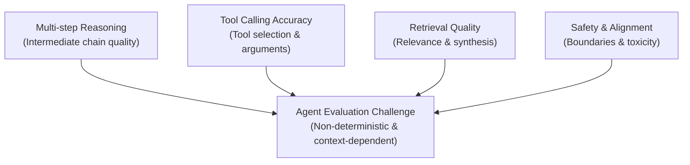
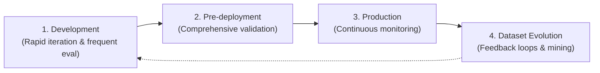
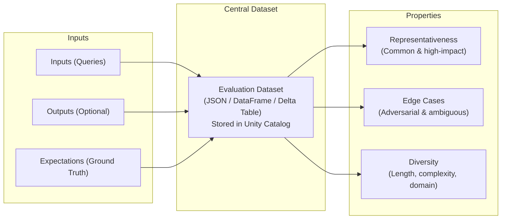
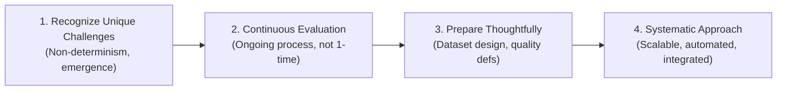

# Módulo 1: The Challenge of Evaluating AI Agents
## Curso 5: Agent Evaluation on Databricks (Databricks Academy)

> **Tipo de contenido:** Transcripción literal y completa de la lección oficial de Databricks Academy  
> **ID del objeto de aprendizaje:** `52875:3580`  
> **Estado:** Oficial Databricks Academy — 100% Verbatim

---

## 1. Overview y Objetivos de Aprendizaje

### Overview
Traditional software testing approaches are fundamentally insufficient for AI agents due to their non-deterministic nature, emergent behaviors, and context-dependent responses. This lecture explores why conventional testing fails with AI agents and introduces the unique challenges that require specialized evaluation frameworks.

We'll examine how AI agents break traditional testing paradigms, understand the complexity of multi-step reasoning evaluation, and learn why evaluation must be treated as a continuous process rather than a one-time validation step.

### Learning Objectives
By the end of this lecture, you will be able to:
1. Explain why traditional software testing approaches are insufficient for AI agents.
2. Identify the key challenges unique to evaluating AI agents (non-determinism, emergent behavior, context dependency).
3. Understand why evaluation must be treated as a continuous process.
4. Recognize the importance of proper evaluation dataset design.
5. Describe the operational setup requirements for systematic agent evaluation.

---

## 2. A. Why Traditional Testing Falls Short

### A1. The Deterministic Testing Paradigm
Traditional software testing relies on deterministic inputs and expected outputs. You write unit tests, integration tests, and end-to-end tests that verify your code produces the exact same result every time given the same input.

| Dimensión | Enfoque Determinista Tradicional |
|---|---|
| **Assumption** | Same input → same output |
| **Verification** | Exact string/number match |
| **Behavior** | Explicitly programmed |
| **Edge Cases** | Anticipated & systematic |

---

### A2. How AI Agents Break the Paradigm
AI agents fundamentally break the deterministic testing paradigm across four core characteristics:

1. **Non-determinism:** Same input can produce different outputs due to temperature & sampling.
2. **Emergent Behavior:** Autonomous tool & reasoning decisions not explicitly programmed.
3. **Context Dependency:** Responses depend on retrieval, history, & external data.
4. **Qualitative Assessment:** Success requires judgment, not exact string matching.

#### Ejemplo Crítico: Por qué falla la coincidencia exacta (Exact Matching)
An agent answering *"What's the weather in San Francisco?"* might respond:
- *"It's currently 65°F and sunny in San Francisco."*
- *"San Francisco weather: 65 degrees, clear skies."*
- *"The temperature in SF is 65°F with no clouds."*

All three are correct, helpful, and appropriate. Yet none match exactly. Traditional assertion testing:
```python
assert output == "expected_response"
```
would fail on all three!

---

## 3. B. The Agent Evaluation Challenge



### B1. Multi-Dimensional Complexity
Evaluating AI agents introduces unique complexities beyond traditional software:
- **Multi-step reasoning:** Agents may invoke multiple tools, retrieve various documents, and build complex reasoning chains. Evaluation must assess not just the final answer but the quality of intermediate steps.
- **Tool calling accuracy:** Did the agent select the right tools? Did it pass appropriate parameters? Did it correctly interpret tool results?
- **Retrieval quality:** For RAG-based agents, evaluation must verify that retrieved documents contain relevant information and that the agent correctly synthesizes information from multiple sources.

### B2. Safety and Real-World Variability
- **Safety and alignment:** Agents must avoid harmful outputs, respect user boundaries, and decline inappropriate requests. These qualities require sophisticated evaluation beyond simple pass/fail tests.
- **Real-world variability:** Production agents encounter diverse user queries, unexpected phrasings, and edge cases that are difficult to anticipate during development.

These challenges demand a more sophisticated evaluation framework specifically designed for the probabilistic, contextual nature of AI agents.

---

## 4. C. Evaluation as a Continuous Process



### C1. The Continuous Evaluation Cycle
Unlike traditional software where comprehensive test suites provide stable quality signals, AI agent evaluation is an ongoing process:
- **Development phase:** Rapid iteration requires frequent evaluation to validate that changes improve quality without introducing regressions.
- **Pre-deployment validation:** Comprehensive evaluation across diverse test cases ensures agents meet quality bars before production release.
- **Production monitoring:** Continuous evaluation of live interactions identifies quality degradation, emerging failure patterns, and opportunities for improvement.

### C2. Why Continuous Evaluation Matters
This continuous evaluation cycle means your evaluation infrastructure must be scalable, automated, and integrated into your development workflow. The evaluation framework must support:
- **Rapid feedback loops** during development.
- **Comprehensive validation** before deployment.
- **Ongoing monitoring** in production.
- **Dataset evolution** as usage patterns change.

---

## 5. D. Preparing for Evaluation

### D1. Why Preparation Matters
Before using any evaluation framework, it's important to make evaluation both purposeful and reproducible. AI agents are non-deterministic and context-dependent, so traditional assertion-style tests fall short. Instead, effective evaluation requires defining quality dimensions, assembling representative datasets, and enabling tracing so judges can assess not just answers, but how those answers were produced.

By clarifying goals, curating datasets, and selecting appropriate judges up front, you create a feedback loop where metrics reflect real user needs and failures are diagnosable through traces and rationales: not just pass/fail scores.

---

### D2. Designing Your Evaluation Dataset



Your evaluation dataset defines what you test and how trustworthy your signals will be. At minimum, it should include inputs (queries) and, where appropriate, expected answers, per-row guidelines, and metadata that reflects retrieval and tool usage.

**Key principles:**
1. **Representativeness:** Include common, high-impact user queries so offline results generalize to production.
2. **Edge cases:** Add ambiguous, out-of-scope, and adversarial prompts to surface failure modes early.
3. **Diversity:** Vary length, complexity, domain, and user expertise to expose blind spots in reasoning and retrieval.
4. **Ground truth and/or guidelines:** Use expected answers or fact sets for objective questions; use natural-language guidelines where style, policy, or completeness matter.
5. **Storage and versioning:** MLflow evaluation datasets are stored in Unity Catalog, which provides built-in versioning, lineage, sharing, and governance.

---

### D3. Operational Setup Requirements
Establish consistent scaffolding so results are comparable and auditable:

| Componente | Requisitos de Configuración Operativa |
|---|---|
| **MLflow Experiments & Runs** | Stable experiment names; tag runs with agent version, dataset version, and parameters; compare metrics in the UI. |
| **Unity Catalog Integration** | Govern datasets and traces with access control, versioning, and lineage; register agents for end-to-end traceability. |
| **Production Feedback Loop** | Enable Unity AI Gateway-enabled inference tables to log requests, responses, and traces for monitoring and mining new evaluation examples. |

---

## 6. Ask Genie Code Query

Want to explore more about agent evaluation challenges? Ask Genie Code by clicking on the genie icon in the Databricks workspace.
Example prompt:
```text
What are the key differences between evaluating traditional software and evaluating AI agents?
```

---

## 7. E. Conclusion

Traditional software testing approaches are fundamentally inadequate for AI agents due to their non-deterministic, emergent, and context-dependent nature.



Understanding these challenges is the foundation for implementing effective agent evaluation. The next lectures explore the tools and techniques that address these challenges systematically.
