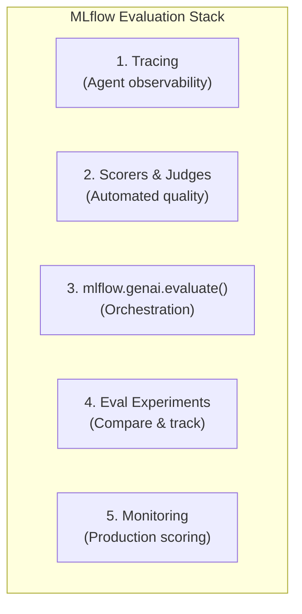
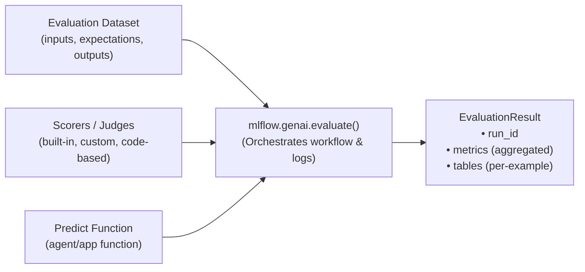
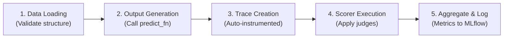
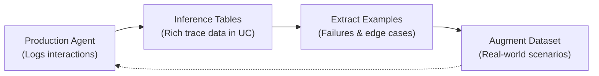

# Módulo 2: MLflow's Evaluation Framework
## Curso 5: Agent Evaluation on Databricks (Databricks Academy)

> **Tipo de contenido:** Transcripción literal y completa de la lección oficial de Databricks Academy  
> **ID del objeto de aprendizaje:** `52871:3581`  
> **Estado:** Oficial Databricks Academy — 100% Verbatim

---

## 1. Overview y Objetivos de Aprendizaje

### Overview
MLflow provides a comprehensive evaluation framework specifically designed for generative AI applications, offering automated judges, tracing capabilities, and systematic assessment tools. This lecture explores MLflow's architecture, core components, and how they work together to enable rigorous agent evaluation.

We'll examine the three fundamental components of MLflow evaluation, understand the `mlflow.genai.evaluate()` function, and explore how tracing provides the foundation for sophisticated evaluation capabilities.

### Learning Objectives
By the end of this lecture, you will be able to:
1. Describe MLflow's evaluation framework architecture and key components.
2. Understand the role of evaluation datasets, scorers, and predict functions.
3. Explain how the `mlflow.genai.evaluate()` function orchestrates evaluation.
4. Understand the role of tracing in agent evaluation and debugging.
5. Recognize how AI Gateway integration enables production monitoring.

---

## 2. A. MLflow for Agent Evaluation

During development, an **evaluation harness** helps you quickly execute your application for every record in your evaluation set and then run each output through your LLM judges and metric computations. In this module, we focus on the evaluation-specific capabilities that are purpose-built for assessing AI agents using Databricks AI Agent Evaluation.

### Stack de Evaluación de MLflow



> [!NOTE]
> **OpenTelemetry Compatible:**
> MLflow traces are fully compatible with OpenTelemetry specs, enabling export to external observability platforms (Datadog, Grafana, Splunk, etc.) via MLflow-only, OTel-only, or dual export modes.

---

## 3. B. Core Architecture: Three Fundamental Components

MLflow's evaluation architecture centers on three components that flow into `mlflow.genai.evaluate()`:



### 1. Evaluation Dataset
Your evaluation dataset defines what you're testing. Each record in an evaluation dataset represents a single test case with the following structure:
- **`inputs`** *(required)*: The test input data that will be passed to your model or application.
- **`outputs`** *(optional)*: The actual outputs generated by your model, typically used for post-hoc evaluation.
- **`expectations`** *(optional)*: The expected outputs or quality criteria that define correct behavior (e.g., expected facts, expected responses, or per-row guidelines).
- **`source`** *(optional)*: Provenance information about how this record was created.
- **`tags`** *(optional)*: Metadata specific to this individual record for organization and filtering.

*Datasets are typically stored as JSON files, Pandas DataFrames, or Delta Tables in Unity Catalog for easy manipulation, lineage, and versioning.*

### 2. Scorers (Judges)
Scorers evaluate your agent's outputs against defined criteria. Choose the right type depending on how much customization and control you need:
- **Built-in judges:** Research-validated LLM-based assessments for common quality dimensions (`Correctness`, `Safety`, `RelevanceToQuery`, `RetrievalGroundedness`, etc.). This category also includes `Guidelines` and `ExpectationsGuidelines` judges that check whether responses pass or fail custom natural-language rules.
- **Custom LLM judges:** Fully customized LLM judges with detailed evaluation criteria and feedback optimization. Capable of returning numerical scores, categories, or boolean values.
- **Code-based scorers:** Programmatic and deterministic scorers for exact matching, format validation, and performance metrics.
- **Third-party scorers:** Specialized metrics from open-source evaluation frameworks.

*Best practice: Start with built-in judges for quick evaluation. As your needs evolve, build custom LLM judges for domain-specific criteria and create custom code-based scorers for deterministic business logic.*

### 3. Predict Function
The predict function generates outputs for your evaluation dataset. This can be:
- Your agent's prediction method (for evaluating on-the-fly).
- A lambda that transforms inputs to the format your agent expects.
- Omitted entirely if you're evaluating pre-generated outputs ("answer sheet" mode).

> [!IMPORTANT]
> **Requisitos de `predict_fn`:**
> When provided, `predict_fn` must:
> 1. Accept keys from the `inputs` dictionary as keyword arguments.
> 2. Return a JSON-serializable dictionary.
> 3. Be instrumented with MLflow Tracing.
> 4. Emit exactly one trace per call.

---

## 4. C. The `mlflow.genai.evaluate()` Function

The `mlflow.genai.evaluate()` function provides an **evaluation harness**: a structured way to feed in test data, run your app, and automatically score the results.

### Sintaxis y Parámetros Clave
```python
import mlflow
from mlflow.genai.scorers import Correctness

results = mlflow.genai.evaluate(
    data=eval_dataset,              # EvaluationDataset, DataFrame, list[dict], etc.
    scorers=[Correctness()],        # Built-in and/or custom scorers
    predict_fn=my_app,              # Optional: direct evaluation
    # model_id="m-abc123...",        # Optional: link to LoggedModel
)
```

| Parámetro | Tipo | Descripción |
|---|---|---|
| `data` | `EvaluationDataset \| DataFrame \| list[dict]` | Dataset de evaluación con entradas, expectativas y salidas opcionales. |
| `scorers` | `list[Scorer]` | Lista de jueces integrados, basados en directrices o personalizados. |
| `predict_fn` | `Callable` | Función del agente para inferencia en caliente (opcional). |
| `model_id` | `str` | Identificador de modelo registrado en MLflow (opcional). |

---

### Workflow de Ejecución de Evaluación



---

### Estructura del Resultado de Evaluación (`EvaluationResult`)
Cada ejecución de evaluación genera:
- **Traces:** Una traza por cada entrada en el dataset de evaluación.
- **Feedback:** Evaluaciones de calidad de los scorers adjuntas a cada traza.
- **Metrics:** Estadísticas agregadas (puntuación media, tasa de éxito / pass rate).
- **Metadata:** Configuración de la corrida, versión del modelo y parámetros.

#### Acceso a Resultados por Ejemplo (Per-Example) en MLflow 3
En MLflow 3, los resultados detallados por ejemplo se consultan a través de las trazas:
```python
eval_traces = mlflow.search_traces(run_id=results.run_id, return_type="list")

for trace in eval_traces:
    assessments = trace.info.assessments
    for assessment in assessments:
        print(f"Scorer: {assessment.name}, Value: {assessment.value}")
```

---

## 5. D. MLflow Tracing: The Foundation of Agent Observability

MLflow Tracing provides comprehensive observability into agent execution, capturing every step of your agent's reasoning process. Tracing is enabled when using `mlflow.genai.evaluate()` with properly instrumented predict functions.

### Dimensiones Capturadas por Tracing
- **Model Calls:** Prompts, responses, and inference parameters.
- **Tool Invocations:** Tool inputs and returned payloads.
- **Retrieval Ops:** Retrieved documents, chunk IDs, and metadata.
- **Timing:** Duration per operation and span latencies.
- **Hierarchy:** Parent-child execution flow across agents and tools.

### Tipos de Spans Principales en Evaluación de Agentes

| Span Type | Propósito |
|---|---|
| `CHAT_MODEL` | Interacciones directas con modelos LLM / Chat endpoints. |
| `AGENT` | Operaciones y decisiones de razonamiento de agentes autónomos. |
| `TOOL` | Ejecución de funciones y herramientas externas. |
| `RETRIEVER` | Búsquedas vectoriales y de texto en AI Search / Vector Search. |
| `CHAIN` | Secuencias y canalizaciones de operaciones encadenadas. |

*Tipos adicionales soportados: `LLM`, `EMBEDDING`, `GUARDRAIL`, `PARSER`, `RERANKER`, `EVALUATOR`, `MEMORY`, `TASK`, `WORKFLOW`, y `UNKNOWN`.*

> [!IMPORTANT]
> **Por qué Tracing es Indispensable para la Evaluación:**
> Ciertos jueces de evaluación (como `RetrievalSufficiency`) requieren obligatoriamente trazas para funcionar, ya que analizan lo que fue recuperado internamente (no solo la respuesta final). Además, el tracing permite la depuración diagnóstica precisa al aislar si un fallo proviene de la calidad de recuperación, selección errónea de herramientas o razonamiento del LLM.

---

## 6. E. AI Gateway Integration and Production Monitoring

Cuando se despliegan agentes en Model Serving, Databricks habilita las **Inference Tables potenciadas por Unity AI Gateway**, cerrando el ciclo entre producción y evaluación:



### Beneficios de las Inference Tables
1. **Automatic Logging:** Cada petición y respuesta se captura sin instrumentación adicional.
2. **Rich Metadata:** Contenido de entrada/salida, marcas de tiempo, latencia, versiones de modelos y datos de traza.
3. **Query Interface:** Tablas Delta consultables mediante SQL en Unity Catalog.
4. **Evaluation Integration:** Los datos de inference tables pueden convertirse directamente en datasets de evaluación para iterar y perfeccionar los agentes.

---

## 7. Ask Genie Code Query

Want to learn more about MLflow's evaluation capabilities? Ask Genie Code by clicking on the genie icon in the Databricks workspace.
Example prompt:
```text
How does mlflow.genai.evaluate() work and what parameters does it accept?
```

---

## 8. F. Conclusión

MLflow's evaluation framework proporciona un sistema estructurado para evaluar aplicaciones de GenAI basado en tres componentes principales: datasets de evaluación, evaluadores (jueces) y funciones de predicción. La función `mlflow.genai.evaluate()` actúa como arnés central de evaluación, orquestando la ejecución, el cálculo de métricas y el registro en una única llamada unificada.
