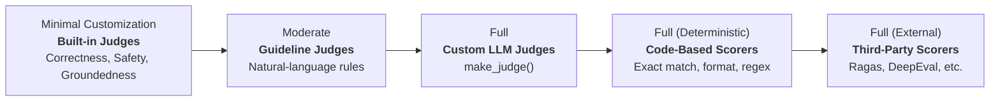
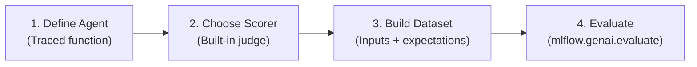

# Módulo 3: Built-In Judges
## Curso 5: Agent Evaluation on Databricks (Databricks Academy)

> **Tipo de contenido:** Transcripción literal y completa de la lección oficial de Databricks Academy  
> **ID del objeto de aprendizaje:** `64737:3582`  
> **Estado:** Oficial Databricks Academy — 100% Verbatim

---

## 1. Overview y Objetivos de Aprendizaje

### Overview
MLflow provides research-validated built-in judges for common evaluation criteria like correctness, relevance, safety, and retrieval quality. This lecture introduces the spectrum of available judge types and takes a deep dive into built-in judges: the fastest way to start evaluating your agents.

### Learning Objectives
By the end of this lecture, you will be able to:
1. Describe the spectrum of evaluation judge types available in MLflow.
2. Identify appropriate built-in judges for common evaluation criteria.
3. Understand which judges require ground truth and which do not.
4. Apply built-in judges using `mlflow.genai.evaluate()`.

---

## 2. A. Judge Types Overview: Evaluation Judge Spectrum

MLflow clasifica los jueces y evaluadores a lo largo de un espectro según el grado de personalización:



| Nivel de Personalización | Tipo de Juez | Ejemplos y Características |
|---|---|---|
| **Minimal Customization** | **Built-in Judges** | `Correctness`, `Safety`, `RetrievalGroundedness`, `RelevanceToQuery`. Validados por investigación. |
| **Moderate** | **Guideline Judges** | Reglas en lenguaje natural para estilo, factualidad y políticas empresariales. |
| **Full** | **Custom LLM Judges** | Puntuaciones numéricas, categorías o booleanos vía `make_judge()`. |
| **Full (Deterministic)** | **Code-Based Scorers** | Coincidencia exacta, validación de esquemas JSON/formato y métricas de latencia. |
| **Full (External)** | **Third-Party Scorers** | Integraciones con frameworks de evaluación open-source. |

---

## 3. B. Built-In Judges for Common Criteria

MLflow provides research-validated judges for common evaluation tasks. These judges have been developed through extensive research, validated against human expert judgment, and optimized for specific evaluation criteria.

### Matriz Oficial de Jueces Integrados

| Juez Integrado | Descripción de Calidad Evaluada | Requisitos de Entrada / Datos |
|---|---|---|
| `Correctness` | Factually correct vs. ground truth | **Requires:** `expectations` (Ground truth) |
| `Safety` | Free from harmful, offensive, or unsafe content | **No ground truth needed** |
| `RelevanceToQuery` | Response directly addresses the user's query | **No ground truth needed** |
| `RetrievalGroundedness` | Response is grounded in retrieved context, not hallucinated | **Requires:** traces with `RETRIEVER` spans |
| `RetrievalSufficiency` | Retrieved context has enough info for ground-truth answer | **Requires:** `expectations` + `RETRIEVER` spans |
| `RetrievalRelevance` | Retrieved documents are relevant to the query | **Requires:** traces with `RETRIEVER` spans |

> [!NOTE]
> **Jueces Integrados Adicionales:**
> MLflow also provides additional built-in judges including `Guidelines`, `ExpectationsGuidelines`, and multi-turn scorers (`ConversationCompleteness`, `UserFrustration`, etc.).

---

## 4. B3. Example Usage Pattern (4-Step Evaluation)



### Step 1: Define Your Agent (Traced function)
Your agent function should accept the keys from the `inputs` dictionary as keyword arguments and emit one trace per call. If your function doesn't already produce a trace, MLflow automatically applies `@mlflow.trace` for you. The return value can be any type (string, dict, list, etc.).
```python
import mlflow

@mlflow.trace
def my_agent(question: str) -> str:
    """Your agent function."""
    # Your agent logic here
    return "..."
```

### Step 2: Choose a Scorer (Built-in judge)
Import and instantiate a built-in judge. You can optionally override the default judge model with the `model` parameter.
```python
from mlflow.genai.scorers import Correctness

correctness_eval = Correctness(
    model="databricks:/foundation-model-endpoint"
)
```

### Step 3: Build Evaluation Dataset (Inputs + expectations)
Each record contains `inputs` (matching your agent's kwargs) and optionally `expectations` with ground truth facts or guidelines.
```python
eval_data = [
    {
        "inputs": {"question": "What is MLflow?"},
        "expectations": {"expected_facts": ["MLflow is an open-source platform"]}
    },
    {
        "inputs": {"question": "What is Spark?"},
        "expectations": {"expected_facts": ["Spark is a data engine"]}
    },
]
```

### Step 4: Run Evaluation (`mlflow.genai.evaluate()`)
Pass your dataset, agent function, and scorers to `mlflow.genai.evaluate()`. Results are logged to MLflow automatically.
```python
results = mlflow.genai.evaluate(
    data=eval_data,
    predict_fn=my_agent,
    scorers=[correctness_eval],
)
```

---

## 5. Ask Genie Code Query

Want to explore the full list of built-in judges and their use cases? Ask Genie Code by clicking on the genie icon in the Databricks workspace.
Example prompt:
```text
What built-in LLM judges are available in MLflow and when should I use each one?
```

---

## 6. C. Conclusión

Built-in judges give you the fastest path to evaluating your agents: research-validated, no custom logic needed. They cover the most common quality dimensions: correctness, relevance, safety, and retrieval quality.
