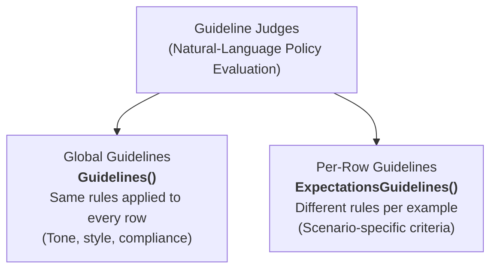

# Módulo 4: Guideline Judges
## Curso 5: Agent Evaluation on Databricks (Databricks Academy)

> **Tipo de contenido:** Transcripción literal y completa de la lección oficial de Databricks Academy  
> **ID del objeto de aprendizaje:** `64738:3583`  
> **Estado:** Oficial Databricks Academy — 100% Verbatim

---

## 1. Overview y Objetivos de Aprendizaje

### Overview
While built-in judges cover common criteria, many evaluation needs are specific to your business: tone, compliance, formatting, or domain-specific rules. Guideline judges let you express these requirements in natural language, making evaluation accessible to domain experts without code changes.

### Learning Objectives
By the end of this lecture, you will be able to:
1. Distinguish between global and per-row guideline judges.
2. Implement the `Guidelines` class for uniform evaluation criteria.
3. Apply the `ExpectationsGuidelines` class for scenario-specific evaluations.
4. Write effective natural language guidelines.

---

## 2. A. Two Types of Guideline Judges



| Dimensión | Global Guidelines (`Guidelines()`) | Per-Row Guidelines (`ExpectationsGuidelines()`) |
|---|---|---|
| **Alcance** | Same rules applied to **every row** | Different rules **per example / test case** |
| **Casos de Uso** | Tone, style, formatting, brand voice, regulatory compliance | Scenario-specific validation criteria, intent-specific expectations |
| **Clase MLflow** | `from mlflow.genai.scorers import Guidelines` | `from mlflow.genai.scorers import ExpectationsGuidelines` |
| **Definición** | Configured in the judge constructor | Provided inside each row's `expectations["guidelines"]` |

---

## 3. Patrones de Implementación de Código

### Patrón 1: Global Guidelines (`Guidelines`)
Apply **uniform criteria across all evaluations** — ideal for consistent standards like tone, style, or formatting. Use the `Guidelines` class with a list of natural-language rules.

```python
import mlflow
from mlflow.genai.scorers import Guidelines

tone_guidelines = Guidelines(
    name="professional_tone",
    guidelines=[
        "The response must use professional language",
        "The response must not use slang",
        "The response must address the user respectfully"
    ],
    model="databricks:/foundation-model-endpoint"
)

# Use in evaluation
results = mlflow.genai.evaluate(
    data=eval_data,
    scorers=[tone_guidelines]
)
```

---

### Patrón 2: Per-Row Guidelines (`ExpectationsGuidelines`)
Apply **different criteria to each example** — ideal when different scenarios require different validation standards. Each row in your dataset includes its own guidelines in the `expectations` field.

```python
import mlflow
from mlflow.genai.scorers import ExpectationsGuidelines

data = [
    {
        "inputs": {"question": "What's the refund policy?"},
        "outputs": "Returns within 30 days with a receipt.",
        "expectations": {
            "guidelines": [
                "The response must mention the 30-day timeframe",
                "The response must include the receipt requirement"
            ]
        }
    },
    {
        "inputs": {"question": "How do I contact support?"},
        "outputs": "Reach us at support@example.com.",
        "expectations": {
            "guidelines": [
                "The response must provide a contact method",
                "The response must be concise"
            ]
        }
    },
]

results = mlflow.genai.evaluate(
    data=data,
    scorers=[ExpectationsGuidelines()]
)
```

---

## 4. B. Ventajas y Mejores Prácticas

### ¿Por qué utilizar Guideline Judges?
- **Expert Accessible:** No coding required. Subject-matter experts (SMEs) can author and audit evaluation rules directly.
- **Rapid Iteration:** Update policies and guidelines without changing underlying codebase.
- **Interpretable:** Self-documenting rules where the judge produces a clear rationale for compliance.
- **Flexible:** Can express complex, context-dependent business rules.

---

### Reglas de Oro para Redactar Directrices Efectivas

> [!IMPORTANT]
> **Key rule: Refer to inputs as "the request" and outputs as "the response"**  
> The LLM judge automatically extracts request/response data from your trace. When writing guidelines, always frame them in terms of *"the request"* (inputs) and *"the response"* (outputs).

#### Patrones de Redacción Recomendados:
- `"The response must …"` (required behavior)
- `"The response must not …"` (prohibited behavior)
- `"The response may optionally …"` (suggested but not required)

#### Consejos Adicionales:
1. **Be specific and concrete:** (e.g., *"The response must cite the source document"* vs. *"The response should be credible"*).
2. **Objective verification:** Write guidelines that can be objectively evaluated and verified by an independent reviewer or judge model.
3. **Focus on observables:** Target observable attributes, keywords, entities, and structures in the response.
4. **Minimize ambiguity:** Eliminate vague adjectives like "good", "fast", or "high-quality".
5. **Multi-example testing:** Test guidelines on multiple examples to ensure consistent and reliable judge behavior.

---

## 5. Ask Genie Code Query

Want to explore guideline judge patterns further? Ask Genie Code by clicking on the genie icon in the Databricks workspace.
Example prompt:
```text
What is the difference between Guidelines and ExpectationsGuidelines in MLflow?
```

---

## 6. C. Conclusión

Guideline judges bridge the gap between built-in judges and fully custom evaluation logic. They let domain experts define quality standards in natural language: global guidelines for uniform criteria, per-row guidelines for scenario-specific validation.
