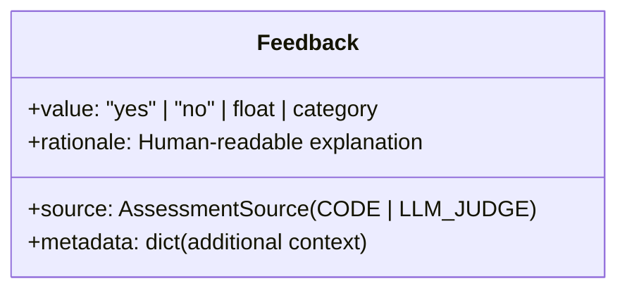

# Módulo 5: Custom Judges and Feedback
## Curso 5: Agent Evaluation on Databricks (Databricks Academy)

> **Tipo de contenido:** Transcripción literal y completa de la lección oficial de Databricks Academy  
> **ID del objeto de aprendizaje:** `64739:3584`  
> **Estado:** Oficial Databricks Academy — 100% Verbatim

---

## 1. Overview y Objetivos de Aprendizaje

### Overview
When built-in and guideline judges don't cover your specific evaluation needs, MLflow supports fully custom evaluation logic: both code-based scorers for deterministic checks and custom LLM judges for sophisticated assessments. This lecture also covers `Feedback` objects, which provide the structured rationales that make evaluation results interpretable and actionable.

### Learning Objectives
By the end of this lecture, you will be able to:
1. Create code-based scorers using the `@scorer` decorator.
2. Understand when and how to implement custom LLM judges with `make_judge()`.
3. Work with `Feedback` objects and understand the role of rationales.
4. Choose the right judge type for your evaluation requirements.

---

## 2. A. Code-Based Scorers: Deterministic Evaluation with `@scorer`

The `@scorer` decorator converts a Python function into a reusable evaluation component. Your function can accept any combination of these keyword arguments:

| Parámetro | Tipo | Descripción |
|---|---|---|
| `inputs` | `dict[str, Any]` | The app's raw input (argument names → values) |
| `outputs` | `Any` | The app's raw output |
| `expectations` | `dict[str, Any]` | Ground truth labels (e.g., expected facts, guidelines) |
| `trace` | `mlflow.entities.Trace` | Complete trace with all spans and metadata |

> [!NOTE]
> **Imperative approach:**
> You write the evaluation logic directly in Python — full control over scoring decisions, data access, and error handling. Use this when evaluation criteria can be expressed as deterministic code (format checks, length validation, keyword matching, schema verification).

### Patrones de Retorno en `@scorer`

#### Opción 1: Con Objeto `Feedback` (Recomendado para Interpretabilidad)
Return a `Feedback` object with **value**, **rationale**, and optional **metadata**. This gives you full interpretability — you can see *why* an example passed or failed:
```python
from mlflow.genai.scorers import scorer
from mlflow.entities import Feedback

@scorer
def response_length(outputs):
    """Verify response length is appropriate."""
    word_count = len(str(outputs.get("response", "")).split())

    if 20 <= word_count <= 100:
        return Feedback(
            value="yes",
            rationale=f"Response length ({word_count} words) is appropriate"
        )
    else:
        return Feedback(
            value="no",
            rationale=f"Response is too {'short' if word_count < 20 else 'long'}"
        )
```

#### Opción 2: Retorno Primitivo (Paso/Fallo Simple)
For straightforward pass/fail checks, scorers can return primitive values directly. More concise, but no rationale for the scoring decision:
```python
from mlflow.genai.scorers import scorer

@scorer
def response_length(outputs):
    wc = len(str(outputs.get("response", "")).split())
    return "yes" if 20 <= wc <= 100 else "no"
```

---

## 3. B. Custom LLM Judges

### ¿Cuándo Usar Custom LLM Judges?
- **Domain-Specific:** Criteria unique to your application.
- **Nuanced Assessment:** Beyond what built-in judges capture.
- **Proprietary Standards:** Regulations, corporate compliance, and policy rules.
- **Multi-Signal Logic:** Combine multiple data sources and internal trace spans.

---

### Construcción de Custom LLM Judges con `make_judge()`

The `make_judge()` API lets you define evaluation criteria in natural language. MLflow handles the LLM invocation, response parsing, and `Feedback` generation automatically.

> [!TIP]
> **Declarative approach:**
> Unlike `@scorer` where you write evaluation logic in Python, `make_judge()` lets you describe *what* to evaluate in natural language. MLflow manages the LLM call, response parsing, and structured output enforcement. Use this when evaluation requires subjective reasoning that's hard to express as deterministic code.

#### Patrón 1: Pass/Fail Judge (Salida Binaria)
The simplest custom judge. Use `feedback_value_type=Literal["yes", "no"]` to enforce binary pass/fail output. Provide a `name` and natural-language `instructions` with template variables (`{{ inputs }}`, `{{ outputs }}`, `{{ expectations }}`):
```python
from typing import Literal
from mlflow.genai import make_judge

formality_judge = make_judge(
    name="formality",
    instructions="""
        Evaluate whether the response is written in a
        professional, formal tone.
        Request: {{ inputs }}
        Response: {{ outputs }}
    """,
    model="databricks:/databricks-claude-sonnet-4-5",
    feedback_value_type=Literal["yes", "no"],
)
```

#### Patrón 2: Multi-Category Judge (Categorías Personalizadas)
Use `feedback_value_type` with `Literal` to define custom categories. The judge uses structured outputs to enforce the type:
```python
from typing import Literal
from mlflow.genai import make_judge

quality_judge = make_judge(
    name="answer_quality",
    instructions="""
        Evaluate the quality of the response.
        Request: {{ inputs }}
        Response: {{ outputs }}
        Expected: {{ expectations }}
        Rate as excellent, acceptable, or poor.
    """,
    feedback_value_type=Literal["excellent", "acceptable", "poor"],
)
```

> [!IMPORTANT]
> **Soporte Dual:** Both `@scorer` and `make_judge()` are supported in offline evaluation (`mlflow.genai.evaluate()`) and production monitoring (`ScorerScheduleConfig`).

---

## 4. C. Feedback Objects and Rationales

All MLflow judges return structured `Feedback` objects: not just scalar scores. This makes evaluation results interpretable and actionable.



- **`value`:** Resultado de la evaluación ("yes" / "no" / score numérico / categoría).
- **`rationale`:** Explicación detallada en lenguaje natural del razonamiento del juez.
- **`source`:** Auto-poblado como `CODE` para `@scorer` y `LLM_JUDGE` para `make_judge()`.
- **`metadata`:** Diccionario con contexto adicional de la evaluación.

### Por Qué Son Cruciales los Rationales
1. **Debugging:** Explican *por qué* falló el modelo, no solo *que* falló.
2. **Judge Validation:** Permiten a los humanos verificar si el juez está razonando correctamente o alucinando.
3. **Pattern Identification:** Los temas comunes en los rationales revelan defectos sistemáticos en prompts o datos de recuperación.
4. **Stakeholder Communication:** Permiten justificar objetivamente las decisiones de calidad ante auditorías o líderes de negocio.

#### Uso Efectivo de Rationales:
- Leer los rationales de todos los fallos para identificar patrones.
- Hacer muestreo aleatorio (spot-check) de aprobados para verificar coherencia lógica.
- Extraer frases y palabras clave recurrentes para categorizar tipos de fallas.
- Compartir rationales representativos durante revisiones de sprint y lanzamientos.

---

## 5. Ask Genie Code Query

Want to explore custom judge patterns and feedback types? Ask Genie Code by clicking on the genie icon in the Databricks workspace.
Example prompt:
```text
How do I create a custom LLM judge using make_judge() in MLflow with trace-based evaluation?
```

---

## 6. D. Conclusión

`@scorer` gives you imperative control for deterministic checks (format, length, schema), while `make_judge()` provides a declarative path for subjective LLM-based assessments. Both return structured `Feedback` objects with values, rationales, and auto-populated sources — and both work in offline evaluation and production monitoring.
