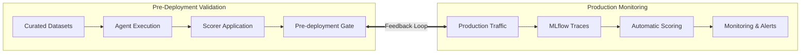
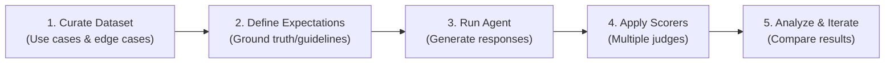
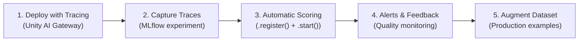
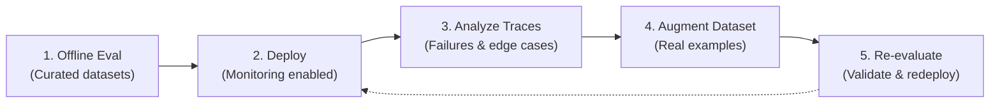
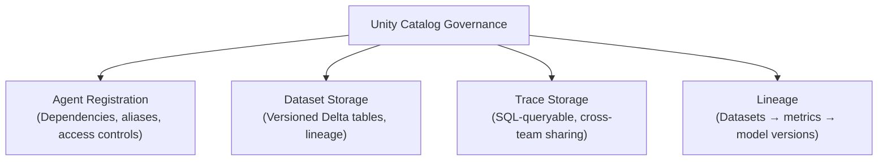
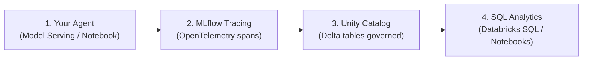

# Módulo 6: Offline vs. Online Evaluation Strategies
## Curso 5: Agent Evaluation on Databricks (Databricks Academy)

> **Tipo de contenido:** Transcripción literal y completa de la lección oficial de Databricks Academy  
> **ID del objeto de aprendizaje:** `52863:3585`  
> **Estado:** Oficial Databricks Academy — 100% Verbatim

---

## 1. Overview y Objetivos de Aprendizaje

### Overview
Effective agent evaluation requires both offline validation using curated datasets and online monitoring of production performance. This lecture explores the complementary roles of offline and online evaluation, their respective strengths and limitations, and how to create feedback loops between them.

We'll examine when to use each approach, understand their implementation patterns, and learn how to build evaluation systems that evolve with real-world usage while maintaining rigorous quality standards.

### Learning Objectives
By the end of this lecture, you will be able to:
1. Identify when to use offline versus online evaluation strategies.
2. Understand the strengths and limitations of each approach.
3. Describe how offline and online evaluation complement each other.
4. Explain how to create feedback loops between production and evaluation.
5. Recognize best practices for comprehensive evaluation strategies.

---

## 2. A. Evaluation Strategy Overview: Two Complementary Approaches



| Estrategia | Enfoque | Flujo Principal | Características |
|---|---|---|---|
| **Offline Evaluation** | Controlled & reproducible | Curated Datasets $\rightarrow$ Agent Execution $\rightarrow$ Scorer Application $\rightarrow$ Pre-deployment Gate | Validación antes de que los usuarios toquen el agente. Permite A/B testing e iteración rápida. |
| **Online Evaluation** | Real-world & continuous | Production Traffic $\rightarrow$ MLflow Traces $\rightarrow$ Automatic Scoring $\rightarrow$ Monitoring & Alerts | Refleja la experiencia real del usuario, detecta desviaciones (drift) e identifica casos borde reales. |

---

## 3. B. Offline Evaluation: Pre-Deployment Validation

Offline evaluation tests your agent using curated datasets before deployment. Controlled, reproducible, and gated.

### Flujo de Trabajo Offline



### Fortalezas y Limitaciones de Offline Evaluation
- **Strengths:**
  - Rigorous validation before users encounter the agent.
  - A/B testing of alternative agent architectures and configurations.
  - Baseline metrics for production comparison.
- **Limitations:**
  - May not fully represent actual user behavior and query distribution.
  - Static datasets become stale over time.
  - Cannot capture scale, concurrency, or unexpected emergent diversity issues.

---

## 4. C. Online Evaluation: Production Monitoring

Online evaluation analyzes agent performance using real user interactions: capturing actual usage patterns, unexpected inputs, and diverse user populations.

### Flujo de Trabajo Online



> [!NOTE]
> **Scorers Compatibles con Producción:**
> Built-in judges, `make_judge()`, `Guidelines`, y funciones decoradas con `@scorer` soportan monitoreo en producción mediante `.register()` + `.start()`. Únicamente se excluyen subclases directas de `Scorer` y scorers de terceros.

### Capacidades de Production Monitoring
- **Auto Scoring:** Evaluación automática mediante LLM judges sobre trazas de producción.
- **Sampling:** Tasas de muestreo configurables para equilibrar costos y cobertura.
- **Alerting:** Alertas basadas en umbrales de calidad (quality thresholds).
- **Trace Inspection:** Inspección profunda de fallas aisladas paso a paso.

---

## 5. D. Complementary Strategies & The Feedback Loop

### ¿Cuándo Usar Cada Enfoque?

#### Casos de Uso de Offline Evaluation:
- **Quality gates:** Pre-deployment validation before users see the agent.
- **A/B testing:** Compare alternative agent implementations side-by-side.
- **Hypothesis testing:** Test specific behaviors (e.g., *"does the new prompt reduce hallucinations?"*).
- **Rapid iteration:** Fast feedback during active development cycles.

#### Casos de Uso de Online Evaluation:
- **Generalization check:** Validate that offline results hold in production.
- **Drift detection:** Catch performance and accuracy degradation over time.
- **User insight:** Understand real needs, pain points, and edge cases.
- **Dataset mining:** Build and expand evaluation datasets from actual usage patterns.

---

### Creación del Ciclo Virtuoso de Retroalimentación (Feedback Loop)



This cycle ensures your evaluation evolves with your understanding of real-world usage while maintaining rigorous pre-deployment validation.

---

## 6. E. Integration with Unity Catalog: Governed Storage

Unity Catalog provides the governance layer for your evaluation workflow: traceability, access control, and lineage tracking across agents, datasets, and traces.



### Almacenamiento de Trazas OpenTelemetry en Tablas Delta de Unity Catalog

Por defecto, MLflow almacena las trazas en el plano de control del servicio. Para cargas de producción masivas, Databricks permite guardar las trazas OpenTelemetry directamente en **tablas Delta de Unity Catalog**:



#### Ventajas Clave sobre el Almacenamiento Predeterminado:
1. **SQL queryable:** Permite unir (JOIN) trazas con tablas de resultados de evaluación y dimensiones de negocio mediante Databricks SQL estándar.
2. **UC access control:** Gobernanza de acceso a nivel de catálogo/esquema/tabla en vez de listas de control de acceso (ACLs) de experimentos.
3. **Long-term retention:** Retención rentable a largo plazo para millones de trazas de producción.
4. **OTel compatible:** Compatible con clientes OpenTelemetry externos mediante exportadores OTLP.

---

## 7. Ask Genie Code Query

Want to learn more about connecting offline and online evaluation? Ask Genie Code by clicking on the genie icon in the Databricks workspace.
Example prompt:
```text
How do I set up online evaluation with MLflow to monitor agent quality in production?
```

---

## 8. F. Conclusión

Offline and online evaluation are complementary strategies. Offline evaluation uses curated datasets and scorers to validate agent quality before deployment, while online evaluation monitors real production traffic using the same scorers via `.register()` + `.start()`. Together they form a feedback loop: production traces reveal failures and edge cases that augment your offline datasets, driving continuous improvement. Unity Catalog ties it all together with governed storage for agents, datasets, and traces.
