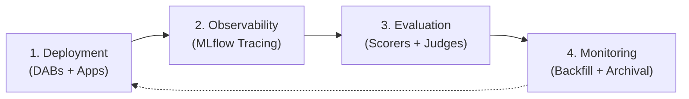
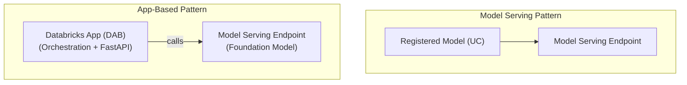
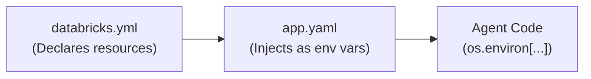
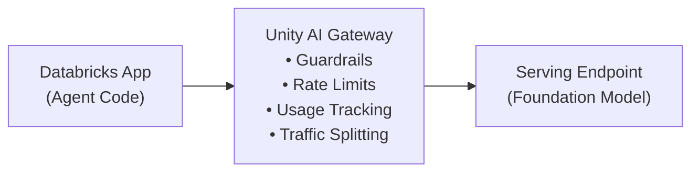

# Módulo 1: Agent Deployment on Databricks
## Curso 6: Deploying and Monitoring Agent Applications on Databricks (Databricks Academy)

> **Tipo de contenido:** Transcripción literal y completa de la lección oficial de Databricks Academy  
> **ID del objeto de aprendizaje:** `63960:3559`  
> **Estado:** Oficial Databricks Academy — 100% Verbatim

---

## 1. Overview y Objetivos de Aprendizaje

### Overview
This lecture covers the architecture and tooling required to move a generative AI agent from a notebook prototype into a production Databricks App. The focus is on the agent lifecycle, Databricks Apps as the deployment target, and Declarative Automation Bundles (DABs) as the packaging and deployment mechanism.

### Learning Objectives
By the end of this lecture you will be able to:
1. Outline the four stages of the agent lifecycle on Databricks.
2. Differentiate Databricks Apps deployment from model serving endpoint deployment.
3. Explain how Declarative Automation Bundles structure and deploy an agent application.
4. Describe how resource injection decouples agent code from infrastructure configuration.
5. Identify the role of Unity AI Gateway as the governance layer for deployed agents.

---

## 2. A. The Agent Lifecycle: From Prototype to Production

Building an agent in a notebook is only the beginning. A production-grade agent must be **deployed** to infrastructure that can serve requests, **observed** so you can understand its behavior, **evaluated** to measure quality, and **monitored** continuously to catch regressions before users notice them.



### Las 4 Etapas del Ciclo de Vida:
- **Deployment:** Package the agent and deploy it as a Databricks App using Declarative Automation Bundles (DABs). The app runs as a managed web application with its own compute, service principal, and URL.
- **Observability:** Integrate MLflow Tracing so every request produces a structured trace capturing inputs, outputs, latency, and execution flow.
- **Evaluation:** Attach scorers to the MLflow Experiment that automatically assess trace quality using LLM judges, guidelines, or custom Python functions.
- **Monitoring:** Manage scorer lifecycles, backfill historical traces with new scorers, and archive traces to Delta tables for long-term analysis.

> [!NOTE]
> **Carácter Incremental del Ciclo:**
> These stages are not strictly sequential. You can add tracing before deployment, attach scorers to an agent that is already live, or backfill evaluation data onto traces logged weeks ago. The lifecycle is designed to be incremental.

---

## 3. B. Deployment Architecture

### B1. Databricks Apps como Entorno Gestionado
**Databricks Apps** provide a managed hosting environment for web applications running on the Databricks platform. When you deploy an agent as a Databricks App, the platform handles the infrastructure concerns so you can focus on the application logic.

**Key characteristics of a Databricks App:**
- **Managed compute:** The platform provisions and manages the compute resources. You do not configure clusters, VMs, or containers.
- **Service principal:** Each app runs under its own service principal identity, which determines what Databricks resources the app can access (serving endpoints, UC objects, experiments).
- **Unique URL:** Every deployed app gets a workspace-scoped URL that users or downstream services can call directly.
- **Workspace integration:** Apps are first-class workspace objects visible on the **Apps** page in the workspace sidebar, where you can monitor status, view logs, and trigger redeployments.

---

### B2. Declarative Automation Bundles (DABs)

A **Declarative Automation Bundle (DAB)** is the project structure that describes your app and its resources. The project folder contains two categories of files:

#### 1. User-authored source files:
- `agent.py`: The agent logic (using the OpenAI Agents SDK pointed at a Databricks model serving endpoint).
- `server.py`: A FastAPI server that wraps the agent and exposes HTTP endpoints.
- `pyproject.toml`: Python dependency specification.

#### 2. Configuration files (defined by DAB/Apps spec):
- `databricks.yml`: Bundle declaration: app name, resources (serving endpoints, MLflow experiments), and permissions.
- `app.yaml`: Runtime manifest: the startup command and environment variable injection via its top-level `env:` section.

#### Two-Step Deployment Process:
Deployment is a **two-step process**:
1. Run `databricks bundle deploy` from the CLI to create or update the app resource and its configuration in the workspace.
2. Deploy the application source code by running `databricks apps deploy <app-name>` from the CLI or through the **Apps** page in the workspace sidebar.

```bash
# Step 1: Deploy the bundle (creates/updates resources)
$ databricks bundle deploy

# Step 2: Deploy the app source code
$ databricks apps deploy my-agent-app --source-code-path /Workspace/Users/<your-username>/my-agent-app
```

> [!TIP]
> The two steps are independent. You can redeploy app source code without changing resource declarations, and you can update resource configuration without redeploying code. This separation makes iterative development faster.

---

### B3. Comparing Deployment Patterns: Model Serving vs Databricks Apps



| Dimensión | Model Serving Endpoint | Databricks App (DAB) |
|---|---|---|
| **What is deployed** | A registered model (MLflow/UC) | Application code (DAB) |
| **Inference** | The endpoint runs the model directly | The app calls a serving endpoint for inference |
| **Scaling** | Managed by serving infrastructure | Managed by the Apps platform |
| **Customization** | Limited to model configuration | Full control: custom UI, middleware, routing logic |
| **Governance** | UC model permissions | App-level ACLs + UC permissions on accessed resources |
| **Tool integration** | Defined in the registered model | MCP servers, direct API calls, any Python library |

---

### B4. Resource Injection: Decoupling Code from Infrastructure

The `databricks.yml` bundle file declares every resource the app depends on. The `app.yaml` file controls how those resources are injected into the running app as **environment variables** via its top-level `env:` section.



#### Ejemplo: `databricks.yml`
```yaml
bundle:
  name: my-agent-app

resources:
  apps:
    my_agent:
      name: my-agent-app
      source_code_path: ./src
      config:
        command: ["uv", "run", "start-server"]
        env:
          - name: DATABRICKS_HOST
            value: ${workspace.host}
          - name: SERVING_ENDPOINT
            value: my-llm-endpoint
          - name: MLFLOW_EXPERIMENT_NAME
            value: /Users/me/my-experiment
```

#### Ejemplo: `app.yaml`
```yaml
command: ["uv", "run", "start-server"]
env:
  - name: SERVING_ENDPOINT
    valueFrom: "my-serving-endpoint"
  - name: SECRET_KEY
    valueFrom: "my-secret"
  - name: MLFLOW_EXPERIMENT_NAME
    value: "/Users/me/my-experiment"
```

#### Lectura en Código Python:
```python
import os

serving_endpoint = os.environ["SERVING_ENDPOINT"]
experiment_name = os.environ["MLFLOW_EXPERIMENT_NAME"]
workspace_host = os.environ["DATABRICKS_HOST"]
```

---

### B5. Unity AI Gateway: Unified Governance Layer

When a deployed agent calls a model serving endpoint for inference, that request passes through the **Unity AI Gateway** — the centralized AI governance layer on Databricks.



| Capacidad del Gateway | Descripción |
|---|---|
| **Guardrails** | Enforce safety and content policies on requests and responses at the gateway level. |
| **Rate limiting** | Configure consumption limits per endpoint to manage capacity and control costs. |
| **Usage tracking** | Analyze costs by endpoint, model, principal, and tags via billable usage system tables. |
| **Traffic splitting** | Distribute requests across multiple model backends for A/B testing or gradual rollouts. |
| **Inference tables** | Log requests and responses to Unity Catalog Delta tables for auditing and analysis. |

---

## 4. Ask Genie Code Query

Want to learn more about **agent deployment patterns**? Ask Genie Code by clicking on the genie icon in the Databricks workspace.
Example prompt:
```text
What are the differences between deploying an agent as a Databricks App versus a model serving endpoint?
```
