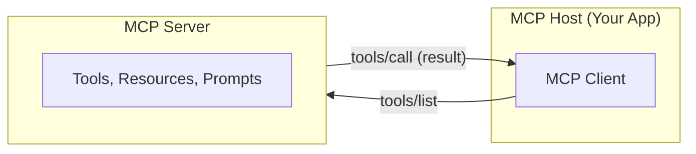
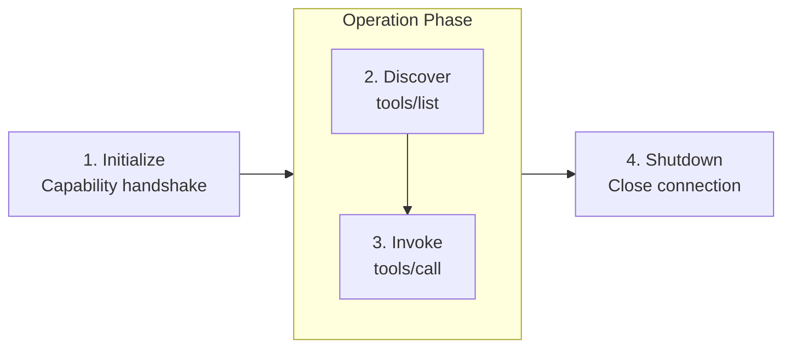

# M02: Tool Integration and Observability

> **Curso:** Deploying and Monitoring Agent Applications on Databricks (Course ID: `5855`)  
> **Lección:** Tool Integration and Observability (LO `63961:3560`)  
> **Tipo:** SCORM Lecture (Contenido Literal Oficial)

---

## Overview

This lecture covers how deployed agents connect to external tools through the Model Context Protocol (MCP) and how MLflow Tracing provides the observability foundation for production monitoring. Together, these capabilities make agents extensible and observable — the prerequisites for evaluation and monitoring covered later in the course.

---

## Learning Objectives

By the end of this lecture you will be able to:
- Describe how MCP enables runtime tool discovery and invocation for deployed agents.
- Differentiate managed, external, and custom MCP servers on Databricks.
- Explain the MCP connection lifecycle from initialization through shutdown.
- Identify what MLflow Tracing captures and how it connects deployment to evaluation.

---

## A. Model Context Protocol

### A1. What Is MCP?

The **Model Context Protocol (MCP)** is an open protocol for connecting AI applications to external systems. Think of it like a USB-C port for AI: just as USB-C provides a standardized physical interface for connecting peripherals, MCP provides a standardized software interface that lets AI applications communicate with data sources, tools, and workflows.

Without MCP, every tool integration requires custom code: API wrappers, authentication handling, response parsing. MCP eliminates this by defining a common protocol that any compliant client and server can speak.

MCP follows a **client-server architecture** with three participants:



| Participant | Role |
| :--- | :--- |
| **MCP Host** | The AI application (e.g., a Databricks App) that manages one or more MCP clients. |
| **MCP Client** | A component inside the host that maintains a dedicated connection to a single MCP server. |
| **MCP Server** | A program that exposes tools, resources, or prompts to connected clients. |

> [!NOTE]
> MCP servers expose three types of primitives:
> 1. **Tools**: Executable functions that can be invoked by the model.
> 2. **Resources**: Read-only data sources (similar to files or documents).
> 3. **Prompts**: Reusable interaction templates or system prompts.
> 
> In practice, **tool primitives** are the most common integration point for agents.

---

### A2. MCP on Databricks

Databricks provides three categories of MCP server to cover different integration needs:

| Type | Description | Example |
| :--- | :--- | :--- |
| **Managed MCP** | Pre-configured servers that give immediate access to Databricks features. | Unity Catalog functions, Genie spaces, AI Search indexes |
| **External MCP** | Managed connections to MCP servers hosted outside of Databricks. | Third-party APIs, SaaS integrations |
| **Custom MCP** | A custom MCP server you write and host as a Databricks App. | Domain-specific tools, internal microservices |

The most common starting point is a **Managed MCP server backed by Unity Catalog functions**. You write a Python function, register it in UC, and the managed MCP server automatically exposes it as a tool that any connected agent can discover and invoke. The agent does not need custom code to call the function. The MCP protocol handles discovery, invocation, and response formatting.

> [!NOTE]
> A single host can connect to **multiple servers simultaneously**, each through its own client instance. This lets an agent access tools from Unity Catalog functions, external APIs, and custom services all through the same protocol.

---

### A3. MCP Lifecycle

Every MCP connection follows a structured lifecycle:



1. **Initialization**: The client sends an `initialize` request declaring its protocol version and capabilities. The server responds with its own capabilities. The client then sends an `initialized` notification to confirm readiness before normal message exchange begins.
2. **Tool discovery**: The client sends a `tools/list` request. The server returns all available tools with their names, descriptions, and input schemas. The agent uses these descriptions to decide when to call each tool.
3. **Tool invocation**: When the agent decides to use a tool, the client sends a `tools/call` request with the tool name and arguments. The server executes the function and returns the result.
4. **Shutdown**: Either side can close the connection gracefully.

#### Example: Connecting to UC functions via MCP

```python
# MCP integration using the Databricks OpenAI connector
from databricks.sdk import WorkspaceClient
from databricks_openai.agents import McpServer
from agents import Agent, Runner

workspace_client = WorkspaceClient()

# 1. Initialize -- connect to UC functions as an MCP server (async context manager)
async with McpServer.from_uc_function(
    catalog="my_catalog",
    schema="my_schema",
    workspace_client=workspace_client,
    name="uc-functions",
) as uc_server:
    # 2. Discovery -- tools are listed automatically
    # 3. Invocation -- agent calls tools as needed
    agent = Agent(
        name="my_agent",
        model="databricks-claude-sonnet-4-5",
        mcp_servers=[uc_server],
    )
    result = await Runner.run(agent, "Look up info for Acme Corp")
```

> [!NOTE]
> Tools are **discovered at runtime**, not hardcoded. If a new UC function is registered on the MCP server, connected agents can discover and use it without redeployment. When MLflow Tracing is active, every MCP tool call is captured as a span within the trace.

---

### A4. MCP in a Deployed App

In a Databricks App, MCP servers are typically initialized at startup and shared across requests. The app's service principal must have permissions to access the underlying resources (UC functions, external endpoints) that the MCP servers expose.

#### Example: FastAPI server with MCP tool integration

```python
# server.py -- FastAPI app with MCP integration
import os
from contextlib import asynccontextmanager
from fastapi import FastAPI
from pydantic import BaseModel
from databricks.sdk import WorkspaceClient
from databricks_openai.agents import McpServer
from agents import Agent, Runner

class ChatRequest(BaseModel):
    message: str

workspace_client = WorkspaceClient()

@asynccontextmanager
async def lifespan(app: FastAPI):
    # Initialize MCP server at startup (async context manager)
    async with McpServer.from_uc_function(
        catalog=os.environ["UC_TOOL_CATALOG"],
        schema=os.environ["UC_TOOL_SCHEMA"],
        workspace_client=workspace_client,
        name="uc-functions",
    ) as uc_server:
        app.state.agent = Agent(
            name="deployed_agent",
            model=os.environ["SERVING_ENDPOINT"],
            mcp_servers=[uc_server],
        )
        yield

app = FastAPI(lifespan=lifespan)

@app.post("/chat")
async def chat(request: ChatRequest):
    result = await Runner.run(app.state.agent, request.message)
    return {"response": result.final_output}
```

> [!NOTE]
> - The UC catalog and schema are injected as environment variables through `databricks.yml`, keeping the app code portable across environments.
> - The service principal assigned to the app must have `EXECUTE` permission on the UC functions.
> - The `McpServer.from_uc_function` must be used as an async context manager to properly manage the server connection lifecycle.

---

## B. Observability with MLflow Tracing

### B1. Adding Tracing to Your Agent

MLflow Tracing records the execution of each agent request as a structured **trace**, a tree of **spans** that represent individual operations. The simplest way to enable tracing is the `@mlflow.trace` decorator on your agent's entry point.

Each span captures:
- **Inputs and outputs**: What went into the operation and what came out.
- **Timing**: Start time, end time, and duration.
- **Span type**: The kind of operation (e.g., `AGENT`, `CHAT_MODEL`, `TOOL`, `RETRIEVER`).
- **Status**: Whether the operation succeeded or failed.

If the agent calls supported libraries (e.g., the OpenAI SDK), child spans are generated automatically for each library call. You can also add manual spans with `mlflow.start_span()` for custom logic.

#### Trace Span Hierarchy

```text
AGENT handle_request
 ├── CHAT_MODEL chat.completions
 ├── TOOL lookup_weather
 └── CHAT_MODEL chat.completions
```

#### Example: `@mlflow.trace` decorator and manual spans

```python
import mlflow

# Automatic tracing of entry point and supported libraries
@mlflow.trace
def handle_request(user_message: str) -> str:
    # Child spans generated automatically for OpenAI calls:
    # CHAT_MODEL spans capture LLM interactions
    # TOOL spans capture MCP tool invocations
    response = agent.run(user_message)
    return response

# Manual span for custom logic
@mlflow.trace
def handle_request_v2(user_message: str) -> str:
    with mlflow.start_span(name="preprocessing") as span:
        cleaned = preprocess(user_message)
        span.set_inputs({"raw": user_message})
        span.set_outputs({"cleaned": cleaned})
    
    response = agent.run(cleaned)
    return response
```

> [!NOTE]
> A typical agent trace contains a root `AGENT` span with child spans for `CHAT_MODEL` calls, `TOOL` invocations, and `RETRIEVER` operations. This hierarchy shows exactly how the agent processed the request: which tools it called, in what order, and how long each step took.

---

### B2. Traces in Production

In production, traces are logged to an **MLflow Experiment** backed by Unity Catalog. This means traces are stored as governed objects with full lineage and access control. The experiment serves as the central hub where all observability and evaluation data converges.

Traces are the foundation that the rest of the monitoring pipeline builds on:
- **Scorers evaluate traces**, not raw requests. Any agent that produces MLflow traces can be evaluated using the same scorer infrastructure.
- **Trace archival** streams traces to Delta tables for SQL-based analysis and dashboarding.
- **Metric backfill** applies new scorers retroactively to traces logged before the scorer existed.

The experiment name is typically injected as an environment variable through `databricks.yml`, so the agent code sets it at startup:

```python
import os
import mlflow

# Set MLflow experiment at startup
mlflow.set_experiment(os.environ["MLFLOW_EXPERIMENT_NAME"])
```

> [!NOTE]
> Tracing must be enabled before scorers can be useful. If your agent is not producing traces, there is nothing for scorers to evaluate. The first step in any monitoring setup is ensuring traces are flowing to an MLflow Experiment.

---

### B3. Storing Traces in Unity Catalog

By default, traces are stored in the MLflow control plane. For production workloads, you can store OpenTelemetry traces directly in **Unity Catalog Delta tables**. This gives you long-term retention, SQL-queryable trace data, and governance through UC schema and table permissions rather than experiment-level ACLs.

To bind an experiment to Unity Catalog storage, pass a `trace_location` parameter when creating or setting the experiment:

```python
import mlflow
from mlflow.entities.trace_location import UnityCatalog

experiment = mlflow.set_experiment(
    experiment_name="my-agent-experiment",
    trace_location=UnityCatalog(
        catalog_name="my_catalog",
        schema_name="my_schema",
        table_prefix="agent_traces",
    ),
)
```

This automatically creates four Delta tables in the specified schema:

| Table | Contents |
| :--- | :--- |
| `<prefix>_otel_spans` | Individual span records (the primary trace data). |
| `<prefix>_otel_annotations` | Assessments and feedback attached to traces. |
| `<prefix>_otel_logs` | Log entries associated with trace execution. |
| `<prefix>_otel_metrics` | Metric values computed by scorers. |

Once stored in Delta tables, traces can be queried directly with SQL through a Databricks SQL warehouse, enabling custom reporting and dashboards.

#### Governance and Permissions

Access is controlled through UC table permissions:
- Users need `USE_CATALOG`, `USE_SCHEMA`, and explicit `MODIFY` + `SELECT` grants on each table.
- **Important**: `ALL_PRIVILEGES` is **not sufficient** — `MODIFY` and `SELECT` must be granted explicitly.

> [!NOTE]
> - Once you bind an experiment to a UC trace location, you **cannot reassign** it to a different location.
> - Multiple experiments can share the same UC location.
> - Users with access to the UC tables can view all traces stored there, regardless of which experiment the traces belong to.
> - **Ingestion limits**: Ingestion is capped at **200 traces per second per workspace** and **100 MB per second per table**.
