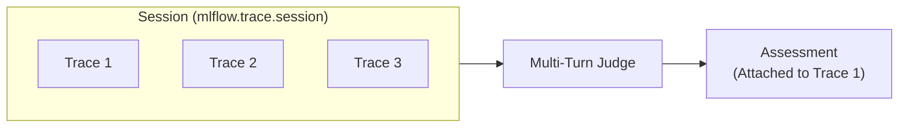
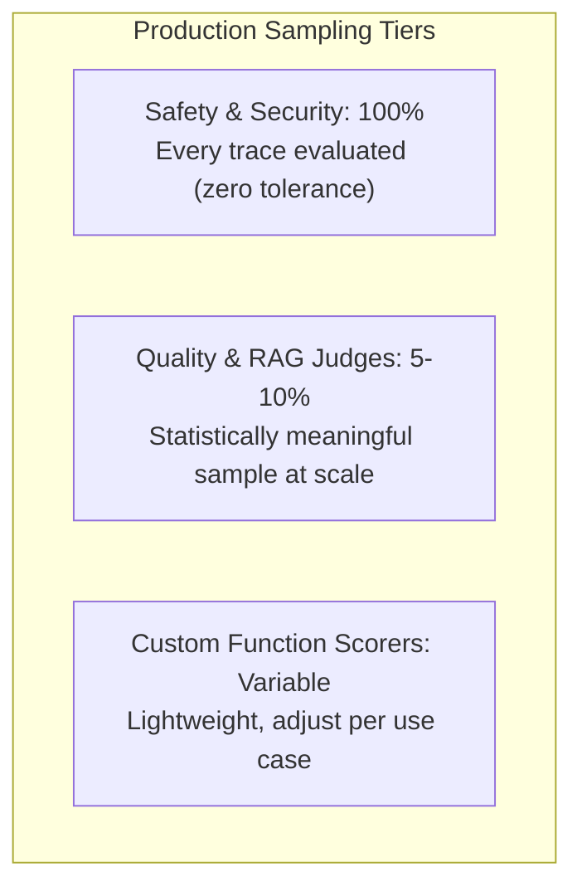
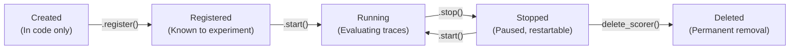
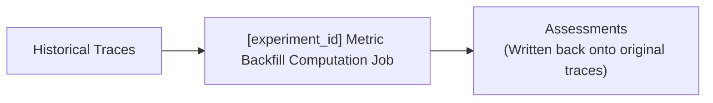
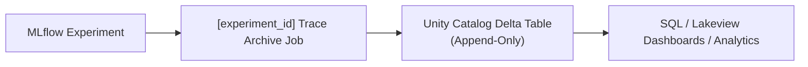

# M03: Production Evaluation and Monitoring

> **Curso:** Deploying and Monitoring Agent Applications on Databricks (Course ID: `5855`)  
> **Lección:** Production Evaluation and Monitoring (LO `63962:3561`)  
> **Tipo:** SCORM Lecture (Contenido Literal Oficial)

---

## Overview

This lecture covers the full spectrum of production evaluation and monitoring for generative AI applications on Databricks. It begins with the four scorer types available for automated quality assessment, progresses through multi-turn conversation judges for session-level evaluation, and then covers sampling strategies, the scorer lifecycle, management APIs, metric backfill for historical traces, and trace archival to Delta tables for long-term analysis.

---

## Learning Objectives

By the end of this lecture you will be able to:
- Differentiate the four scorer types and select the appropriate one for a given evaluation need.
- Construct serializable custom scorers using the `@scorer` decorator.
- Configure multi-turn judges for conversation-level quality assessment.
- Design a sampling strategy that balances safety coverage, quality signal, and cost.
- Manage scorers through their full lifecycle: register, start, update, stop, and delete.
- Apply metric backfill to evaluate historical traces with new scorers.
- Enable trace archival to stream production traces into Delta tables for SQL-based analysis.

> [!CAUTION]
> **Prerequisites:** This lecture assumes familiarity with MLflow Tracing and agent deployment concepts from earlier modules in this course. You should understand how traces are logged to MLflow Experiments before proceeding.

---

## A. Scorer Types

### A1. Built-in LLM Judges

MLflow provides **pre-built LLM judges** for common quality dimensions. These are ready-to-use scorers that require no custom prompt engineering. Each judge uses a Databricks-hosted LLM by default, or you can override with `model="databricks:/<endpoint>"`.

The standard pattern for using any built-in judge is two steps: **register** (bind to an experiment) and **start** (begin evaluating traces):

```python
from mlflow.genai.scorers import Safety, ScorerSamplingConfig

# 1. Register the scorer (binds to active experiment)
safety_judge = Safety().register(name="my_safety_judge")

# 2. Start with a sampling rate
safety_judge = safety_judge.start(
    sampling_config=ScorerSamplingConfig(sample_rate=0.7)
)

# Custom model override
custom = Safety(
    model="databricks:/databricks-gpt-oss-20b"
).register(name="custom_safety_judge")
```

The full set of built-in judges spans safety, response quality, RAG, tool calls, and guidelines:

| Category | Judges | Ground truth? |
| :--- | :--- | :--- |
| **Safety** | `Safety` | No |
| **Response quality** | `RelevanceToQuery` | No |
| | `Correctness` | Yes |
| **RAG** | `RetrievalRelevance`, `RetrievalGroundedness` | No |
| | `RetrievalSufficiency` | Yes |
| **Tool calls** | `ToolCallEfficiency` | No |
| | `ToolCallCorrectness` | Optional |
| **Guidelines** | `Guidelines`, `ExpectationsGuidelines` | No |

> [!NOTE]
> All built-in judges accept an optional `model=` parameter to override the default LLM. Format: `"databricks:/<endpoint-name>"`. The `.register(name=...)` name must be unique within the experiment.

---

### A2. Guidelines Judges

**Guidelines judges** evaluate traces against natural-language criteria you define. Each guideline is a pass/fail rule. The judge returns `Feedback` with value `"yes"` or `"no"` (strings, not booleans).

- Takes a `name` and a `guidelines` list of plain-English rules.
- Guidelines can reference **context variable keys** by name (e.g., `retrieved_documents`, `max_allowed_discount`).
- Optionally override the judge model with `model="databricks:/..."`.

```python
from mlflow.genai.scorers import Guidelines, ScorerSamplingConfig

english_judge = Guidelines(
    name="english",
    guidelines=["The response must be in English"]
).register(name="is_english")

english_judge = english_judge.start(
    sampling_config=ScorerSamplingConfig(sample_rate=0.7)
)
```

> [!NOTE]
> Guidelines judges are the fastest way to encode domain-specific quality rules without writing code. Write the rule in plain English and the LLM judge evaluates each trace against it.

---

### A3. Custom Prompt Judges

Use `make_judge` from `mlflow.genai.judges` when you need **full control over the evaluation prompt**. This lets you write a custom template with specific instructions and define multi-level quality scales.

- Only five template variables are allowed: `{{ inputs }}`, `{{ outputs }}`, `{{ expectations }}`, `{{ trace }}`, `{{ conversation }}`. Custom variable names throw validation errors.
- Specify quality levels with `feedback_value_type` using `Literal` types.
- The `model` parameter is required when using `{{ trace }}`-based judges; optional otherwise.

```python
from typing import Literal
from mlflow.genai.judges import make_judge

formality_judge = make_judge(
    name="formality",
    instructions="""Evaluate whether the response is
formal, somewhat formal, or not formal.
Request: {{ inputs }}
Response: {{ outputs }}""",
    feedback_value_type=Literal[
        "formal", "semi_formal", "not_formal"
    ],
).register(name="formality_judge")
```

> [!NOTE]
> Custom prompt judges sit between guidelines judges (natural-language rules) and custom function scorers (arbitrary Python). Use them when you need a specific prompt structure or multi-level quality scales that go beyond pass/fail.

---

### A4. Custom Function Scorers

The `@scorer` decorator turns any Python function into an MLflow-compatible evaluation function. This gives you **full control**: regex checks, schema validation, keyword matching, business rules: anything you can express in Python.

```python
from mlflow.genai.scorers import scorer

@scorer
def mentions_databricks(outputs):
    return "databricks" in str(outputs.get("response", "")).lower()

@scorer(aggregations=["mean", "min", "max"])
def response_length(outputs):
    return len(str(outputs.get("response", "")))
```

#### Serialization Rules

Custom scorers run remotely and must be fully self-contained:

| Rule | Details |
| :--- | :--- |
| **`import` inline** | Every import must be inside the function body. |
| **Notebook-defined** | Must be defined in a Databricks notebook. |
| **No class-based scorers** | `Scorer` subclasses cannot be serialized for remote execution. |
| **No external references** | Cannot reference variables or modules defined outside the function. |
| **No import-requiring type hints** | Signature hints cannot reference types that need imports. |

> [!NOTE]
> Use `aggregations=["mean", "min", "max"]` on numeric scorers to get experiment-level summary statistics. Aggregated metrics appear in the experiment view for trend analysis.

---

## B. Multi-Turn Judges

### B1. Conversation Judges

Multi-turn judges evaluate **entire conversations**, not individual requests. They operate on sessions (groups of traces that share the same `mlflow.trace.session` metadata value). Assessments attach to the **first trace** in the session.



#### Built-in Multi-Turn Judges

| Judge | What it evaluates |
| :--- | :--- |
| `ConversationCompleteness` | Whether the agent fully resolved the user's request across all turns. |
| `UserFrustration` | Repeated questions, escalation language, confusion signals. |
| `ConversationalSafety` | Safety violations that emerge only across multiple turns. |
| `KnowledgeRetention` | Whether the agent correctly retains information from earlier in the conversation. |
| `ConversationalGuidelines` | Whether responses comply with provided guidelines throughout the conversation. |
| `ConversationalRoleAdherence` | Whether the agent maintains its assigned role throughout the conversation. |
| `ConversationalToolCallEfficiency` | Whether tool usage across the conversation was efficient and appropriate. |

```python
from mlflow.genai.scorers import (
    ConversationCompleteness, UserFrustration,
    ConversationalSafety, ScorerSamplingConfig,
)

completeness = ConversationCompleteness().register(
    name="conversation_completeness"
)
completeness = completeness.start(
    sampling_config=ScorerSamplingConfig(sample_rate=1.0)
)
```

> [!NOTE]
> A single-turn safety check might pass every response, but a user repeating the same question four times signals a broken experience only a multi-turn judge can detect. All multi-turn judges are built-in and require no external integrations. None require ground truth.

---

### B2. Session Configuration

Sessions are identified by the `mlflow.trace.session` **metadata field**. All traces sharing the same session ID are grouped into a single conversation for multi-turn evaluation.

- Set via `mlflow.update_current_trace(session_id=..., user=...)` or equivalently via the `metadata=` dict.
- Metadata is **immutable** once logged (unlike tags which can be updated).
- A conversation is considered complete after a configurable buffer (default **5 minutes** of inactivity).
- Configure the buffer via `MLFLOW_ONLINE_SCORING_DEFAULT_SESSION_COMPLETION_BUFFER_SECONDS`.

```python
# Set session metadata for multi-turn grouping

# Option 1: Dedicated parameters (recommended)
mlflow.update_current_trace(
    session_id=session_id,
    user=user_id,
)

# Option 2: Equivalent using the metadata dict
mlflow.update_current_trace(
    metadata={
        "mlflow.trace.session": session_id,
        "mlflow.trace.user": user_id,
    }
)
```

> [!NOTE]
> Session tracking only requires **metadata** — do not set `mlflow.trace.session` in tags. The production monitoring service groups traces into conversations using the metadata field. The dedicated `session_id=` parameter stores the value in metadata under the `mlflow.trace.session` key automatically.

---

## C. Online Evaluation

### C1. Sampling Strategy

Not every scorer needs to evaluate every trace. A well-designed sampling strategy balances **coverage**, **quality signal**, and **cost**. The general principle: the higher the risk of missing an issue, the higher the sampling rate should be.



- **Critical (100%)**: Safety and security scorers should run on every trace. The cost of missing a safety violation far outweighs evaluation cost.
- **Expensive (5-10%)**: LLM-based judges that make their own model calls are expensive per evaluation. 5% still provides statistically meaningful quality signals at scale.
- **Custom (variable)**: Lightweight function scorers can run at higher rates. Combine single-turn and multi-turn judges at different rates.

```python
from mlflow.genai.scorers import list_scorers

# Audit all active scorers and their rates
for s in list_scorers():
    if s.sample_rate > 0:
        print(f"{s.name} active at {s.sample_rate}")
```

> [!NOTE]
> Maximum **20 scorers** per experiment. Use `list_scorers()` to audit what is running and at what rates. `ScorerSamplingConfig(sample_rate=X)` can be changed at any time via `.update()`.

---

### C2. Scorer Lifecycle

Every scorer moves through a defined set of states:



- **register**: Binds the scorer to an MLflow experiment. The name must be unique within the experiment. Appears in the Scorers tab but does not evaluate traces yet.
- **start**: Activates the scorer with a `ScorerSamplingConfig`. It begins evaluating new traces at the specified sample rate.
- **stop**: Pauses evaluation. The scorer remains registered and can be restarted. Historical assessments are preserved.
- **update**: Changes the sampling configuration on a running scorer. Returns a new instance.
- **delete**: Permanently removes the scorer. Must be stopped first. Historical assessments remain on their traces.

```python
from mlflow.genai.scorers import Safety, ScorerSamplingConfig, delete_scorer

# Full lifecycle
safety = Safety().register(name="safety_v1")
safety = safety.start(sampling_config=ScorerSamplingConfig(sample_rate=1.0))

# Update sampling rate
safety = safety.update(sampling_config=ScorerSamplingConfig(sample_rate=0.5))

# Stop (preserves history)
safety = safety.stop()

# Restart from stopped state
safety = safety.start(sampling_config=ScorerSamplingConfig(sample_rate=1.0))

# Permanent removal
safety = safety.stop()
delete_scorer(name="safety_v1")
```

> [!IMPORTANT]
> **Immutability pattern:** Every lifecycle method (`.register()`, `.start()`, `.stop()`, `.update()`) returns a **new instance**. Always reassign: `scorer = scorer.start(...)`. If you call `scorer.stop()` without reassigning, the variable still points to the old (running) state.

---

## D. Scorer Management

### D1. get_scorer()

Use `get_scorer()` to retrieve any registered scorer by name. This is essential when you need to manage a scorer that was created in a different notebook session or through the Databricks UI.

- Returns the scorer object with its current state, sample rate, and configuration.
- Works with UI-created scorers and API-created scorers alike.
- The returned object supports all lifecycle methods (`.start()`, `.stop()`, `.update()`).

```python
from mlflow.genai.scorers import get_scorer, ScorerSamplingConfig

# Fetch a scorer created in the UI or another session
my_scorer = get_scorer(name="professional")
print(f"Name: {my_scorer.name}")
print(f"Rate: {my_scorer.sample_rate}")

# Update the sampling rate
updated = my_scorer.update(
    sampling_config=ScorerSamplingConfig(sample_rate=0.8)
)

# Original remains unchanged (immutable)
print(f"Original: {my_scorer.sample_rate}")
print(f"Updated:  {updated.sample_rate}")
```

> [!NOTE]
> `get_scorer()` resolves against the active MLflow experiment. Make sure `mlflow.set_experiment()` points to the correct experiment before calling it.

---

### D2. Stopping and Deleting

- **Stopping** pauses a running scorer. It remains registered and can be restarted at any time. The background Trace Metrics Computation Job continues running until all scorers in the experiment are stopped.
- **Deleting** permanently removes a scorer from the experiment. The scorer must be stopped before deletion. Historical assessments produced by the scorer are preserved on their traces.

```python
from mlflow.genai.scorers import get_scorer, list_scorers, delete_scorer, ScorerSamplingConfig

# Stop a scorer (always reassign)
safety = safety.stop()

# Stop a scorer fetched by name
ui_scorer = get_scorer(name="professional")
ui_scorer = ui_scorer.stop()

# Resume later
safety = safety.start(
    sampling_config=ScorerSamplingConfig(sample_rate=1.0)
)

# Bulk cleanup: stop and delete all scorers
for s in list_scorers():
    s = s.stop()
    delete_scorer(name=s.name)

# Verify
print(list_scorers())  # []
```

> [!NOTE]
> **`.stop()` vs. `delete_scorer()`:** Stopping pauses evaluation but keeps the scorer registered (it can be restarted). Deleting permanently removes it. Historical assessments are preserved in both cases.

---

## E. Backfill and Archival

### E1. Metric Backfill

**Metric backfill** applies scorers to traces logged before the scorer existed. This lets you retroactively evaluate historical traces with new quality checks without reprocessing the original requests.



- `backfill_scorers` is from `databricks.agents.scorers`.
- Creates a **`[experiment_id] Metric Backfill Computation Job`** in Jobs and Pipelines.
- Pass a list of scorer name strings to use their current sample rates, or use `BackfillScorerConfig` for custom rates.
- Returns a `job_id` for tracking progress.
- Only one backfill job can run per experiment at a time (`RESOURCE_CONFLICT` error if you try to start a second).

```python
from datetime import datetime, timedelta
from databricks.agents.scorers import backfill_scorers, BackfillScorerConfig

# Simple backfill using registered sample rates
job_id = backfill_scorers(
    scorers=["safety_check", "response_length"]
)

# Custom sample rates with time range
job_id = backfill_scorers(
    experiment_id=YOUR_EXPERIMENT_ID,
    scorers=[
        BackfillScorerConfig(scorer=safety_judge, sample_rate=0.8),
        BackfillScorerConfig(scorer=response_length, sample_rate=0.9),
    ],
    start_time=datetime.now() - timedelta(days=7),
    end_time=datetime.now(),
)
```

> [!TIP]
> **Best practices for Backfill:**
> 1. Test with a narrow time range first.
> 2. Use lower sample rates for expensive judges during large backfills.
> 3. Verify scorer names with `list_scorers()` before starting.
> 4. Track progress via the `job_id` in the Jobs UI.

---

### E2. Trace Archival

**Trace archival** streams production traces from an MLflow Experiment into a Unity Catalog Delta table. Once archived, traces can be queried with SQL, used in Lakeview dashboards, or joined with business data for long-term analysis.



- Uses `mlflow.tracing.archival` module.
- Creates a **`[experiment_id] Trace Archive Job`** that continuously streams traces.
- The Delta table is created automatically if it does not exist.
- Traces are written in **append-only** mode. Existing data is never overwritten.
- Can also be enabled from the MLflow Experiment UI (click "Delta sync: Not enabled").

```python
from mlflow.tracing.archival import (
    enable_databricks_trace_archival,
    disable_databricks_trace_archival,
)

# Enable archival to a Delta table
enable_databricks_trace_archival(
    delta_table_fullname="my_catalog.my_schema.archived_traces",
    experiment_id="YOUR_EXPERIMENT_ID",
)

# Disable (existing data preserved, new traces stop flowing)
disable_databricks_trace_archival(
    experiment_id="YOUR_EXPERIMENT_ID"
)
```

> [!NOTE]
> Disabling archival stops the Trace Archive Job but **preserves all existing data** in the Delta table. Archival can be re-enabled at any time. The Delta table schema is managed automatically: no manual schema definition is needed.
