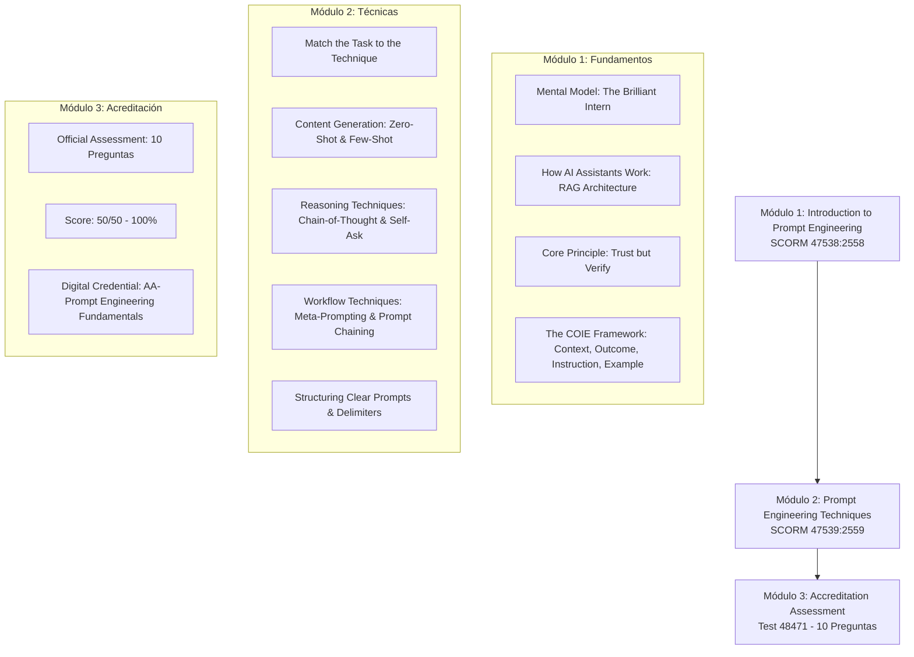

# 01. Course Introduction and Syllabus

> **Curso:** Prompt Engineering Fundamentals  
> **Código Oficial:** `ACAD-ALL-SLP-FREE-PEF-ENG-v1`  
> **Course ID:** `4733`  
> **Proveedor:** Databricks Academy  

---

## 1. Visión General del Curso

En el entorno empresarial moderno, los asistentes de Inteligencia Artificial impulsados por modelos de lenguaje grande (LLMs) y arquitecturas de Recuperación Mejorada por Generación (RAG) se han convertido en herramientas cotidianas para ingenieros de datos, analistas y líderes operativos. Sin embargo, la calidad del resultado que proporciona un asistente de IA depende directamente de la calidad y estructura de las instrucciones que recibe.

Este curso introduce las bases conceptuales, los marcos de trabajo estructurales y las técnicas de prompting avanzadas necesarias para convertir a los asistentes de IA en colaboradores confiables, transparentes y alineados con los objetivos del negocio.

---

## 2. Mapa Curricular y Lecciones

El curso se divide formalmente en tres módulos principales dentro de Databricks Academy:

---

## 3. Prerrequisitos y Consideraciones Técnicas

- **Acceso a un Asistente de IA:** Se recomienda contar con acceso a un asistente empresarial o entorno de experimentación (como **Databricks Assistant**, Databricks AI Playground, o interfaces basadas en modelos fundacionales tipo Llama 3, Claude Sonnet o GPT-4).
- **Conocimientos Previos:** No se requieren conocimientos previos de programación avanzada ni aprendizaje automático profundo; el curso está diseñado para cualquier profesional que interactúe con modelos de lenguaje.
- **Enfoque de Seguridad Empresarial:** Énfasis constante en el gobierno de datos, privacidad corporativa y prevención de fugas de propiedad intelectual al formular prompts.

---

## 4. Competencias Adquiridas

Al completar este plan de estudio, el participante domina:
- La formulación precisa de contexto corporativo para evitar alucinaciones.
- La delimitación clara de expectativas de salida (formato, tono, longitud y restricciones).
- El uso de ejemplos de pocos disparos (*Few-Shot*) para imponer estilos estandarizados sin reentrenamiento.
- La activación de capacidades de razonamiento profundo mediante *Chain-of-Thought* para cálculos y análisis lógicos.
- La descomposición autónoma de requerimientos complejos mediante *Self-Ask*.
- El diseño de cadenas modulares de prompts (*Prompt Chaining*) para automatizar flujos de trabajo de principio a fin.
