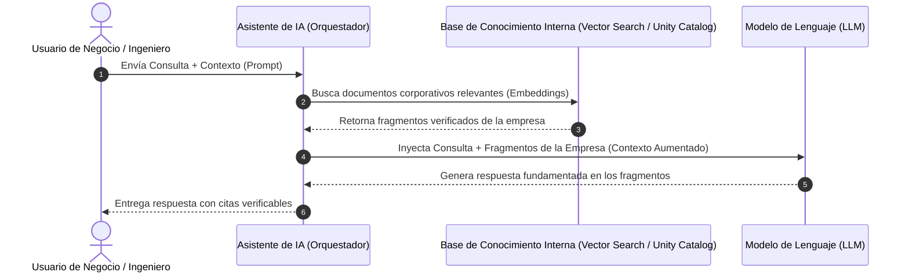

# 01. AI Assistants and the "Trust but Verify" Principle

> **Módulo 1:** Introduction to Prompt Engineering  
> **Tema Central:** Modelos mentales para interactuar con asistentes de IA y arquitectura RAG  

---

## 1. El Modelo Mental del "Becario Brillante" (*The Brilliant Intern*)

Una de las analogías más potentes presentadas por Databricks para entender cómo opera un Asistente de IA es la del **"Becario Brillante"**:

> *"Imagina a un graduado universitario con honores: ha leído millones de libros, memorizado enciclopedias enteras, domina la sintaxis de múltiples lenguajes de programación y puede redactar a una velocidad sobrehumana. Sin embargo, acaba de incorporarse a tu empresa hoy: no conoce a tus clientes, no comprende la política interna no escrita, carece de contexto institucional y, si le das una orden vaga, intentará agradarte asumiendo lo que cree que quieres, pudiendo equivocarse con total elocuencia."*

### Lecciones clave del modelo:
1. **Conocimiento amplio vs. Contexto local:** El LLM posee un vasto conocimiento público preentrenado, pero ignora la realidad específica de tu organización a menos que se la suministres.
2. **Necesidad de instrucciones explícitas:** Las instrucciones vagas generan resultados mediocres. La precisión en la instrucción determina la precisión del resultado.
3. **Supervisión activa:** El asistente no reemplaza el juicio profesional del humano; actúa como un multiplicador de productividad que requiere validación.

---

## 2. Cómo Funcionan los Asistentes Empresariales: Arquitectura RAG

En Databricks y en entornos corporativos modernos, los asistentes de IA no operan en el vacío. Se integran a través de una arquitectura **RAG (Retrieval-Augmented Generation)**:

### Componentes de un Sistema RAG:
- **Retrieval (Recuperación):** El sistema extrae automáticamente activos de conocimiento interno (manuales de producto, esquemas de tablas en Unity Catalog, políticas internas, tickets históricos) utilizando búsqueda semántica vectorial.
- **Augmentation (Aumento):** La información recuperada se concatena dinámicamente en la ventana de contexto del prompt.
- **Generation (Generación):** El LLM utiliza su capacidad de razonamiento para sintetizar una respuesta basada **estrictamente** en los datos proporcionados, minimizando alucinaciones.

---

## 3. El Principio Fundamental: "Trust but Verify" (Confía pero Verifica)

El lema operativo indispensable en el uso de IA empresarial es **"Trust but Verify"**:

> **Definición:** *Aprovechar la velocidad, síntesis y capacidad analítica del asistente de IA, pero asegurando siempre que la salida sea cotejada contra fuentes internas verificadas antes de tomar decisiones críticas o llevar código a producción.*

### Lista de Verificación para Auditoría de Salidas de IA:

| Criterio de Verificación | Pregunta Clave | Acción Correctiva si Falla |
|---|---|---|
| **Verificación Fáctica** | ¿Los números, métricas y afirmaciones coinciden con los reportes oficiales? | Solicitar las citas directas o la consulta SQL origen. |
| **Consistencia Lógica** | ¿La conclusión se deriva coherentemente de las premisas planteadas? | Aplicar técnica *Chain-of-Thought* para auditar los pasos intermedios. |
| **Ausencia de Alucinación** | ¿Hay términos o nombres de funciones inventados que no existen en el SDK? | Ejecutar y verificar en entorno de pruebas (sandbox). |
| **Alineación de Políticas** | ¿Cumple con los estándares de seguridad, gobernanza y tono corporativo? | Reforzar el bloque de *Constraints* e instrucciones negativas en el prompt. |
